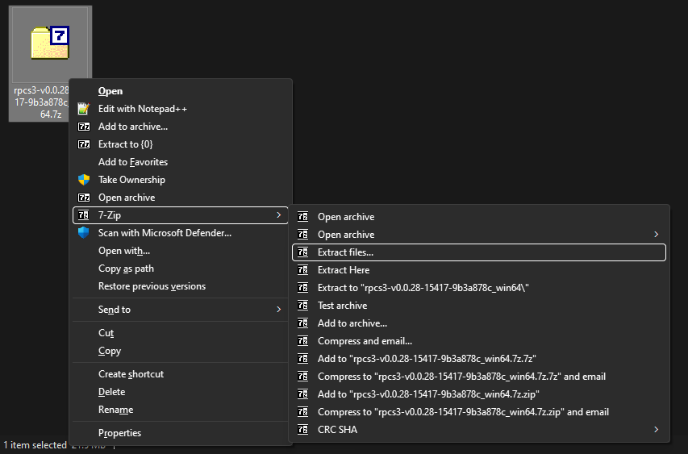
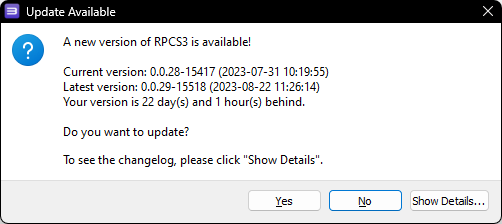
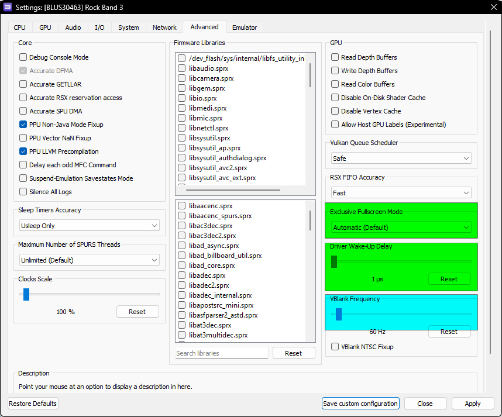

Video Version (Outdated):  
 - YouTube")

 

> * _Linux Version_ (N/A)  
> * _Mac Version_ (N/A)  
> * _SteamDeck Version_ (N/A)  
> * [_[Versión en español]_  (WIP)](https://github.com/carlmylo/rb3-pc/tree/espa%C3%B1ol-win#readme)  

>##### WARNING:
_This tutorial will **not** provide you with a download to the game or DLC. None of the Discord servers listed will provide you with them, either. Make a backup of your own copy or Google for help. **Piracy is illegal and attracts Tim Sweeney's lawyers**._
 

1. [_[Requirements]_](#requirements)
2. [_[Installation]_](#installation)
3. [_[Configuration]_](#configuration)
4. [_[Disable Updates]_](#disable-updates)
5. [_[Controllers (RB/GH Guitars, Drums, and Gamepads)]_](#controllers)
6. [_[User Account]_](#user-account)
7. [_[RPCN]_](#rpcn)
8. [_[Quick Configuration]_](#quick-configuration)
9. [_[Custom Configuration]_](#custom-configuration)
10. [_[CPU]_](#cpu)
11. [_[GPU]_](#gpu)
12. [_[Audio]_](#audio)
13. [_[I/O (Wired Pro Guitars and USB/MIDI Keyboards)]_](#io)
14. [_[Network]_](#network)
15. [_[Advanced]_](#advanced)
16. [_[Emulator]_](#emulator)
17. [_[Wireless PS3 Mustang Pro Guitars and Keyboards with Dongles]_](#wireless-ps3-mustang-pro-guitar-and-ps3-rock-band-3-keyboard-with-dongle)
18. [_[Troubleshooting]_](#troubleshooting)
19. [_[Conclusion]_](#conclusion)

 

# REQUIREMENTS:

You will need:
* _A copy of Rock Band 3 for the PS3 on your computer. (BLUS-30463 is strongly suggested)_
* _An instrument controller. You can use:_
	*   _Any Rock Band and Guitar Hero Guitar (PS3, PS4, Wii, X360)_
	*   _Any Rock Band and Guitar Hero Drums (PS3, Wii, X360)_a
	*   _Rock Band 3 MIDI Pro Adapter and a compatible instrument (PS3 version only)_b
	*   _Rock Band 3 Keyboard (PS3 version via dongle only)_b c
	*   _Rock Band 3 Fender Mustang PRO-Guitars \[**Wireless**\] (PS3 version via dongle only)_b
	*   _Rock Band 3 Fender Mustang PRO-Guitars \[**Wired**\] (PS3, Wii, X360 via MIDI to USB adapter)_
	*   _Rock Band 3 Squier Stratocaster PRO-Guitars (PS3, Wii, X360 via via MIDI to USB adapter)_
	*   _Any MIDI Keyboards (**37 keys minimum** via USB or MIDI to USB adapter)_c d
	*   _MIDI Drum Kits (via USB or MIDI to USB adapter with MidiDrumHero and VJoy)_e
	*   _Microphones (game can be controlled with most game controllers or typing keyboard when playing as a vocalist)_
*   _A computer_
	* Minimum:
		* OS: Windows 10
		* Processor: Intel Core i5-4460 (or equivalent CPU with a CPUMark score of 4872 and AVX2)
		* Memory: 8 GBs
		* Graphics: GeForce GT 730 2GB
 		* Storage: 11.2 GBs (5400 RPM HDD)
   		* Notes: The absolute lowest one can realistically play this game on. Low quality 720p with no post-processing, 130 ms audio latency, 60 Hz with occasional performance drops.
	* Recommended
		* OS: Windows 10
		* Processor: AMD Ryzen 5 2600
		* Memory: 16 GBs
		* Graphics: NVIDIA GeForce GTX 1650
 		* Storage: 145.66 GBs for **all** officially released content dating from RB1 to RB3, including DLC, RBN, and exports (SSD)
 		* Notes: Great performance with ample headroom for multitasking while playing. 1080p with full post-processing, 100 ms audio (or lower), 75 Hz.
	* You can check [[RPCS3's page for suggested specifications here]](https://rpcs3.net/quickstart) although they may be a bit inflated for this game.
*   _[[7zip]](https://www.7-zip.org/download.html) (or WinRAR if you hate yourself)_

a Although you can use PS4 Rock Band kits via Bluetooth, Pro Cymbals will refuse to work so they are exempt from this tutorial.  
b Wii Rock Band instrument controllers and dongles can be (permanently) converted for PS3 so you can use passthrough mode, but this is beyond the scope of this tutorial. Google is your friend.  
c Connecting keyboards via MIDI with less than 37 keys is possible but not ideal so they're exempt from this tutorial.  
d Certain MIDI keyboards, notably Yamaha ones, may exhibit problems due to their MIDI implementation. [[These keyboards require the latest version of RPCS3]](https://rpcs3.net/download).  
e I don't have a MIDI Drumkit so there is no set up tutorial for this. Apologies. If you have one and would like to help by sending in screenshots of the setup process, please contact me on the Milohax Discord.

 

# INSTALLATION:

We'll be downloading an older version of RPCS3 because it performs better at the moment. Although this guide is Windows-centric, I have linked Linux just in case you want to try it on Linux based operating systems. For those curious (nerds), this is the last RPCS3 build before the QT6 merge which has various problems.c  
c Certain MIDI keyboards, notably Yamaha ones, may exhibit problems due to their MIDI implementation. [[These keyboards require the latest version of RPCS3]](https://rpcs3.net/download).  

[[Click here to download RPCS3.]](https://github.com/RPCS3/rpcs3-binaries-win/releases/download/build-9b3a878c189e4e688b6025de0d0ff659116dcade/rpcs3-v0.0.28-15417-9b3a878c_win64.7z)

|  |  |
|---|---|

**Once it downloads, extract the .7zip file.**  

I would strongly suggest extracting the files into “C:\\Games\\RPCS3” or a separate internal drive to avoid permissions issues. Also, untick the box that will create a sub-directory, as shown highlighted in the picture. 

**Avoid installing to and running from an external drive**, as they typically lack the stability to work properly.  

Once that's extracted, [**[download the PlayStation 3 system software from Sony's website]**](https://www.playstation.com/en-us/support/hardware/ps3/system-software/). **Scroll down** until you get **to** “**Update using a computer**”, **click that** to expand, **then click on “Download PS3 Update.**”  
  
_**If you're using a Chromium-based browser like Chrome or Edge, MAKE SURE YOU RIGHT-CLICK AND “Save link as,” or your download MAY become stuck.**_

Once again, the picture below links to the download page.

Now **open up RPCS3**. **Tick "I have read the Quickstart guide" and "Do not show again", then click "Continue."**  

As mentioned earlier, this is an outdated build of RPCS3, and you'll be warned about this.
**Make sure you click "No."**

**Drag** the **PS3UPDAT.PUP** file you just downloaded from Sony's website **into RPCS3** 

**Click "Yes"** when the firmware installer prompts you.  

**Let it install.**  

**When it finishes, click "OK."**  

It will start compiling modules, which may take a few minutes. **Let it do its thing.**  

Next, **navigate to the folder where you have your copy of Rock Band 3 stored and drag the folder into RPCS3**. Keep this folder somewhere you won't accidentally delete it, as you'll need it. Again, you're on your own when it comes to finding a copy. [[I used “PS3 Disc Dumper” for this because it's the easiest way.]](https://youtu.be/mRxSKxoYt_g)

Rock Band 3 is now in your game library in RPCS3, but it's out of date. Let's fix that. **You will need to download the update PKG file** which is linked below. This link directly connects to the same Sony servers that the PS3 downloads from. You may receive security warnings because the server lacks HTTPS.  
[\[CLICK HERE TO DOWNLOAD ROCK BAND 3 UPDATE PKG\]](http://b0.ww.np.dl.playstation.net/tppkg/np/BLUS30463/BLUS30463_T4/e52d21c696ed0fcf/UP8802-BLUS30463_00-ROCKBAND3PATCH05-A0105-V0100-PE.pkg)

The filename will look something like this:

**When it's finished downloading, drag the update file into RPCS3 and click Yes**, just like you did earlier with the PS3UPDAT.PUP file.  

 

# CONFIGURATION:

***IF YOU HAVE CHANGED SETTINGS FOR RPCS3, SET THEM BACK TO DEFAULT BEFORE FOLLOWING THIS TUTORIAL!***

 

## DISABLE UPDATES

As current versions of RPCS3 perform worse for Rock Band 3 and other rhythm games, **it is currently suggested to stay on an older version and disable the updates**.
To do this, look at the top menu bar of RPCS3, then **click on Configuration > GUI**  

**In "Check for updates on startup", change the option to "No", then click "Apply" then "Save."**  

## CONTROLLERS:

**This section is for standard controllers (five-fret guitars, RB/GH drums).**  
Pro Guitars and/or Keyboards are set up later.

**Right click on “Rock Band 3” and select “Create Custom Gamepad Configuration”**

* If you are planning on plugging in multiple instruments, _you must set them on different ports_.
* Standard PS3 guitar and drum controllers _should_ be plug and play. If they aren't, follow the binding instructions below. 
* If you're using PS3, PS4, or Wii guitars, set the “Handlers” option to “MMJoyStick.” 
* If you're using Xbox 360 guitar controllers, set the “Handlers” option to “XInput”
*  If you're using PS3, PS4, Wii, or Xbox 360 drum controllers, set the “Handlers” option to “MMJoyStick.”

Below are the buttons you should map in RPCS3's Gamepad Settings.

**If your controller isn't being detected, click “Refresh”. If that doesn't solve it, restart RPCS3.**

Once you've finished configuring, **remember to click “Save”.**

  
**Guitar**:  
Make sure you **set “Device Class” to “Guitar”.**

**Switch the drop-down menu next to it to "Rock Band" if you're using a Rock Band guitar or leave it on “Guitar Hero” if you're using a Guitar Hero guitar**. 
 
**Some guitar controllers** (most notably Guitar Hero controllers) misbehave and **refuse to map sometimes. If you try mapping a button and get “U+”, click “Filter Noise"** at the bottom left of the controller configuration window **then try mapping**.

| **RPCS3**          | **Rock Band Guitars** | **Guitar Hero Guitars** |
|:------------------:|:---------------------:|:-----------------------:|
| Cross |  |  |
| Circle |  |  |
| Square |  |  |
| Triangle |  |  |
| L1 |  |  |
| D-Pad: Up |  |  |
| D-Pad: Down |  |  |
| Right Stick:   Left/Right |  |  |
| Right Stick:   Up/Down   (PS3/PS4/Wii guitars only) |  | |
| L2   (Xbox 360 guitars only) |  | |
| R1 |  | Does not work |

**Drums**:

Make sure you **set “Device Class” to “Drum”.**

**Switch the drop-down menu next to it to "Rock Band" if you're using Rock Band drums, “Rock Band Pro” if you're using Rock Band Drums with Pro expansions, or leave it on “Guitar Hero” if you're using Guitar Hero drums.**

If you're using a 360 MPA with a drum kit, please ask [**[the Milohax discord]**](https://discord.gg/xrba4CjdNC) for the mapping as they know more about this.

| **RPCS3**    | **Rock Band Drums** | **Rock Band Pro Drums** | **Guitar Hero Drums** |
|:--------:|:---------------:|:-------------------:|:-----------------:|
| Cross |  |  |  |
| Circle |  |  |  |
| Square |  |  |  |
| Triangle |  |  |  |
| L1 |  |  |  |
| D-Pad |  |  |  |
| R1 |  |  |  |
| R3 |  | Cymbal Modifier | |
| L3 |  | Pad Modifier | |

**Vocals**:  
*For vocals*, you can *use regular controllers*. If you're using a PS4 controller, switch to DS4. If you're using an Xbox One controller, switch to XInput. There's no need to remap anything. Alternatively, you can use a typing keyboard and refer to this guide to customize the mapping according to your preferences.

| **PlayStation (DS4)** | **Xbox One (XInput)** | **Use**                         | **Alt Use**         |
|:---------------------:|:---------------------:|:-------------------------------:|:-------------------:|
|  |  | Navigation |
|  |  | Navigation |
|  |  | Select                          |
|  |  | Back                            | Mic 3 Volume (Song) |
|  |  | Mic 1 Volume (Song) |
|  |  | View More Info (Library)        | Mic 2 Volume (Song) |
|  |  | Options                         | Pause (Song)        |
|  |  | Filters (Library)               | Overdrive (Song)    |
|  |  | Guide Part Selection (Practice) |
|  |  | Vocal Part Selection (Practice) |
|  |  | Vocal Track Volume (Song)       |
|  |  | Pitch Correction (Song)         |

  

Here's what a _The Beatles: Rock Band Höfner_ Wii controller looks like when it's set up. Note that "Handlers" is set set to "MMJoystick" and "Devices" is set to the correct Joystick number. Since it's a Rock Band guitar controller, "Device Class" is also set to 'Guitar" and the box next to that is set to "Rock Band".

 

## USER ACCOUNT:
In RPCS3, go to **Manage > User Accounts** 

Once you're there, **click on the default username (00000001 - User) and then click “Rename user” and change it** to whatever you want, then close it out.  

 

## RPCN

If you don't want to play online, [you can skip to the next part.](#quick-configuration)

Go to **Configuration > RPCN**

Click on “**Account**”:  

Click “**Create Account**”:  

Enter a **username** and **password**:  
  
  

You will be prompted for an **email address** so you can receive a **verification token**:  
  

**Click “Yes”** and go to your email inbox. You may have to wait a few minutes to get it. If you're still waiting, check your spam inbox. The email will be called **“Your token for RPCN.” Copy the token**:

**Paste the token** into RPCS3 and click OK:  

 

# QUICK CONFIGURATION:
These files are meant for those that just want to play with minimal setup. It is still strongly suggested that you do [[custom configuration]](https://github.com/carlmylo/rb3-pc/tree/main#custom-configuration) to tweak to what's best for your computer.  
**You *MUST* have** [[**Rock Band 3 Deluxe installed**]](https://rb3dx.neocities.org/) otherwise these will not work to their full potential.  

To use these, **click on the settings you want to download then extract the ZIP archives in the folder where you extracted RPCS3**. It should combine folders automatically if you did it right.  
Players who want to use [[microphones]](https://github.com/carlmylo/rb3-pc/tree/main#audio), [[Wired Pro Guitar and USB/MIDI Keyboards]](https://github.com/carlmylo/rb3-pc/#io), or [[PS3 Mustang guitars or RB3 Keyboards with dongles]](https://github.com/carlmylo/rb3-pc/#wireless-ps3-mustang-pro-guitar-and-ps3-rock-band-3-keyboard-with-dongle) will still need to configure those.

* [[Recommended settings]](https://github.com/carlmylo/rb3-pc/raw/main/config/customconfig/recommended.zip) - These are the settings used for the recommended specs listed in [[requirements]](#requirements).
* [[Minimum settings]](https://github.com/carlmylo/rb3-pc/raw/main/config/customconfig/minimum.zip) - These are the settings used for the minimum specs listed in [[requirements]](#requirements).

For more info on these settings, [[check the Readme for the settings repository]](https://github.com/carlmylo/rb3-pc/tree/main/config/customconfig#about).

 

# CUSTOM CONFIGURATION:

**Right click on Rock Band 3** in RPCS3, then click on “**Create Custom Configuration**”  

This may seem overwhelming because of the sheer number of options, but I have color-coded the settings that require adjustment. Everything not colored should remain on the default options and left unchanged.

| COLOR | MEANING |
|---|---|
|  | **REQUIRED** |
|  | **Performance Tweaks** |
|  | **Optional** |

We'll go tab by tab, starting with:

 

## CPU

*  **Improved CPU performance, at the cost of bottlenecking on certain machines**: 
	* **Change "SPU Block Size" to "Mega"** - Ties smaller SPU compiled together, which requiring fewer cores/threads. Drastically speeds up game startup time on certain machines.
	* **Change "Preferred SPU Threads" to "1", "2", "3", or "4"** - Can help prevent stutter caused by CPU overloads. **Start from 4 and lower it until it improves**.
	* **AS A LAST RESORT** **"SPU XFloat Accuracy" to "Relaxed"** - Changing this will gain a few frames but **will break practice mode and possibly other features!**

 

## GPU

*  REQUIRED: 
	* **Enable "Write Color Buffers"** - This fixes 99% of the issues with characters having glitched textures.
*  Performance Tweaks: 
	* **Enable "VSync"** - Reduces screen tearing and may lead to a more stable framerate. Slightly increases latency.
	* **Change "Frame Limit"** 
		* Set it to "Off" to use higher VBlank Frequencies (which may introduce jitter).
		* Set it to 60 if you want a locked 60 FPS framerate (redundant with 60 Hz Vblank). 
		* Auto will use default RPCS3 settings.
		* It is suggested to use your graphics driver's settings or software like MSI Afterburner to cap your framerate instead.
	* **Adjust "Shader Quality"** depending on your system.
		* Low and Medium will drastically reduce quality at certain frame rates with little performance gains.
		* High is the best option. Ultra looks similar to high.
		* Auto will use default RPCS3 settings. This is the suggested setting. 
	* **Adjust "Resolution Scale"** to preference and to what your computer can handle. Lower for performance gains at a drastic cost in quality. Increase for sharper graphics.
	* **Adjust "Resolution Scale Threshold"** depending on "Resolution Scale" above. Set the number to whatever percent you increased your resolution (i.e., for 1920x1080, which is 150% of 1280x720, you'd calculate what 150% of 16 is, which would be 24.
	* **Change "ZCULL Accuracy" to "Relaxed"** - For low end GPUs. Provides a slight performance improvement but may cause graphical anomalies.

 

## Audio

*  REQUIRED: 
	* **Enable "Enable Buffering"** - Absolutely required by Rock Band 3. It should be enabled by default but if it's disabled, re-enable it.
*  Tweak depending on audio hardware: 
	* **Adjust "Audio Buffer Duration"** depending on system.
		* Lower values give you less audio latency but higher CPU usage.
		* Higher values give you more audio latency but lower CPU usage.
		* Vocalists are affected the most by this, as a higher latency creates a distracting echo. Instrument players can use calibration to compensate either way.
		* You can change this while the game is running, but it will require re-calibrating in Rock Band 3's system settings.
*  For Vocalists: 
	* **Select an input device in "Mic1", "Mic2", and "Mic3"** for vocals. If not playing vocals, Mic1 will be used for voice chat.

 

## I/O
**This section is for people playing with USB/MIDI Keyboards or Pro Guitars!**
* **If you're not playing with a wired Pro Guitar or a USB/MIDI keyboard,** [[**skip** over **this section**].](#network)  
* **If you're playing with a PS3 Rock Band 3 Keyboard or wireless PS3 Mustang Pro Guitar,** [[**skip** over **this section**].](#network)  

**If your keyboard has a USB port**, all you need to do is **plug it into your computer**.  
  

**If your keyboard only has a MIDI output, you will need a MIDI to USB interface**.
  

**The same applies to Rock Band 3 Pro Guitars** as they only have MIDI outputs.
  

Here's an example of a MIDI to USB interface. Most will come with an LED indicator to show activity. **To check that you've plugged it in correctly, you should see “MIDI In” blinking when you press a key**.  
  

**If you have an audio interface, you may already have a way to plug in MIDI** to your computer, as some audio interfaces come with MIDI inputs. For example, this Scarlett has MIDI connections in the back.  
>  

**If everything's connected**, let's go ahead and **focus on RPCS3's I/O tab.**  

*  For third party Keyboard and wired Pro Guitar players: 
	* 🎹 **Keyboard Players: Leave your "Emulated MIDI type" on "Keyboard" and select your keyboard or MIDI interface in the drop-down menu next to it.**.
	* 🎸 **Pro Guitar Players: Change your "Emulated MIDI type" from "Keyboard" to "Guitar (17 Frets)" if you have a Mustang Pro Guitar, or "Guitar (22 Frets)" if you have a Squier Pro Guitar, then select your MIDI to USB interface in the drop-down menu next to it**.
  
 **If your instrument isn't detected in the drop-down menu, click on "Save custom configuration", close the Custom Configuration window, then right click on Rock Band 3 to reopen it. If that doesn't work, restart RPCS3.**  
  
As **keyboards don't have PS3 buttons, the first octave is** reserved **for mapped keys**. Use the picture below as a reference. I **strongly** suggest putting labels on your keyboard to remind you of what each key does along with color ranges. **The** keyboard's **pitch knob should be mapped to the touch strip and modulation wheel and sustain pedal should be mapped to Overdrive deployment.**
  

 

## NETWORK

*  REQUIRED: 
	* **Change the Network Status to “Connected” as highlighted in the picture. If left on “Disconnected,” the game will temporarily freeze when browsing the song library.**
*  For online multiplayer: 
	* Tick **"Enable UPNP"** or **forward port 9103 (UDP) in your firewall. Don't enable UPNP while port forwarding** as this can cause crashes.
	* As of writing this, there are two Rock Band 3 multiplayer servers to connect to. You can easily switch between them.
		* **Join the** [[**Milohax Discord server**]](https://discord.gg/6rRUWXPYwb) and **go to** the **[\[#ashcentral-status\]](https://discord.com/channels/961352072140324924/1153056600030973992)** channel. **Copy the information for RPCS3**. This is the suggested server due to having more features and frequent updates.  
		* Join the [[RBEnhanced Discord server]](https://discord.gg/6rRUWXPYwb) and go to the [[#gocentral-connecting]](https://discord.com/channels/953085263008129064/1076031372185042984) channel. Follow the instructions for RPCS3.  

 

## ADVANCED

*  Depending on your computer: 
	* **Change "Driver Wake-up Delay" to "20µ"** if you experience crashing after a few songs. Increase it to "40µ" if the issue persists.
	* **Change "Exclusive Fullscreen Mode" to "Prefer borderless fullscreen"** to prevent potential crashes and audio desync when changing program focus constantly.
	* **Adjust VBlank Frequency** if you want a higher internal framerate. This can make it easier to hit notes but may cause graphical instability and connection issues while online. **It's best left alone** and not recommended to go above 75 Hz if adjusting it for online play.
	* **Enable "Silence All Logs"** - **Not suggested** but can help reduce drive usage on computers with slower drives. This is a non-issue for most people. **If you disable this, neither the RPCS3 team or the Milohax team will be able to help you with troubleshooting and crashes**.
*  For higher framerates: 
	* **Enable "Debug Console Mode"** - With this option enabled and Rock Band 3 Deluxe installed, you can take advantage of higher memory access, leading to longer sessions with longer songs and increased stability. Most people should enable this.
	

 

## EMULATOR

You can leave this as is if you want, but I would consider changing the following options:
*  Optional tweaks: 
	* **“Show trophy popups”** - Mimics the way Trophy notifications appear on the PS3. I personally disable this as the game has its own pop-ups.
	* **“Show PPU compilation hint”** - This creates a popup whenever RPCS3 is compiling units for the PPU. This only comes up once as "Recompiler (LLVM)" in the CPU tab does this when launching the game.
	* **“Show shader compilation hint”** - This creates a popup whenever RPCS3 is compiling shaders. Whether you leave it on or not is up to you, but I should tell you what this means as it is important. When you run PS3 games, it has to compile shaders to “translate” the graphics from a PS3 format to a format your PC can work with. **The game will** appear to **stutter when this happens**. **This happens on ALL computer systems. When it finishes** compiling an effect, **it will usually never happen again**. **The best way to deal with this is** just **to** **play the game** as it will quickly go away. You can also use Rock Band 3 Deluxe's Autoplay modifier to let it go through a few songs in a party shuffle and let it compile a decent amount of shaders.
	* **“Start games in Fullscreen mode”** - Obviously just switches to Fullscreen when you start Rock Band 3. I personally enable this.  
	* **“Use Native Interface”** - Disabling this can fix naming things in game on controllers as that feature only works for standard gamepads.
    

**After all of that, remember to click "Apply" then "Save custom configuration"**

That's the difficult part over with.

 

# Wireless PS3 Mustang Pro Guitar and PS3 Rock Band 3 Keyboard with dongle

**If you're not playing with a PS3 Mustang Pro Guitar and PS3 Keyboard with their respective dongles**, [[**skip over this section**]](#troubleshooting)

To start with, **close out RPCS3** **and plug in the instrument's dongle** to your computer.

Now, [**\[go to Zadig's website\]**](https://zadig.akeo.ie/) and **download the latest version. then open it** up.

Click on **Options** then **List All Devices**  

You should now see devices listed. **Switch it to your Rock Band 3 Pro Instrument**. In this example, we're using the Mustang Pro Guitar, which shows up as “Harmonix RB3 Mustang Guitar for PlayStation® 3”.  

**After selecting the right device, you should see the option to replace the driver. _MAKE SURE YOU ARE REPLACING THE DRIVER ONLY FOR THE PRO GUITAR/KEYBOARD._** Click Replace Driver.  

A warning will appear. **Again, make sure you have selected your RB3 Pro Guitar or keyboard instrument.** After you have made sure, **click** “**Yes**.”  

It will then install the driver. As the program says, it may take a few minutes.  

If everything goes well, you will get this message:  

**Close Zadig** and, **with the dongle** still **connected**, **open up RPCS3** and **open Rock Band 3**.

Turn your controller on and you should see it automatically assign a player number.  

Likewise, in Rock Band 3, you will see the instrument ready to join.  

 

## TROUBLESHOOTING

*   **_Stuttering Audio_**

	* 
	* Increase “Audio Buffer Duration” as mentioned in [[the Audio tab of Rock Band 3's Custom Configuration]](#audio) until the stuttering stops. 100 ms is a great starting point for low end computers.

*   **_General performance issues_**
	*	Set your computer to the [[High Performance power plan.]](https://help.ableton.com/hc/en-us/articles/115000211304-Using-the-High-performance-power-plan-Windows-)
	*   Go back to the [[Custom Configuration setup section]](#configuration) and apply suggested low performance tweaks.
	*   Install [[Rock Band 3 Deluxe]](https://rb3dx.neocities.org/) and disable Post Effects in Deluxe Settings.
	*	Close out the dedicated Discord client and open it up in your browser or on your phone.

*   **_Game doesn't fill the screen_**
	*   Enable "Overscan" in Rock Band 3's System Settings.

*   **_Game feels off_**
	*   Run Calibration in Rock Band 3's System Settings if you haven't for some reason. Disable “Dolby Digital” if you enabled it in the same menu.

*   **_Game occasionally crashes when practicing on regular guitar/bass_**
	*   This is a known bug which currently has no solution.

*   **_Cannot use Automatic Calibration in System Settings_**
	*   Automatic Calibration only works for PS3 guitar controllers with passthrough.

*   **_Game gets stuck when naming a character or band_**
	*   This is an RPCS3 issue when using guitars or drum controllers to name things. I would strongly suggest using a regular controller for any customization. You can try to fix it by changing the effects switch on a RB guitar controller. Otherwise, changing your controller's Input Handler in “[[Create Custom Gamepad Configuration]](#controllers)” to “Keyboard” then back to whatever you had originally fixes it, but your mapping may get deleted. This should work while the game is running.

*   **_Characters have flying instruments and accessories_**
	*   There is currently no fix for this. If you experience this, [[please report your findings on RPCS3's GitHub].](https://github.com/RPCS3/rpcs3/issues/8408)

*   **_Scrolling through library has long pauses_**
	*   You forgot to set the “Network Status” to “Connected” in the [[Network tab when setting up the Custom Configuration]](#network) for Rock Band 3.

*   **_My PS3 instrument controller shows up as two_**
	*   You did [[controller configuration](#controllers) for a PS3 controller, which usually isn't needed due to passthrough. Just unbind the controller and it should be fine.

*   **_[Rock Band 3 Deluxe] I crash in the intro video_**
	*   You have incompatible files. You need to go to Rock Band 3's game directory in `dev_hdd0\game\BLUS30463\USRDIR` and delete every `.dta` file aside from `dx_high_memory.dta`.
	
*   **_[Pro Drums] Hitting two cymbals registers as a tom_**
	*   This is an infamous Rock Band 3 bug called the "double cymbal glitch". I sadly do not know the solution to this as I don't own a drum kit. Please feel free to ask around in the Milohax Discord server.

*   **_\[ONLINE\] Cannot find a 3rd or 4th player_**
	*   In Rock Band 3's Custom Configuration, [[go to the network tab]](#network) and make sure “Enable UPNP” is enabled. If for some reason you can't do UPNP, you will need to forward port 9103 (UDP) in your firewall. **don't enable UPNP while port forwarding** as this can cause crashes.

  *   **_\[ONLINE\] I crash when searching for players_**
	*   If you have UPNP enabled in Rock Band 3's Custom Configuration [[Network section]](#network), you will need to disable it and [[search how to port forward in your router]](https://www.noip.com/support/knowledgebase/general-port-forwarding-guide).

*   **_\[ONLINE\] Stuck on “Registering Account” when trying to connect to GoCentral_**
	*   You may have lost connection to RPCN or GoCentral and will have to restart the game. If you continue to get this after restart, go to the top menu in RPCS3, “Configuration” > “RPCN” > “Account” > “Test Account” then restart the game to force a reconnection.
 
*   **_\[ONLINE\] I keep disconnecting constantly while playing_**
	*   Double check to make sure your connection is stable. Try connecting via Ethernet cable is possible. If you have increased your VBlank past 60 Hz, set it back to 60 Hz. Aside from that, you may have connection issues.

*   **_“I followed every step and my game is crashing or performing horribly”_**
	*   Double check to make sure you meet the requirements and have followed every step correctly. This guide has been tested thoroughly and has been proven to work for plenty of people with varying degrees of hardware. If you are absolutely sure you followed every step correctly, it is 90% likely that the dump of the game you have is bad, and 9% chance your computer ran out of disk space or doesn't meet the minimum specs, and 1% chance it's a skill issue.

 

## CONCLUSION

That's it! You now (hopefully) have a functional setup to play Rock Band 3 on your PC. While you're here, why not join some communities that are helping keep the Rock Band community alive?

**Rock Band 3 Deluxe/Milohax:** 

Milohax are the developers of the must-have Rock Band 3 Deluxe mod that I cannot recommend enough. **[\[Download here.\]](https://rb3dx.neocities.org/)** On top of adding many quality-of-life features like faster bootups, 60fps venues, and automatic DLC loading, **it also includes RB3\_Plus, which adds extra Pro Keys and Pro Guitar/Bass to songs that didn't have them.** **If you have a Pro instrument, this is a must-have**! On top of this, there are various visual customization options, like using themes from older (and newer) Rock Bands and even Guitar Hero. [You can **\[join the amazing Milohax Discord here\]**](https://discord.gg/xrba4CjdNC).

**RBEnhanced:**

Developers of the amazing RBEnhanced mod that currently only exists for Xbox 360 and Wii. The same developers also help run and maintain the GoCentral server that is the only way to play Rock Band 3 on PS3 online at the moment. As of writing this, there is an active offshoot that has crossplay with Wii and PS3 players. You can [**\[join RBEnhanced's Discord here\]**](https://discord.gg/6rRUWXPYwb).

Special thanks to:

*   [Dark](https://dark.ski/), [Linos](https://www.youtube.com/@LinosMelendi), [Jnack](https://www.youtube.com/@jnackmclain), [Hughtobasic](https://www.youtube.com/@thisisRK), [ihatecompvir](https://www.youtube.com/@ihatecompvir1591), and [LysiX](https://www.youtube.com/@LysiX) for technical information regarding RPCS3 and Rock Band 3.
*   [qfoxb](https://github.com/qfoxb), [SlothDemon](https://www.youtube.com/@SlothDemon1991), [Jnack](https://www.youtube.com/@jnackmclain) (tested for nearly 50 hours lmao), [knvtva](https://github.com/knvtva), and 1osks for reporting results.
*   RPCS3 Wiki for having pretty decent information on controllers and USB passthrough.
*   [TheNathannator's](https://github.com/TheNathannator) [PlasticBand GitHub](https://github.com/TheNathannator/PlasticBand) for even better documentation on controllers.

  
This work is licensed under a [Creative Commons Attribution-ShareAlike 4.0 International License](http://creativecommons.org/licenses/by-sa/4.0/).

