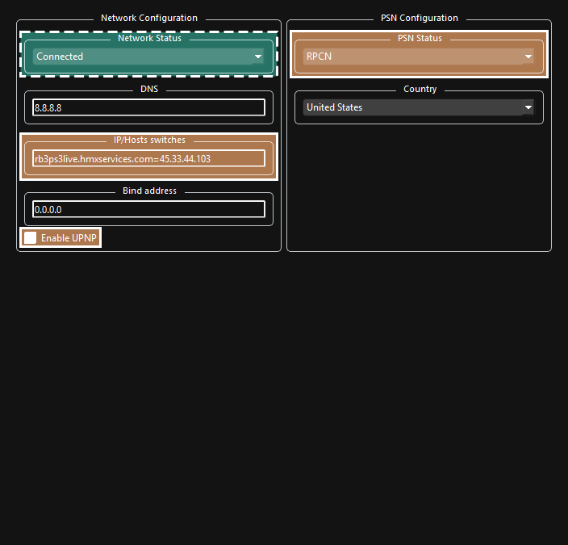

Versión Video (no actualizada):  
 - YouTube")

 

>##### ADVERTENCIA:
_Esta guía **no** te va a dar links para descargar el juego ni el DLC. Ninguno de los servidores de Discord mencionades tampoco te los va a dar. Haga su propia copia o busque ayuda en Google. **La piratería es ilegal y atrae a los abogados de Tim Sweeney!**._
 

1. [_Requisitos_](#requisitos)
2. [_Instalación_](#installation)
3. [__Configuración__](#configuration)
4. [_Controladores (guitarras, baterías, y gamepads de RB o GH))_](#controllers)
5. [_Cuenta de usuario_](#user-account)
6. [_RPCN_](#rpcn-account)
7. [_Configuración Customizada_](#custom-configuration)
8. [_CPU_](#cpu)
9. [_GPU_](#gpu)
10. [_Audio_](#audio)
11. [_E/S (guitarras Pro y teclados con cable USB/MIDI)_](#io)
12. [_Red_](#network)
13. [_Avanzado_](#advanced)
14. [_Emulador_](#emulator)
15. [_Guitarras y teclados inalámbricos PS3 Mustang Pro con receptores_](##wireless-ps3-mustang-pro-guitar-and-ps3-rock-band-3-keyboard-with-dongle)
16. [_Soluciónes de problemas_](#troubleshooting)
17. [_Conclusión_](#conclusion)

 

# REQUISITOS:

Necesitarás:
* _Una copia de Rock Band 3 para PS3 en tu compu. (Idealmente BLUS-30463)_
* _11.12 GBs de espacio mínimo. (145.66 GBs para **todo** el contenido oficial desde RB1 hasta RB3, incluyendo DLC, RBN y exportes.)_
* _Un control instrumento. Puedes usar:_
	*   _Cualquier guitarra de Rock Band y Guitar Hero (PS3, PS4, Wii, X360)_
	*   _Cualquier batería de Rock Band y Guitar Hero (PS3, PS4, Wii, X360)_
	*   _Cualquier instrumento MIDI compatible junto con el adaptador MIDI Pro Rock Band 3 (solo la versión de PS3)_a
	*   _Teclado Rock Band 3 (solo la versión de PS3 con receptor propio) _a b
	*   _Guitarra PRO de Rock Band 3 Fender Mustang \[**Inalámbrica**\] (solo la versión de PS3 con receptor propio)_a
	*   _Guitarra PRO de Rock Band 3 Fender Mustang \[**Con cable**\] (versiónes de PS3, Wii, X360 con adaptador de MIDI a USB)_
	*   _Guitarra PRO Rock Band 3 Squier Stratocaster (versiónes de PS3, Wii, X360 con adaptador de MIDI a USB)_
	*   _Cualquier teclado MIDI (**con 37 teclas a lo mínimo** conectado por USB o por adaptador MIDI a USB)_b c
	*   _Batería MIDI (conectado por USB o por adaptador MIDI a USB y los programas MidiDrumHero and VJoy)_d
	*   _Cualquier micrófono detectado por tu compu (el juego se puede controlado con la mayoría de mandos o con el teclado cuando juegas como vocalista)_
*   _Una computadora_
	* Esta guía ha sido probada con especificaciones tan bajas como los CPUs Intel Core i5-4460, Intel Core i5-6500, Intel Core i7-3770, AMD Ryzen 2600, y AMD Ryzen 3 3200G. También se ha probado en GPU tan bajas como NVIDIA GeForce GT 730, NVIDIA GTX 1650 y AMD Radeon RX 550. Eso que se sugiere 16 GB de RAM, funciona bien con 8 GB de RAM. Técnicamente, se puede usar un SteamDeck para jugar, pero eso está muy complejo para incluir en esta guía.
    Puedes ver [la página de RPCS3 para sus especificaciones sugeridas](https://rpcs3.net/quickstart) pero están exageradas para este juego.
*   _[7zip](https://www.7-zip.org/download.html) (o WinRAR si te odias a ti mismo)_

a Los instrumentos y receptores de Rock Band para el Wii se pueden convertir a PS3, pero eso es demasiado complejo para incluir en esta guía. Google es tu amigo.  
b Es posible conectar teclados con MIDI que tengan menos de 37 teclas, pero no es lo ideal, asi que no está recomendado en esta guía.  
c Ciertos teclados MIDI, especialmente los de Yamaha, pueden darte problemas por su implementación de MIDI. El equipo de RPCS3 conoce a este problema y se está trabajando en una solución.  
d Así que no hay instrucciones para configurarlas. Si tienes uno y te gustaría ayudar enviar capturas la configuración, mandame un mensaje por el Milohax Discord.

 

# INSTALACIÓN:

Vamos a descargar una versión anterior de RPCS3 porque funciona mejor en este momento. Eso que está guía es para Windows, he incluido a Linux y Mac OS en caso de que quieras probar esta versión en esos sistemas operativos. Para los curiosos, esta es la última versión de RPCS3 antes de la inclusión de QT6, que tiene muchos problemas.

|  |  |  |
|---|---|---|

**Cuando se descargue, extrae el archivo .7zip..**  

Recomiendo extraer los archivos a “C:\\Games\\RPCS3” o otro disco interno para evitar problemas con permisos. También desactiva la opcion que creará el subdirectorio como en la imagen. No lo instales en un disco externo, porque puede causar problemas feos.  

Once that’s extracted, [**download the PlayStation 3 system software from Sony’s website**](https://www.playstation.com/en-us/support/hardware/ps3/system-software/). **Scroll down** until you get to “**Update using a computer**”, **click that** to expand, then **click on “Download PS3 Update.**”  
  
_**If you’re on a Chromium based browser like Chrome or Edge, MAKE SURE YOU RIGHT CLICK AND “Save link as”, or it MAY become stuck.**_

Once again, the picture below links to the download page.

Now **open up RPCS3**, and **drag** the **PS3UPDAT.PUP** you just downloaded from Sony’s website **into RPCS3** **then click Yes**.  

**Let it install.**  

**When it finishes, click OK**  

It will start compiling modules, which may take a few minutes. **Let it do its thing.**  

Next, **go to the folder where you have your copy of Rock Band 3 stored and drag the folder into RPCS3**. Again, you're on your own here. [I used “PS3 Disc Dumper” for this because it’s the easiest way.](https://youtu.be/mRxSKxoYt_g)

Rock Band 3 is now in your game library in RPCS3, however it’s out of date. Let’s fix that. **You will need to download the update PKG file** which is linked below. This directly links to Sony’s official download. You may get security warnings as Sony’s update server lacks HTTPS.  
[\[CLICK HERE TO DOWNLOAD ROCK BAND 3 UPDATE PKG\]](http://b0.ww.np.dl.playstation.net/tppkg/np/BLUS30463/BLUS30463_T4/e52d21c696ed0fcf/UP8802-BLUS30463_00-ROCKBAND3PATCH05-A0105-V0100-PE.pkg)

The filename will look something like this:

When that’s finished, **drag the update file into RPCS3 and click Yes**, just like you did earlier with the PS3UPDAT.PUP file.  

 

# CONFIGURATION:

*IF YOU HAVE CHANGED SETTINGS FOR RPCS3, SET THEM BACK TO DEFAULT FOR ROCK BAND 3 BEFORE FOLLOWING THIS TUTORIAL!*

 

## CONTROLLERS:

**This is for standard (five fret guitars, RB/GH drums) controllers.**  
Pro Guitars, or Keyboards are set up later.

Right click “Rock Band 3” and click on **“Create Custom Gamepad Configuration”**

* If you are planning on plugging in multiple instruments, _you must make profiles for each of them_.
* PS3 standard guitar and drum controllers _should_ be plug and play. If, for some reason, they’re not, you will need to bind them as detailed below. 
* If you’re using PS3, PS4, or Wii controllers, set the “Handlers” option to “MMJoyStick.” 
* If you’re using Xbox controllers, set the “Handlers” option to “XInput”

Below are the buttons you should map in RPCS3’s Gamepad Settings. **[\[You can also check RPCS3’s website for reference as well\]](https://wiki.rpcs3.net/index.php?title=Help:Peripherals_and_accessories#Configuring_Instruments).**

**If your controller isn’t being detected, hit “Refresh”. If that doesn’t solve it, restart RPCS3.**

When you’re finished, **remember to click “Save”.**

  
**Guitar**:  
Make sure you **set “Device Class” to “Guitar”.**

Switch the dropdown menu next to it to"Rock Band" if you’re using a Rock Band guitar or leave it on “Guitar Hero” if you’re using a Guitar Hero guitar.  
**Some guitar controllers** (most notably Guitar Hero controllers) **misbehave and refuse to map** sometimes. If you try mapping a button and get “U+”, try pressing “**Filter Noise**” the bottom left of the controller configuration.

| **RPCS3**          | **Rock Band Guitars** | **Guitar Hero Guitars** |
|:------------------:|:---------------------:|:-----------------------:|
| Cross |  |  |
| Circle |  |  |
| Square |  |  |
| Triangle |  |  |
| L1 |  |  |
| D-Pad: Up |  |  |
| D-Pad: Down |  |  |
| Right Stick: Right |  |  |
| L2 |  | |
| R1 |  | Does not work |

**Drums**:

Make sure you **set “Device Class” to “Drum”.**

Switch the dropdown menu next to it to"Rock Band" if you’re using Rock Band drums, “Rock Band Pro” if you’re using Rock Band Drums with Pro expansions, or leave it on “Guitar Hero” if you’re using Guitar Hero drums.

| **RPCS3**    | **Rock Band Drums** | **Rock Band Pro Drums** | **Guitar Hero Drums** |
|:--------:|:---------------:|:-------------------:|:-----------------:|
| Cross |  |  |  |
| Circle |  |  |  |
| Square |  |  |  |
| Triangle |  |  |  |
| L1 |  |  |  |
| D-Pad |  |  |  |
| R1 |  |  |  |
| R3 |  | Cymbal Modifier | |
| L3 |  | Pad Modifier | |

**Vocals**:  
Vocals use regular controllers. If you're using a PS4 controller, switch to DS4. If you're using an Xbox One controller, switch to XInput. You don't have to remap anything. You can also use a typing keyboard and use this guide as reference to change the mapping to your liking.

| **PlayStation (DS4)** | **Xbox One (XInput)** | **Use**                         | **Alt Use**         |
|:---------------------:|:---------------------:|:-------------------------------:|:-------------------:|
|  |  | Navigation |
|  |  | Navigation |
|  |  | Select                          |
|  |  | Back                            | Mic 3 Volume (Song) |
|  |  | Mic 1 Volume (Song) |
|  |  | View More Info (Library)        | Mic 2 Volume (Song) |
|  |  | Options                         | Pause (Song)        |
|  |  | Filters (Library)               | Overdrive (Song)    |
|  |  | Guide Part Selection (Practice) |
|  |  | Vocal Part Selection (Practice) |
|  |  | Vocal Track Volume (Song)       |
|  |  | Pitch Correction (Song)         |

  

As an example, here’s what a _Wii The Beatles: Rock Band Hofner_ controller looks like when it’s set up. Note the "Handlers" being set to "MMJoystick" and "Devices" being set to the correct Joystick number. Also note that, since it's a Rock Band guitar controler, "Device Class" is set to 'Guitar" and the box next to that is set to "Rock Band".

 

## Cuenta de Usuario:
En RPCS3,ve a **Manage > User Accounts**  

Una vez que estes ahi,dale click en el Nombre de usuario Predeterminado (00000001 - User) y Luego click en **“Rename user”** y cambialo al nombre que quieras y luego lo cierras.

 

## Cuenta de RPCN

Si no quieres jugar Online, [puedes saltarte esta parte.](#custom-configuration)

Ve a **Configuration > RPCN**

Da click en “**Account**”:  

Click en “**Create Account**”:  

Pon un **Nombre de Usuario** Y **Contraseña**:  
  
  

Se mostrara una ventana pidiendo un **Correo Electronico** para asi recibir un **Token de Verificacion**:  
  

**Click en “Ok”** y ve a la bandeja de entrada de tu correo electronico. Puede que tengas que esperar un par de minutos para que llegue el correo. Si todavia sigues esperando,checa la pestaña de **"Spam"**. El Email se llama **“Your token for RPCN.” Copy the token**:

**Pega el token** a RPCS3 Y presiona Ok:  

 

# CUSTOM CONFIGURATION:

**Right click on Rock Band 3** in RPCS3, then click on “**Create Custom Configuration**”  

This may seem overwhelming due to the sheer number of options but I have color coded stuff that will need adjustment. Everything not colored should be on default options.

| COLOR | MEANING |
|---|---|
|  | *REQUIRED* |
|  | Low performance fixes |
|  | Adjust depending on PC, or leave it alone |
|  | Optional |

We’ll go tab by tab, starting with:

 

## CPU

*  **For low end CPUs** (older 4 core/4 threads chips): 
	* **Change "SPU Block Size" to "Mega"** - Ties smaller SPU compiled together, which requires less cores/threads.
	* **Change "Preferred SPU Threads" to "1"** - Limiting to 1 thread helps prevent stutter caused by CPU overloads.
	* **AS A LAST RESORT** **"SPU XFloat Accuracy" to "Relaxed"** - Changing this will gain a few frames but **will break practice mode!**

 

## GPU

*  REQUIRED: 
	* **Enable "Write Color Buffers"** - Fixes 99% of the issues with characters having glitched textures.
*  For low end GPUs: 
	* Change "ZCULL Accuracy" to "Relaxed" - Slight performance improvement which may cause graphical anomalies.
*  Tweak depending on computer: 
	* Change "Frame Limit" to "Off" to use enable uncapped framerate (may introduce jitter), set to 60 if you want a locked 60 FPS framerate (redundant with 60 Hz Vblank). **It is suggested to use your graphics card's driver settings for frame rate capping, or software like MSI Afterburner.**
	* Adjust "Shader Quality" depending on your system. Low and Medium will drastically reduce quality, Auto will use suggested RPCS3's setting, and High is the best option. Ultra looks similar to high.
	* Adjust "Resolution Scale" to taste. Lower for a performance gains at a drastic cost in quality. Increase for sharper graphics.
	* Adjust "Resolution Scale Threshold" depending on "Resolution Scale" above. Set the number to whatever percent you increased your resolution (i.e. for 1920x1080, which is 150%, you'd calculate what 150% of 16 is, which would be 24.
*  OPTIONAL: 
	* Enable "VSync" - Reduces screen tearing and may lead to a more stable framerate. Increases latency slightly.

 

## Audio

*  REQUIRED: 
	* **Enable "Enable Buffering"** - Absolutely required by Rock Band 3. It should be enabled by default but if it's disabled, reenable it.
*  For Windows users: 
	* **Change "Audio Out" to XAudio2"** - Can help with with latency.
*  Tweak depending on computer: 
	* Adjust "Audio Buffer Duration" depending on system. **Lower values mean less latency but more CPU** required to keep stable audio. **Higher values mean more stable audio due to less CPU stress**. This can be changed while the game is running but **will require re-calibrating** in Rock Band 3's system settings.
*  For Vocalists: 
	* Select an input device in "Mic1", "Mic2", and "Mic3" for vocals. If not playing vocals, they will be used for voice chat.

 

## I/O
This section is **for people playing with a Keyboard or a Pro Guitar**
* **If you’re not playing with a wired Pro Guitar or a USB/MIDI keyboard,** [**skip** over **this section**.](#network)  
* **If you’re playing with a PS3 Rock Band 3 Keyboard or wireless PS3 Mustang Pro Guitar,** [**skip** over **this section**.](#network)  

**If your keyboard has a USB port**, all you need to do is **plug it into your computer**.  
  

**If your keyboard only has a MIDI output**, you will need **a MIDI to USB interface**.
  

**The same applies to Rock Band 3 Pro Guitars** as they only have MIDI outputs.
  

Here’s an example of a MIDI to USB interface. Most will come with a indicator LED to show activity. To check that you plugged it in correctly, **you should see “MIDI In” blinking when you press a key**.  
  

Do note that **some audio interfaces have MIDI inputs**, so if you have one, you may already have a way to plug in MIDI to your computer. For example, this Scarlett has MIDI connections in the back.  
>  

**If everything's connected**, let's go ahead and **focus on RPCS3's I/O tab.**  

* : 
	* 🎹 Keyboard Players: **Leave your "Emulated MIDI type" on "Keyboard" and select your your keyboard in the drop down menu next to it, or MIDI interface, depending on your connection**.
	* 🎸 Pro Guitar Players: **Change your "Emulated MIDI type" from "Keyboard" to "Guitar (17 Frets)" if you have a Mustang Pro Guitar, or "Guitar (22 Frets)" if you have a Squier Pro Guitar, then set your MIDI interface in the drop down menu next to it, or MIDI interface, depending on your connection**.
  
 **If your instrument isn’t detected in the drop down menu, save your configuration so far and restart RPCS3.**  
  
As **keyboards don’t have PS3 buttons, the first octave is** reserved **for mapped keys**. Use this picture as reference. I **strongly** suggest putting artist tape, masking tape, or painter’s tape on your keyboard and drawing the buttons for reference.
  

 

## Red

*  REQUERIDO: 
	* **Cambia el Network Status a “Connected” como se remarca en la imagen. Si se deja en “Disconnected”, el juego se congelara temporalmente mientras navegas por la Biblioteca de Canciones.**
*  Para el Multijugador: 
	* Activa **"Enable UPNP"** o ** Redirecciona el puerto 9103 (UDP) en tu firewall. No actives el UPNP mientas redireccionas el puerto** ya que esto puede causar crasheos.
	* **Unete al \[[Servidor de RBEnhanced](https://discord.gg/6rRUWXPYwb)\]**y**ve al**canal de**[\[#gocentral-connecting\]](https://discord.com/channels/953085263008129064/1076031372185042984)**. **Sigue las Instrucciones para RPCS3**. Aunque la imagen de abajo include detalles, esto esta sujeto a cambios, y siempre **referirte al \[[Servidor de Discord de RBEnhanced](https://discord.gg/6rRUWXPYwb)\]para** esta **informacion**. Mientas estas ahi puedes organizar sesiones con otros jugadores.

 

## ADVANCED

* : 
	* **Change "Exclusive Fullscreen Mode" to "Prefer borderless fullscreen"** to prevent potential crashes and desync when changing program focus constantly.
	* Change "Driver Wake-up Delay" to "20µ" if you experience rare freezing after a few songs. Increase to "40µ" if it still happens.
* : 
	* Adjust VBlank Frequency if you want a higher internal framerate. This can make it easier to hit notes, but can cause graphical instability and connection issues while online. It's best left alone.

 

## EMULADOR

Puedes dejar esto como quieras, pero yo consideraria cambiar las siguientes opciones:
*  Cambios Opcionales: 
	* “Show trophy popups” - Simula la notificacion de trofeos de la PS3. Personamente desactivo esto ya que el juego tiene sus propias notificaciones.
	* “Show PPU compilation hint” - Esto crea una notificacion cuando RPCS3 esta compilando los shaders PPU. Esto solo sale si tienes la opcion "Recompiler (LLVM)" activada en la pestaña de CPU.
	* “Show shader compilation hint” - Esto crea una notificacion cuando RPCS3 esta compilando Shaders. Ya sea si lo dejas activado o no ya es cosa tuya, pero debo decirte que esto es importante. Cuando ejecutas juegos de PS3, tiene que compilar shaders para "trasladar" los graficos de una PS3 a un formato que tu PC pueda usar. **El juego seguirá trabandose mientras esto pase** . **Esto Pasa en TODOS los PC's.** Cuando termine de compilar un efecto, **esto usualmente ya no vuelve a pasar otra vez**. **La mejor forma de lidiar con esto es** simplemente **jugar al juego normalmente** y luego se ira rapidamente
	* “Start games in Fullscreen mode” - Obviamente solo cambia el modo de Pantalla Completa cuando inicias Rock Band 3. Personalmente yo activo esto.
	* “Use Native Interface” - Desactivar esto hara que se remuevan todas las notificaciones de RPCS3 mienras el juego es ejecutado.

Y con eso termina la parte dificil.

 

#### Wireless PS3 Mustang Pro Guitar and PS3 Rock Band 3 Keyboard with dongle

If you’re not playing with a PS3 Mustang Pro Guitar and PS3 Keyboard with their respective dongles, [skip over this section.](#troubleshooting)

To start with, **close out RPCS3** **and plug in the instrument’s dongle** to your computer.

Now, [**\[go to Zadig’s website\]**](https://zadig.akeo.ie/) and **download the latest version.** **Open it** up.

Click on **Options** then **List All Devices**  

You should now see devices listed. **Switch it to your Rock Band 3 Pro Instrument**. In this example, we’re using the Mustang Pro Guitar, which shows up as “Harmonix RB3 Mustang Guitar for PlayStation® 3”.  

After selecting the right device, you should see the option to replace the driver. **MAKE SURE YOU ARE REPLACING THE DRIVER ONLY FOR THE PRO GUITAR/KEYBOARD.** Click Replace Driver.  

A warning will appear. **Again, make sure you have selected your RB3 Pro Guitar or keyboard instrument.** After you have made sure, click “**Yes**”  

It will then install the driver. As the program says, it may take a few minutes.  

If everything goes well, you will get this message:  

**Close Zadig** and, **with the dongle** still **connected**, **open up RPCS3** and **open Rock Band 3**.

Turn your controller on and you should see it automatically assign a player number.

Likewise, in Rock Band 3, you will see the instrument ready to join.  

 

## TROUBLESHOOTING

*   **_Audio Entrecortado_**

	* 
	* Aumenta el "Audio Buffer Duration" como se menciona en [la pestaña de Audio de la Configuracion Personalizada de Rock Band 3] (#Audio) hasta que el Audio Entrecortado se detenga. 100 ms es un buen comienzo para computadoras de bajo rendimiento.

*   **_Problemas Generales de Rendimiento_**
	*   Regresa y Lee los“**EXTRA**” Mensajes de la [Seccion de Configuracion Personalizada](#configuration).
	*   Instala [RB3 Deluxe](https://github.com/hmxmilohax/rock-band-3-deluxe/tree/main#playstation-3) y deshabilita los Efectos de Post Procesado en el apartado "Deluxe Settings"

*   **_El juego no se llena en toda la_****_pantalla_**
	*   Activa la Opcion "Overscan" en el Menu de Opciones de RB3.

*   **_El juego tiene retrao de Audio o Notas_**
	*   Ejecuta la calibracion en el menu de ajustes de Sistema de Rock Band 3 si no lo has hecho. Deshabilita la opcion "Dolby Digital" en el mismo menu.
	
*   **_No puedo usar la Calibracion Automatica_**
	*   La calibracion automatica solo funciona con las guitarras de PS3 via Traspaso/Conexion Directa .

*   **_El juego se Traba al ponerle Nombre a un Personaje_**
	*   Esto es un problema de RPCS3. Puedes solucionarlo cambiando el los efectos con el Interruptor de Efectos en una Guitarra de RB. De lo contrario,cambiando tu controlador de Entrada en "[Crear una Configuracion Personalizada para El Mando](#controllers)" a "Teclado" y luego regresarlo a donde lo tenias originalmente lo arregla. Esto deberia funcionar mientras el juego se esta ejecutando..

*   **_Los Instrumentos o Accesorios de los Personajes flotan o los traspasan_**
	*   Actualmente no hay ninguna solucion para esto. Si Experimentas esto, [Por favor reportar tus descubrimientos en el Github de RPCS3.](https://github.com/RPCS3/rpcs3/issues/8408)

*   **_Al navegar por la biblioteca hay pausas largas_**
	*   En ese caso,olvidaste poner el "Network Status" a "Connected" en la [Pestaña "Network" al hacer la Configuracion Personalizada](#network) para Rock Band 3.

*   **_My PS3 instrument controller shows up as two_**
	*   You did [controller configuration](#controllers) for a PS3 controller, which usually isn’t needed due to passthrough. Just unbind the controller and it should be fine.
	
*   **_[Pro Bateria] Golpear dos platillos se registra como un tambor_**
	*   Este es un bug conocido de Rock Band 3 llamado "Glitch de los Platilos Dobles". Lastimosamente no se la solucion ya que no juego la Bateria. Por favor sientete libre de preguntar en el servidor de Discord de MiloHax.

*   **_\[ONLINE\] No puedo encontrar al Tercer o Cuarto jugador_**
	*   En la Configuracion Personalizada de Rock Band 3, [ve a la pestaña de Network](#network) y asegurate de tener activado la opcion "Enable UPNP". Si por alguna razon no puedes activar el UPNP, tendras que redireccionar el puerto 9103 (UDP) en tu firewall. **No actives el UPNP mientras estas redireccionando el puerto** ya que esto puede causar crasheos.
	
*   **_\[ONLINE\] Al tratar de conectar a GoCentral el juego se queda en "Registering Account_**
	*   Puede que hayas perdido la conexion a RPCN o GoCentral y tendras que reiniciar el Juego. Si continuas teniendo esto luego de haber reiniciado, ve al menu de arriba en RPCS3 a, "Configuration" > "RPCN" > "Account" > "Test Account" luego reinicia el juego para forzar una reconexion.

*   **_“Segui todos los pasos y todavia tengo crasheos/mal rendimiento”_**
	*   Revisa nuevamente para asegurarte de que has seguido cada paso correctamente. Esta guía ha sido probada y ha demostrado funcionar para muchas personas con diferentes tipos de hardware. Si estás absolutamente seguro de haber seguido cada paso correctamente, es muy probable que el archivo del juego que tienes esté dañado en un 90%, que haya un 9% de posibilidades de que tu computadora se haya quedado sin espacio en disco, y un 1% de que sea skill issue.

 

## CONCLUSION

Eso es todo! Ahora (Con un poco de suerte) tienes un set-up funcional para jugar Rock Band 3 en Tu Computadora. Mientras estas aca, porque no te unes a algunas comunidades que estan ayudando a mantener viva la Comunidad de Rock Band?

**Rock Band 3 Deluxe/Milohax:** 

Desarroladores del imprescindible Mod Rock Band 3 Deluxe que no puedo recomendar lo suficiente.**[\[Descarga Aqui.\]](https://github.com/hmxmilohax/rock-band-3-deluxe#readme)**Además de agregar muchas características de calidad de vida como arranques más rápidos, escenarios a 60 fps y carga automática de contenido descargable, **también incluye RB3_Plus, que agrega Pro Keys adicionales y Pro Guitar/Bass a canciones que no las tenían.****¡Si tienes un instrumento Pro, esto es imprescindible!** Además de esto, hay varias opciones de personalización visual, como el uso de Apariencias de Rock Bands más antiguos (y más nuevos) e incluso de Guitar Hero.[You can**\[join Milohax’s Discord here\]**](https://discord.gg/xrba4CjdNC).

*
**RBEnhanced:**

[

Desarrolladores del Increible mod RBEnhanced el cual solamente existe para Xbox 360 y Wii. Los mismos desarrolladores tambien ayudan y mantienen el servidor de GoCentral el cual es la unica manera de jugar Rock Band 3 en linea en Xbox,PS3 y Wii por el Momento. Puedes[**\[unirte al servidor de RBEnhanced Aqui\]**](https://discord.gg/6rRUWXPYwb).

Agradecimientos especiales a:

*   [DarkRTA](https://www.youtube.com/@darkrta), [Linos](https://www.youtube.com/@LinosMelendi), [Jnack](https://www.youtube.com/@jnackmclain), [Hughtobasic](https://www.youtube.com/@thisisRK), [ihatecompvir](https://www.youtube.com/@ihatecompvir1591), and [LysiX](https://www.youtube.com/@LysiX) por informacion tecnica sobre RPCS3 y Rock Band 3.
*   qfoxb, [SlothDemon](https://www.youtube.com/@SlothDemon1991), [Jnack](https://www.youtube.com/@jnackmclain) (el cual hizo pruebas por casi 20 horas en autoplay lmao), knvtva, y 1osks por reportar resultados.
*   RPCS3 Wiki por tener una cantidad decente de informacion sobre los Controladores y los Traspasos Via USB.

  
This work is licensed under a [Creative Commons Attribution-ShareAlike 4.0 International License](http://creativecommons.org/licenses/by-sa/4.0/).

