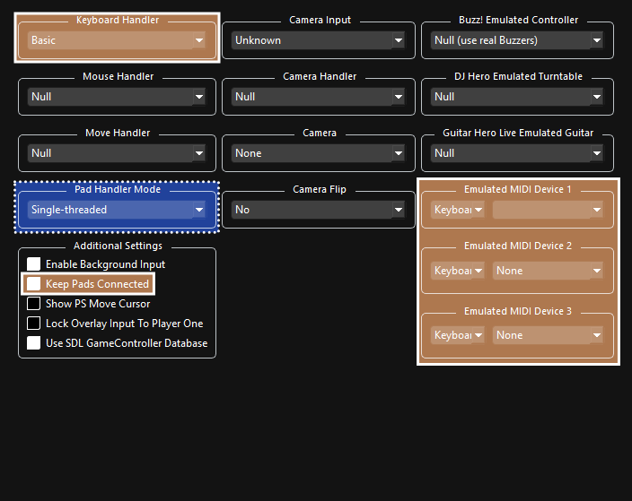

Video Version (Outdated):  
 - YouTube")

 

> * _Linux Version_ (N/A)  
> * _Mac Version_ (N/A)  
> * [_Versión en español_(WIP)](https://github.com/carlmylo/rb3-pc/tree/espa%C3%B1ol-win#readme)  

>##### WARNING:
_This tutorial will **not** provide you with a download to the game or DLC. None of the Discord servers listed will provide you with them, either. Make a backup of your own copy or Google for help. **Piracy is illegal and attracts Tim Sweeney's lawyers**._
 

1. [_Requirements_](#requirements)
2. [_Installation_](#installation)
3. [_Configuration_](#configuration)
4. [_Controllers (RB/GH Guitars, Drums, and Gamepads)_](#controllers)
5. [_User Account_](#user-account)
6. [_RPCN_](#rpcn-account)
7. [_Quick Configuration_](#quick-configuration)
8. [_Custom Configuration_](#custom-configuration)
9. [_CPU_](#cpu)
10. [_GPU_](#gpu)
11. [_Audio_](#audio)
12. [_I/O (Wired Pro Guitars and USB/MIDI Keyboards)_](#io)
13. [_Network_](#network)
14. [_Advanced_](#advanced)
15. [_Emulator_](#emulator)
16. [_Wireless PS3 Mustang Pro Guitars and Keyboards with Dongles_](#wireless-ps3-mustang-pro-guitar-and-ps3-rock-band-3-keyboard-with-dongle)
17. [_Troubleshooting_](#troubleshooting)
18. [_Conclusion_](#conclusion)

 

# REQUIREMENTS:

You will need:
* _A ripped copy of Rock Band 3 for the PS3. (BLUS-30463 is strongly suggested)_
* _An instrument controller. You can use:_
	*   _Any Rock Band and Guitar Hero Guitar (PS3, PS4, Wii, X360)_
	*   _Any Rock Band and Guitar Hero Drums (PS3, PS4, Wii, X360)_
	*   _Rock Band 3 MIDI Pro Adapter and a compatible instrument (PS3 version only)_a
	*   _Rock Band 3 Keyboard (PS3 version via dongle only)_a b
	*   _Rock Band 3 Fender Mustang PRO-Guitars \[**Wireless**\] (PS3 version via dongle only)_a
	*   _Rock Band 3 Fender Mustang PRO-Guitars \[**Wired**\] (PS3, Wii, X360 via MIDI to USB adapter)_
	*   _Rock Band 3 Squier Stratocaster PRO-Guitars (PS3, Wii, X360 via via MIDI to USB adapter)_
	*   _Any MIDI Keyboards (**37 keys minimum** via USB or MIDI to USB adapter)_b c
	*   _MIDI Drumkits (via USB or MIDI to USB adapter with MidiDrumHero and VJoy)_d
	*   _Microphones (game can be controlled with most game controllers or typing keyboard when playing as a vocalist)_
*   _A computer_
	* Minimum:
		* OS: Windows 10
		* Processor: Intel Core i5-4460 (or equivalent CPU with a CPUMark score of 4872 and AVX2)
		* Memory: 8 GBs
		* Graphics: GeForce GT 730 2GB
 		* Storage: 11.2 GBs (5400 RPM HDD)
   		* Notes: The absolute lowest one can realistically play this game on. Low quality 720p with no post-processing, 130ms audio latency, 60Hz with occasional performance drops
	* Recommended
		* OS: Windows 10
		* Processor: AMD Ryzen 5 2600
		* Memory: 16 GBs
		* Graphics: NVIDIA GeForce GTX 1650
 		* Storage: 145.66 GBs for **all** officially released content dating from RB1 to RB3, including DLC, RBN, and exports (SSD)
 		* Notes: Great performance with ample headroom for multitasking. 1080p with full post-processing, 100ms audio (or lower), 75Hz.
	* You can check [RPCS3’s page for suggested specifications here](https://rpcs3.net/quickstart) although they may be a bit inflated for this game.
*   _[7zip](https://www.7-zip.org/download.html) (or WinRAR if you hate yourself)_

a Wii Rock Band instrument controllers and dongles can be converted for PS3, but this is beyond the scope of this tutorial. Google is your friend.  
b Connecting keyboards via MIDI with less than 37 keys is possible but not ideal so are therefore exempt from this tutorial.  
c Certain MIDI keyboards, notably Yamaha ones, may exhibit problems due to their MIDI implementation. [These keyboards require the latest version of RPCS3](https://rpcs3.net/download).  
d I don’t have a MIDI Drumkit so there is no set up tutorial for this. Apologies. If you have one and would like to help by sending in screenshots of the setup process, please contact me on the Milohax Discord.

 

# INSTALLATION:

We’ll be downloading an older version of RPCS3 as it performs better at the moment. Although this guide is Windows-centric, I have linked Linux just in case you want to try it on Linux based operating systems. For those curious (nerds), this is the last RPCS3 build before the QT6 merge which has various problems.c  
c Certain MIDI keyboards, notably Yamaha ones, may exhibit problems due to their MIDI implementation. [These keyboards require the latest version of RPCS3](https://rpcs3.net/download).  

|  |  |
|---|---|

**Once it downloads, extract the .7zip file.**  

I would strongly suggest extracting the files into “C:\\Games\\RPCS3” or a separate internal drive to avoid  permissions issues. I'd also untick the box that will create a sub-directory as shown highlighted in the picture. Avoid installing and running from an external drive as it can cause massive issues.  

Once that’s extracted, [**download the PlayStation 3 system software from Sony’s website**](https://www.playstation.com/en-us/support/hardware/ps3/system-software/). **Scroll down** until you get to “**Update using a computer**”, **click that** to expand, then **click on “Download PS3 Update.**”  
  
_**If you’re on a Chromium based browser like Chrome or Edge, MAKE SURE YOU RIGHT CLICK AND “Save link as”, or it MAY become stuck.**_

Once again, the picture below links to the download page.

Now **open up RPCS3**, and **drag** the **PS3UPDAT.PUP** you just downloaded from Sony’s website **into RPCS3** **then click Yes**.  

**Let it install.**  

**When it finishes, click OK**  

It will start compiling modules, which may take a few minutes. **Let it do its thing.**  

Next, **go to the folder where you have your copy of Rock Band 3 stored and drag the folder into RPCS3**. Keep this folder somewhere you won't accidentally delete it as you need it. Again, you're on your own when it comes to finding a copy. [I used “PS3 Disc Dumper” for this because it’s the easiest way.](https://youtu.be/mRxSKxoYt_g)

Rock Band 3 is now in your game library in RPCS3, however it’s out of date. Let’s fix that. **You will need to download the update PKG file** which is linked below. This directly links to the same Sony servers the PS3 downloads from. You may get security warnings as said server lacks HTTPS.  
[\[CLICK HERE TO DOWNLOAD ROCK BAND 3 UPDATE PKG\]](http://b0.ww.np.dl.playstation.net/tppkg/np/BLUS30463/BLUS30463_T4/e52d21c696ed0fcf/UP8802-BLUS30463_00-ROCKBAND3PATCH05-A0105-V0100-PE.pkg)

The filename will look something like this:

When it's finished downloading, **drag the update file into RPCS3 and click Yes**, just like you did earlier with the PS3UPDAT.PUP file.  

 

# CONFIGURATION:

*IF YOU HAVE CHANGED SETTINGS FOR RPCS3, SET THEM BACK TO DEFAULT FOR ROCK BAND 3 BEFORE FOLLOWING THIS TUTORIAL!*

 

## CONTROLLERS:

**This is for standard (five fret guitars, RB/GH drums) controllers.**  
Pro Guitars, or Keyboards are set up later.

Right click “Rock Band 3” and click on **“Create Custom Gamepad Configuration”**

* If you are planning on plugging in multiple instruments, _you must set them on different ports_.
* Standard PS3 guitar and drum controllers _should_ be plug and play. If, for some reason, they’re not, you will need to bind them as detailed below. 
* If you’re using PS3, PS4, Wii guitar and drums, or Xbox 360 drum controllers, set the “Handlers” option to “MMJoyStick.” 
* If you’re using Xbox 360 guitar controllers, set the “Handlers” option to “XInput”

Below are the buttons you should map in RPCS3’s Gamepad Settings. **[\[You can also check RPCS3’s website for reference as well\]](https://wiki.rpcs3.net/index.php?title=Help:Peripherals_and_accessories#Configuring_Instruments).**

**If your controller isn’t being detected, hit “Refresh”. If that doesn’t solve it, restart RPCS3.**

When you’re finished, **remember to click “Save”.**

  
**Guitar**:  
Make sure you **set “Device Class” to “Guitar”.**

Switch the dropdown menu next to it to"Rock Band" if you’re using a Rock Band guitar or leave it on “Guitar Hero” if you’re using a Guitar Hero guitar.  
**Some guitar controllers** (most notably Guitar Hero controllers) **misbehave and refuse to map** sometimes. If you try mapping a button and get “U+”, try pressing “**Filter Noise**” the bottom left of the controller configuration.

| **RPCS3**          | **Rock Band Guitars** | **Guitar Hero Guitars** |
|:------------------:|:---------------------:|:-----------------------:|
| Cross |  |  |
| Circle |  |  |
| Square |  |  |
| Triangle |  |  |
| L1 |  |  |
| D-Pad: Up |  |  |
| D-Pad: Down |  |  |
| Right Stick: Left/Right |  |  |
| Right Stick: Up/Down (PS3/PS4/Wii guitars only) |  | |
| L2 (Xbox 360 guitars only) |  | |
| R1 |  | Does not work |

**Drums**:

Make sure you **set “Device Class” to “Drum”.**

Switch the dropdown menu next to it to"Rock Band" if you’re using Rock Band drums, “Rock Band Pro” if you’re using Rock Band Drums with Pro expansions, or leave it on “Guitar Hero” if you’re using Guitar Hero drums.

| **RPCS3**    | **Rock Band Drums** | **Rock Band Pro Drums** | **Guitar Hero Drums** |
|:--------:|:---------------:|:-------------------:|:-----------------:|
| Cross |  |  |  |
| Circle |  |  |  |
| Square |  |  |  |
| Triangle |  |  |  |
| L1 |  |  |  |
| D-Pad |  |  |  |
| R1 |  |  |  |
| R3 |  | Cymbal Modifier | |
| L3 |  | Pad Modifier | |

**Vocals**:  
Vocals use regular controllers. If you're using a PS4 controller, switch to DS4. If you're using an Xbox One controller, switch to XInput. You don't have to remap anything. You can also use a typing keyboard and use this guide as reference to change the mapping to your liking.

| **PlayStation (DS4)** | **Xbox One (XInput)** | **Use**                         | **Alt Use**         |
|:---------------------:|:---------------------:|:-------------------------------:|:-------------------:|
|  |  | Navigation |
|  |  | Navigation |
|  |  | Select                          |
|  |  | Back                            | Mic 3 Volume (Song) |
|  |  | Mic 1 Volume (Song) |
|  |  | View More Info (Library)        | Mic 2 Volume (Song) |
|  |  | Options                         | Pause (Song)        |
|  |  | Filters (Library)               | Overdrive (Song)    |
|  |  | Guide Part Selection (Practice) |
|  |  | Vocal Part Selection (Practice) |
|  |  | Vocal Track Volume (Song)       |
|  |  | Pitch Correction (Song)         |

  

As an example, here’s what a _Wii The Beatles: Rock Band Hofner_ controller looks like when it’s set up. Note the "Handlers" being set to "MMJoystick" and "Devices" being set to the correct Joystick number. Also note that, since it's a Rock Band guitar controler, "Device Class" is set to 'Guitar" and the box next to that is set to "Rock Band".

 

## USER ACCOUNT:
In RPCS3, go to **Manage > User Accounts**  

Once you’re there, click on the default username (00000001 - User) and then click **“Rename user”** and change it to whatever you want, then close it out.  

 

## RPCN ACCOUNT

If you don’t want to play online, [you can skip this part.](#custom-configuration)

Go to **Configuration > RPCN**

Click on “**Account**”:  

Click “**Create Account**”:  

Enter a **username** and **password**:  
  
  

You will be prompted for an **email address** so you can receive a **verification token**:  
  

**Click “Yes”** and go to your email inbox. You may have to wait a few minutes to get it. If you’re still waiting, check your spam inbox. The email will be called **“Your token for RPCN.” Copy the token**:

**Paste the token** into RPCS3 and click OK:  

 

# QUICK CONFIGURATION:
These are meant for users that quickly want to just start playing with minimal setup. It is still strongly suggested that you do [[custom configuration]](https://github.com/carlmylo/rb3-pc/tree/english-win#custom-configuration) to tweak to your computer's optimal settings.  
You *MUST* have [[Rock Band 3 Deluxe installed]](https://github.com/hmxmilohax/rock-band-3-deluxe#-installing-on-rpcs3) otherwise these will not work to their full potential.  

To use these, click on the settings you want to download then extract the ZIP archives in the folder where you extracted RPCS3. It should combine folders automatically if you did it right.  
Players who want to use [[microphones]](https://github.com/carlmylo/rb3-pc/tree/english-win#audio), on [[Wired Pro Guitar and USB/MIDI Keyboards]](https://github.com/carlmylo/rb3-pc/tree/english-win#audio), or with [[wireless RB3 Mustang or RB3 keyboard controllers]](https://github.com/carlmylo/rb3-pc/tree/english-win#audio) will still need to do configure those.

* [[Recommended settings]](https://github.com/carlmylo/rb3-pc/raw/english-win/config/customconfig/recommended.zip) - These are the settings used for the recommended specs listed in [requirements](#requirements).
* [[Minimum settings]](https://github.com/carlmylo/rb3-pc/raw/english-win/config/customconfig/minimum.zip) - These are the settings used for the minimum specs listed in [requirements](#requirements).

For more info on these settings, [[check the readme for the settings repository]](https://github.com/carlmylo/rb3-pc/tree/english-win/config/customconfig#about).

 

# CUSTOM CONFIGURATION:

**Right click on Rock Band 3** in RPCS3, then click on “**Create Custom Configuration**”  

This may seem overwhelming due to the sheer number of options but I have color coded stuff that will need adjustment. Everything not colored should be on default options and left alone.

| COLOR | MEANING |
|---|---|
|  | *REQUIRED* |
|  | Low performance tweaks |
|  | Adjust depending on PC, or leave it alone |
|  | Optional |

We’ll go tab by tab, starting with:

 

## CPU

*  **For low end CPUs** (older 4 core/4 threads chips): 
	* **Change "SPU Block Size" to "Mega"** - Ties smaller SPU compiled together, which requires less cores/threads.
	* **Change "Preferred SPU Threads" to "1"** - Limiting to 1 thread helps prevent stutter caused by CPU overloads.
	* **AS A LAST RESORT** **"SPU XFloat Accuracy" to "Relaxed"** - Changing this will gain a few frames but **will break practice mode!**

 

## GPU

*  REQUIRED: 
	* **Enable "Write Color Buffers"** - Fixes 99% of the issues with characters having glitched textures.
*  For low end GPUs: 
	* Change "ZCULL Accuracy" to "Relaxed" - Slight performance improvement which may cause graphical anomalies.
*  Tweak depending on computer: 
	* Change "Frame Limit" to "Off" to use enable uncapped framerate (may introduce jitter), set to 60 if you want a locked 60 FPS framerate (redundant with 60 Hz Vblank). **It is suggested to use your graphics card's driver settings for frame rate capping, or software like MSI Afterburner.**
	* Adjust "Shader Quality" depending on your system. Low and Medium will drastically reduce quality, Auto will use suggested RPCS3's setting, and High is the best option. Ultra looks similar to high.
	* Adjust "Resolution Scale" to taste. Lower for a performance gains at a drastic cost in quality. Increase for sharper graphics.
	* Adjust "Resolution Scale Threshold" depending on "Resolution Scale" above. Set the number to whatever percent you increased your resolution (i.e. for 1920x1080, which is 150%, you'd calculate what 150% of 16 is, which would be 24.
*  OPTIONAL: 
	* Enable "VSync" - Reduces screen tearing and may lead to a more stable framerate. Increases latency slightly.

 

## Audio

*  REQUIRED: 
	* **Enable "Enable Buffering"** - Absolutely required by Rock Band 3. It should be enabled by default but if it's disabled, reenable it.
*  For Windows users: 
	* **Change "Audio Out" to XAudio2"** - Can help with with latency.
*  Tweak depending on computer: 
	* Adjust "Audio Buffer Duration" depending on system. **Lower values mean less latency but more CPU** required to keep stable audio. **Higher values mean more stable audio due to less CPU stress**. This can be changed while the game is running but **will require re-calibrating** in Rock Band 3's system settings.
*  For Vocalists: 
	* Select an input device in "Mic1", "Mic2", and "Mic3" for vocals. If not playing vocals, they will be used for voice chat.

 

## I/O
This section is **for people playing with a Keyboard or a Pro Guitar**
* **If you’re not playing with a wired Pro Guitar or a USB/MIDI keyboard,** [**skip** over **this section**.](#network)  
* **If you’re playing with a PS3 Rock Band 3 Keyboard or wireless PS3 Mustang Pro Guitar,** [**skip** over **this section**.](#network)  

**If your keyboard has a USB port**, all you need to do is **plug it into your computer**.  
  

**If your keyboard only has a MIDI output**, you will need **a MIDI to USB interface**.
  

**The same applies to Rock Band 3 Pro Guitars** as they only have MIDI outputs.
  

Here’s an example of a MIDI to USB interface. Most will come with a indicator LED to show activity. To check that you plugged it in correctly, **you should see “MIDI In” blinking when you press a key**.  
  

Do note that **some audio interfaces have MIDI inputs**, so if you have one, you may already have a way to plug in MIDI to your computer. For example, this Scarlett has MIDI connections in the back.  
>  

**If everything's connected**, let's go ahead and **focus on RPCS3's I/O tab.**  

* : 
	* 🎹 Keyboard Players: **Leave your "Emulated MIDI type" on "Keyboard" and select your your keyboard in the drop down menu next to it, or MIDI interface, depending on your connection**.
	* 🎸 Pro Guitar Players: **Change your "Emulated MIDI type" from "Keyboard" to "Guitar (17 Frets)" if you have a Mustang Pro Guitar, or "Guitar (22 Frets)" if you have a Squier Pro Guitar, then set your MIDI interface in the drop down menu next to it, or MIDI interface, depending on your connection**.
  
 **If your instrument isn’t detected in the drop down menu, save your configuration so far and restart RPCS3.**  
  
As **keyboards don’t have PS3 buttons, the first octave is** reserved **for mapped keys**. Use this picture as reference. I **strongly** suggest putting artist tape, masking tape, or painter’s tape on your keyboard and drawing the buttons for reference.
  

 

## NETWORK

*  REQUIRED: 
	* **Change the Network Status to “Connected” as highlighted in the picture. If left on “Disconnected”, the game will freeze temporarily when browsing the song library.**
*  For online multiplayer: 
	* Enable **"Enable UPNP"** or **forward port 9103 (UDP) in your firewall. Don’t enable UPNP while port forwarding** as this can cause crashes.
	* **Join the \[[RBEnhanced Discord server](https://discord.gg/6rRUWXPYwb)\]** and **go to** the **[\[#gocentral-connecting\]](https://discord.com/channels/953085263008129064/1076031372185042984)** channel. **Follow the instructions for RPCS3**. Although the picture above includes details, this is subject to change, and you should **always refer to the \[[RBEnhanced Discord](https://discord.gg/6rRUWXPYwb)\] for** this **information**. While you’re there, you can also organize sessions with other players.  

 

## ADVANCED

* : 
	* **Change "Exclusive Fullscreen Mode" to "Prefer borderless fullscreen"** to prevent potential crashes and desync when changing program focus constantly.
	* Change "Driver Wake-up Delay" to "20µ" if you experience rare freezing after a few songs. Increase to "40µ" if it still happens.
* : 
	* Adjust VBlank Frequency if you want a higher internal framerate. This can make it easier to hit notes, but can cause graphical instability and connection issues while online. It's best left alone.

 

## EMULATOR

You can leave this as is if you want, but I would consider changing the following options:
*  Optional tweaks: 
	* “Show trophy popups” - Mimics the way Trophy notifications appeared on the PS3. I personally disable this as the game has its own pop-ups.
	* “Show PPU compilation hint” - This creates a popup whenever RPCS3 is compiling units for the PPU. This only comes up once as "Recompiler (LLVM)" in the CPU tab does this when launching the game.
	* “Show shader compilation hint” - This creates a popup whenever RPCS3 is compiling shaders. Whether you leave it on or not is up to you, but I should tell you what this means as it is important. When you run PS3 games, it has to compile shaders to “translate” the graphics from a PS3 format to a format your PC can work with. **The game will** appear to **stutter when this happens**. **This happens on ALL computer systems. When it finishes** compiling an effect, **it will usually never happen again**. **The** **best way to deal with this is** just **to** **play the game** as it will quickly go away.
	* “Start games in Fullscreen mode” - Obviously just switches to Fullscreen when you start Rock Band 3. I personally enable this.  
	* “Use Native Interface” - Disabling this will remove RPCS3 notifications entirely while the game is launched.
    

That's the difficult part over with.

 

# Wireless PS3 Mustang Pro Guitar and PS3 Rock Band 3 Keyboard with dongle

If you’re not playing with a PS3 Mustang Pro Guitar and PS3 Keyboard with their respective dongles, [skip over this section.](#troubleshooting)

To start with, **close out RPCS3** **and plug in the instrument’s dongle** to your computer.

Now, [**\[go to Zadig’s website\]**](https://zadig.akeo.ie/) and **download the latest version.** **Open it** up.

Click on **Options** then **List All Devices**  

You should now see devices listed. **Switch it to your Rock Band 3 Pro Instrument**. In this example, we’re using the Mustang Pro Guitar, which shows up as “Harmonix RB3 Mustang Guitar for PlayStation® 3”.  

After selecting the right device, you should see the option to replace the driver. **MAKE SURE YOU ARE REPLACING THE DRIVER ONLY FOR THE PRO GUITAR/KEYBOARD.** Click Replace Driver.  

A warning will appear. **Again, make sure you have selected your RB3 Pro Guitar or keyboard instrument.** After you have made sure, click “**Yes**”  

It will then install the driver. As the program says, it may take a few minutes.  

If everything goes well, you will get this message:  

**Close Zadig** and, **with the dongle** still **connected**, **open up RPCS3** and **open Rock Band 3**.

Turn your controller on and you should see it automatically assign a player number.  

Likewise, in Rock Band 3, you will see the instrument ready to join.  

 

## TROUBLESHOOTING

*   **_Stuttering Audio_**

	* 
	* Increase “Audio Buffer Duration” as mentioned in [the Audio tab of Rock Band 3’s Custom Configuration](#audio) until the stuttering stops. 100 ms is a great starting point for low end computers.

*   **_General performance issues_**
	*   Go back to the [Custom Configuration setup section](#configuration) and apply suggested low performance tweaks.
	*   Install [RB3 Deluxe](https://github.com/hmxmilohax/rock-band-3-deluxe/tree/main#playstation-3) and disable Post Effects in Deluxe Settings.

*   **_Game doesn’t fill the_** **_screen_**
	*   Enable Overscan in Rock Band 3’s System Settings.

*   **_Game is delayed_**
	*   Run Calibration in Rock Band 3’s System Settings if you haven’t for some reason. Disable “Dolby Digital” if you enabled it in the same menu.

*   **_Cannot use Automatic Calibration in System Settings_**
	*   Automatic Calibration only works for PS3 guitar controllers via passthrough.

*   **_Game gets stuck when naming a character_**
	*   This is an RPCS3 issue. You can fix it by changing the effects switch on a RB guitar controller. Otherwise, changing your controller’s Input Handler in “[Create Custom Gamepad Configuration](#controllers)” to “Keyboard” then back to whatever you had originally fixes it. This should work while the game is running.

*   **_Characters have flying instruments and accessories_**
	*   There is currently no fix for this. If you experience this, [please report your findings on RPCS3’s Github.](https://github.com/RPCS3/rpcs3/issues/8408)

*   **_Scrolling through library has long pauses_**
	*   You forgot to set the “Network Status” to “Connected” in the [Network tab when setting up the Custom Configuration](#network) for Rock Band 3.

*   **_My PS3 instrument controller shows up as two_**
	*   You did [controller configuration](#controllers) for a PS3 controller, which usually isn’t needed due to passthrough. Just unbind the controller and it should be fine.
	
*   **_[Pro Drums] Hitting two cymbals registers as a tom_**
	*   This is an infamous Rock Band 3 bug called the "double cymbal glitch" I sadly do not know the solution as I don't play drums. Please feel free to ask around in the Milohax Discord server.

*   **_\[ONLINE\] Cannot find a 3rd or 4th player_**
	*   In Rock Band 3’s Custom Configuration, [go to the network tab](#network) and make sure “Enable UPNP” is enabled. If for some reason you can’t do UPNP, you will need to forward port 9103 (UDP) in your firewall. **Don’t enable UPNP while port forwarding** as this can cause crashes.

*   **_\[ONLINE\] Stuck on “Registering Account” when trying to connect to GoCentral_**
	*   You may have lost connection to RPCN or GoCentral and will have to restart the game. If you continue to get this after restart, go to the top menu in RPCS3, “Configuration” > “RPCN” > “Account” > “Test Account” then restart the game to force a reconnection.

*   **_“I followed every step and my game is still crashing”_**
	*   Double check to make sure you have followed every step correctly. This guide has been tested and has been proven to work for plenty of people with varying degrees of hardware. If you are absolutely sure you followed every step correctly, it is 90% likely that the dump of the game you have is bad, and 9% chance your computer ran out of disk space, and 1% chance it’s a skill issue.

 

## CONCLUSION

That’s it! You now (hopefully) have a functional setup to play Rock Band 3 on your PC. While you’re here, why not join some communities that are helping keep the Rock Band community alive?

**Rock Band 3 Deluxe/Milohax:** 

Milohax are the developers of the must-have RB3DX mod that I cannot recommend enough. **[\[Download here.\]](https://github.com/hmxmilohax/rock-band-3-deluxe#readme)** On top of adding many of quality-of-life features like faster bootups, 60fps venues, and automatic DLC loading, **it also includes RB3\_Plus, which adds extra Pro Keys and Pro Guitar/Bass to songs that didn’t have them.** **If you have a Pro instrument, this is a must have**! On top of this, there are various visual customization options, like using themes from older (and newer) Rock Bands and even Guitar Hero. [You can **\[join the amazing Milohax Discord here\]**](https://discord.gg/xrba4CjdNC).

**RBEnhanced:**

Developers of the amazing RBEnhanced mod that currently only exists for Xbox 360 and Wii. The same developers also help run and maintain the GoCentral server that is the only way to play Rock Band 3 on PS3 online at the moment. As of writing this, there is an active offshoot that has crossplay with Wii and PS3 players. You can [**\[join RBEnhanced’s Discord here\]**](https://discord.gg/6rRUWXPYwb).

Special thanks to:

*   [Dark](https://dark.ski/), [Linos](https://www.youtube.com/@LinosMelendi), [Jnack](https://www.youtube.com/@jnackmclain), [Hughtobasic](https://www.youtube.com/@thisisRK), [ihatecompvir](https://www.youtube.com/@ihatecompvir1591), and [LysiX](https://www.youtube.com/@LysiX) for technical information regarding RPCS3 and Rock Band 3.
*   [qfoxb](https://github.com/qfoxb), [SlothDemon](https://www.youtube.com/@SlothDemon1991), [Jnack](https://www.youtube.com/@jnackmclain) (tested for nearly 20 hours via autoplay lmao), [knvtva](https://github.com/knvtva), and 1osks for reporting results.
*   RPCS3 Wiki for having pretty decent information on controllers and USB passthrough.

  
This work is licensed under a [Creative Commons Attribution-ShareAlike 4.0 International License](http://creativecommons.org/licenses/by-sa/4.0/).

