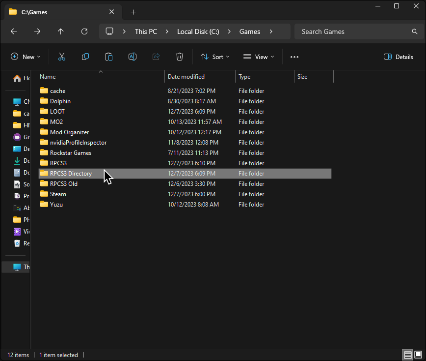
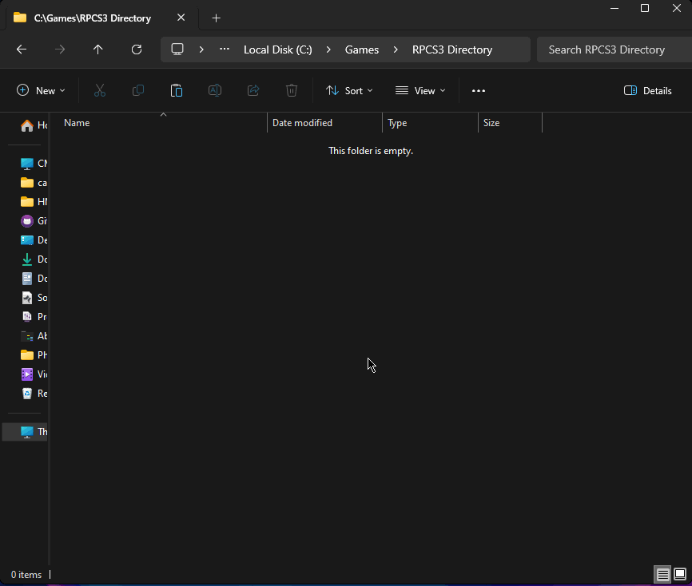
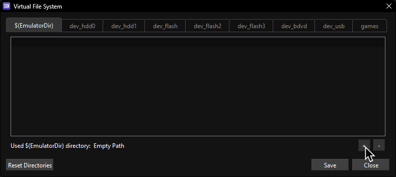
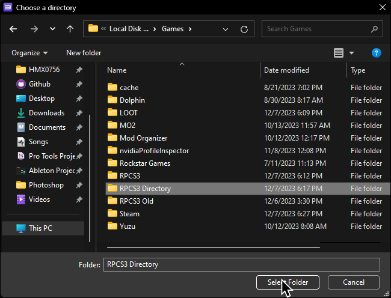
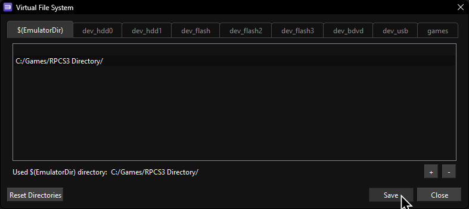

We'll be moving RPCS3's virtual file system to a separate folder to make switching between versions easier. This way, you won't have to install the same content twice.

**This is intended for advanced users.**

Make sure RPCS3 is closed before starting this.

First, create a folder where all of this stuff will be moved to.

I'll be naming the folder "RPCS3 Directory" in this tutorial.

Now, back in the folder RPCS3 is in, cut the following folders:
* dev_bdvd
* dev_flash
* dev_flash2
* dev_flash3
* dev_hdd0
* dev_hdd1
* dev_usb000
* games

Paste them inside of the folder you created.

When it finishes pasting, reopen RPCS3.

Click on Manage > Virtual File System

Then, click on the `+` symbol at the bottom.

Go to the folder you created, click on it, and then click on "Select Folder."

Finally, click "Save".

That's it!

You may have to re-add some games (by drag and dropping the folders) into RPCS3 after this but everything should work like it did before.