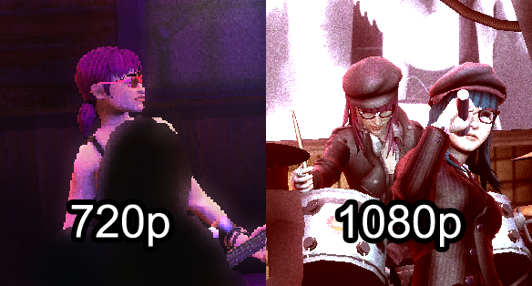
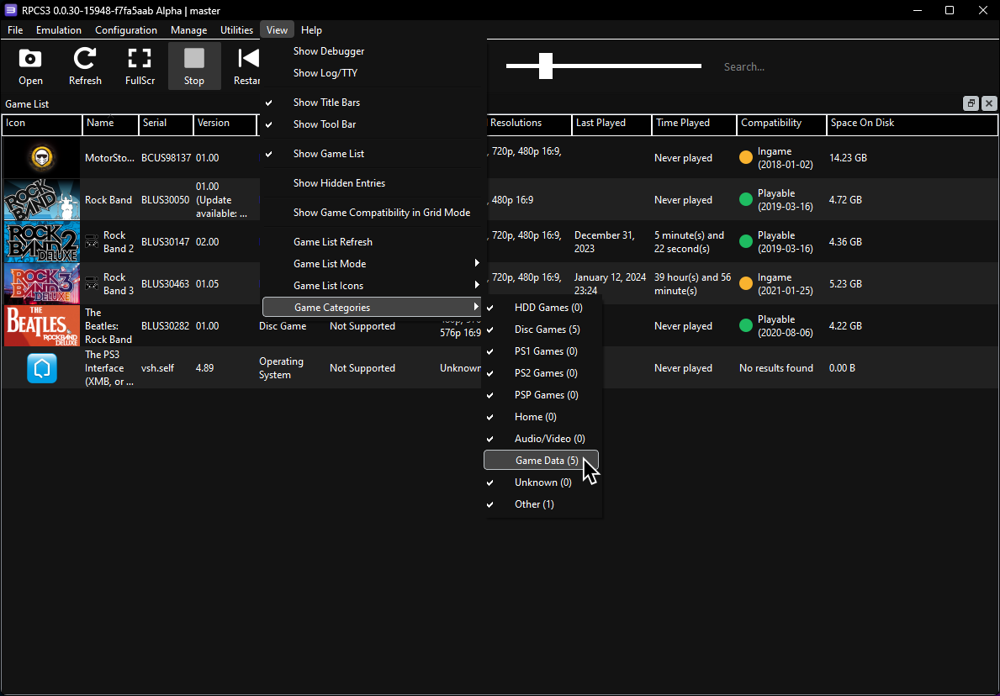
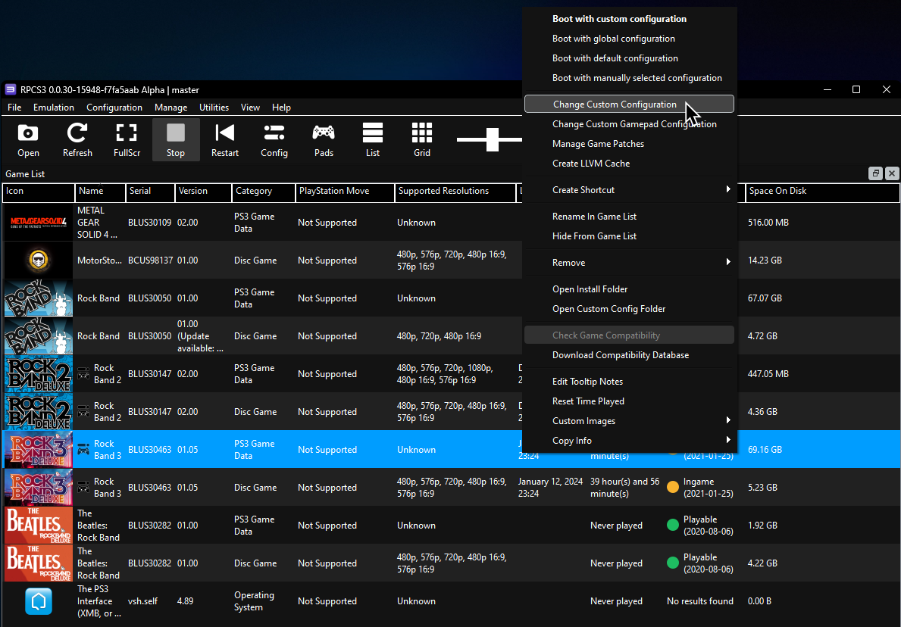
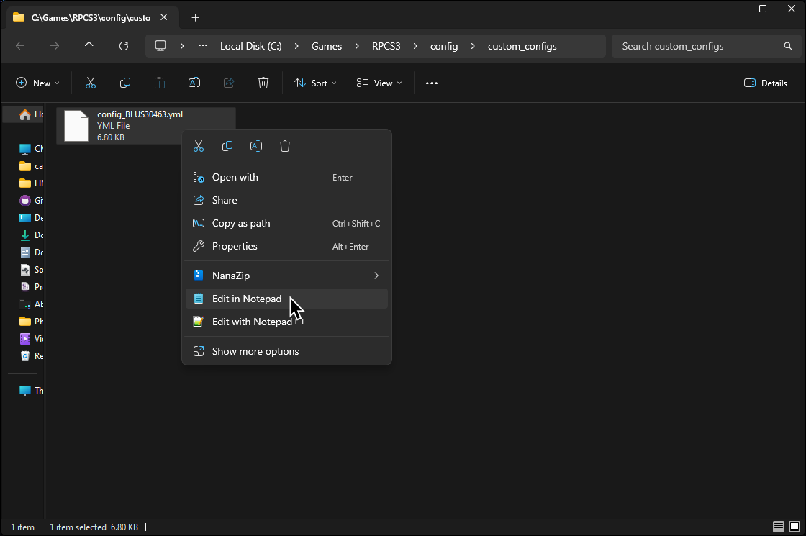
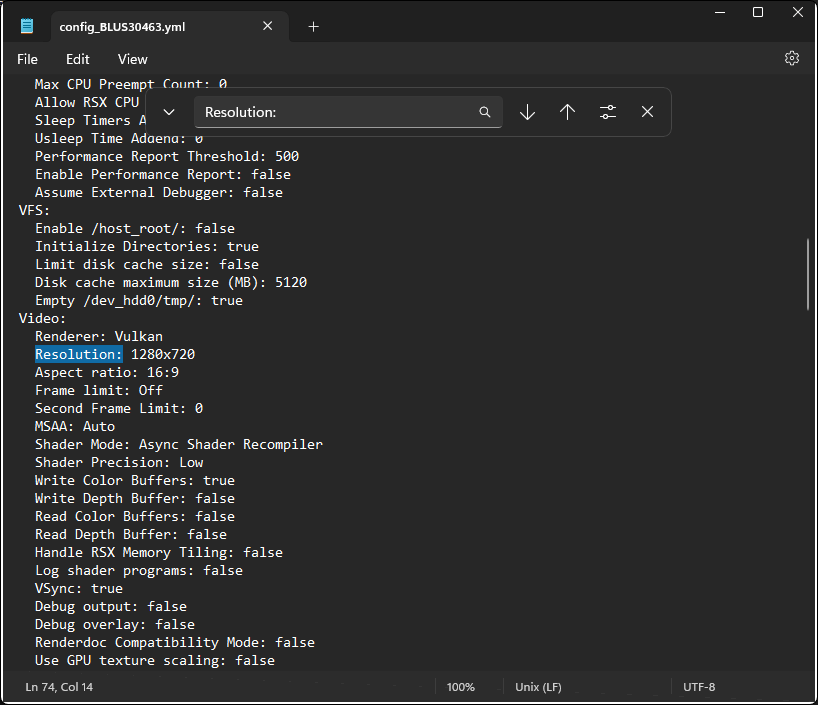
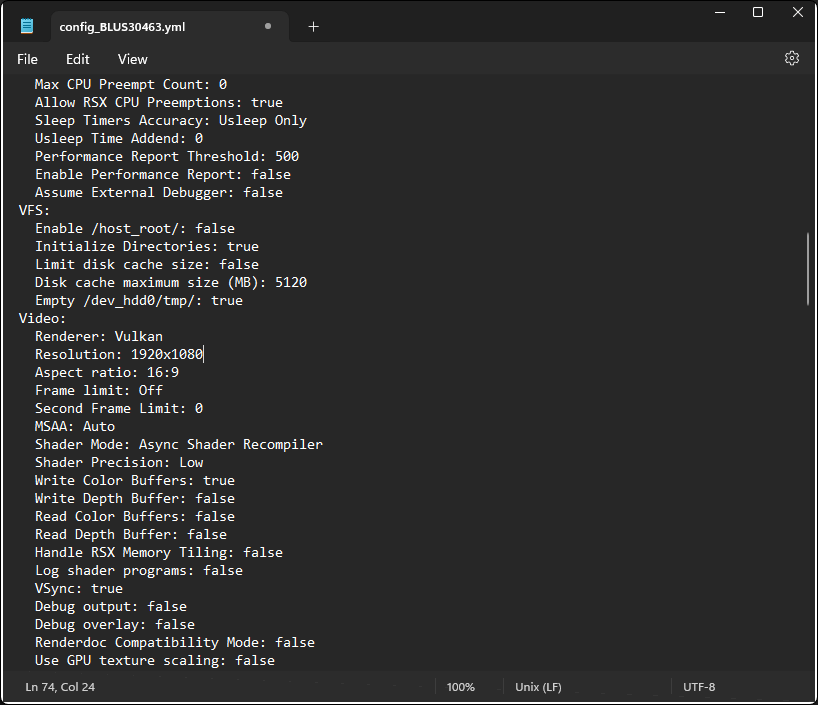

We'll be forcing Rock Band 3 to run in full HD (1920x1080). Please be aware that this requires more graphical power so if you experience degraded performance, undo these changes.

Please note that this mostly affects post processing, shadows, and aliasing with venue FPS set below 30.

Here is a comparison. Rock Band 3 was targeting 1080p with "Resolution Scale" adjusted to match.

There are two ways to do this. We'll go over the easy way first.

### The Easy Way:

Click on "View" > "Game Categories" and then enable "Game Data."

When the new entries show up, right click on Rock Band 3's Game Data entry. Notice that the "Supported Resolutions" for it are unknown, which tricks RPCS3 into letting you set a higher resolution.

In the GPU tab of the Custom Configuration Window, change "Default Resolution" to 1920x1080 then click "Apply."  

### The "Hard" Way:

In RPCS3, right click on Rock Band 3 and click on "Open Custom Config Folder."  

Now open the `config_BLUS30463.yml` file with your default text editor like Notepad, SublimeText, or Notepad++.

In your text editor, search for "`Resolution:`".  

When you find it, change "`1280x720`" to "`1920x1080`" and save the file.

### Conclusion:

That's it. Just note that any time you change anything on the GPU tab, it might reset back to 1280x720 so you'll have to do this again.