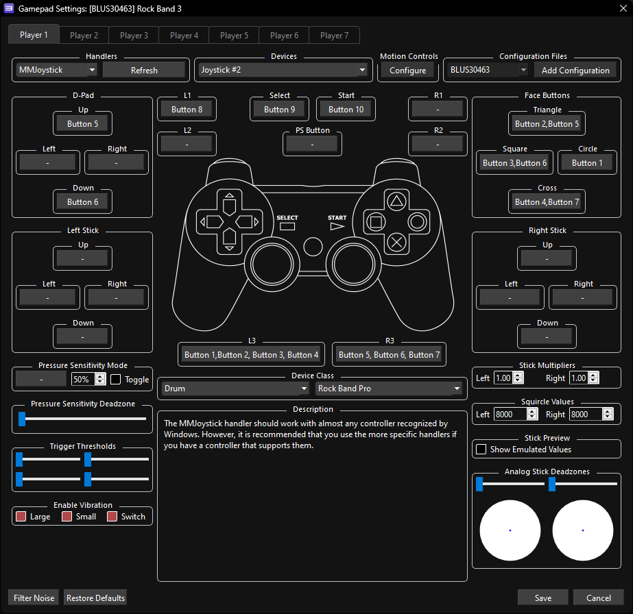

## NOTES:

* This controller requires advanced configuration.
* Requires [[vJoy]](https://github.com/jshafer817/vJoy/releases)
* Requires [[MidiDrumHero]](https://github.com/ejj28/mididrumhero/releases/latest)
* Velocity sensitivity doesn't seem to work.

#### Additional Setup:
Map your drum kit in MidiDrum Hero.

An example MidiDrumhero mapping for an Alesis Nitro Mesh on default settings:
 

In vJoy, it's sugggested to turn off all Axes **except** "X/Y/Z" and change the number of buttons to 10.
Hit "Apply" and "Reset All" when finished.
 

 

 

 

