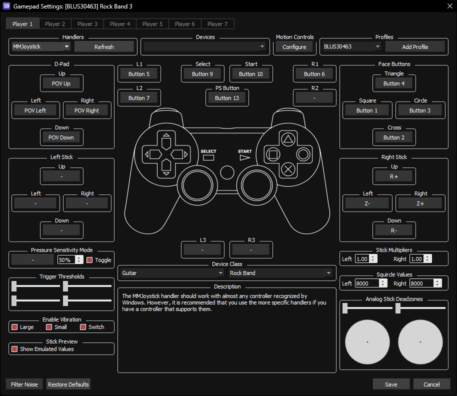

## NOTES:

* The effects switch seems to reset to the middle when it's adjusted, so you'll be locked to flanger.
	* It can be unmapped by removing the Right Stick: Up/Down mappings.

 

 

| **RPCS3**          | **Controller** |
|:------------------:|:---------------------:|
| Cross |  |
| Circle |  |
| Square |  |
| Triangle |  |
| L1 |  |
| D-Pad: Up |  |
| D-Pad: Down |  |
| D-Pad: Left |  |
| D-Pad: Right |  |
| Right Stick:   Left/Right |  |
| Right Stick:   Up/Down |  |
| L2 |  | |
| R1 |  | Does not work |

 

