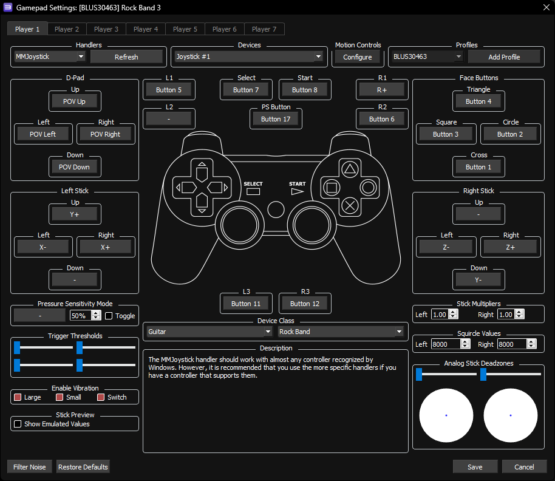

## NOTES:

* This controller requires advanced configuration.
* For the best experience:
	* 1. Go to the Start menu and look for "Set up USB game controllers," then open it.
	* 2. Right click on "Guitar Hero X-plorer"
	* 3. Go to the Settings tab.
	* 4. Hold the guitar at a 45 degree angle. This is halfway between a neck at level and full tilt.
	* 5. While holding the guitar at this angle, click "Calibrate."
	* 6. Click "Next" on the D-Pad screen with no buttons held.
	* 7. On the next screen, press the whammy all the way in then release it, then click "Next."
	* 8. On the next screen, move the guitar to full tilt position, then click "Next."

 

 

 

Mapped by [[Jnack]](https://www.youtube.com/@jnackmclain) and [[KrazzyKlown]](https://www.youtube.com/@KrazzyKlown)