Video Version (Outdated):  
 - YouTube")

 

> * [_[Versión en español]_](https://github.com/carlmylo/rb3-pc/blob/main/readme_es.md)  
> * _Linux Version_ (N/A)  
> * _Mac Version_ (N/A)  
> * _SteamDeck Version_ (N/A)  
> * [_[Older Version of the guide]_ (DO NOT USE UNLESS YOU KNOW WHAT YOU'RE DOING!)](README_EN_028.md)  

>##### WARNING:
_This tutorial will **not** provide you with a download to the game or DLC. None of the Discord servers listed will provide you with them, either. Make a backup of your own copy or Google for help. **Piracy is illegal and attracts Tim Sweeney's lawyers**._
 

1. [_[Requirements]_](#requirements)
2. [_[Installation]_](#installation)
3. [_[Configuration]_](#configuration)
4. [_[Controllers (RB/GH Guitars, Drums, and Gamepads)]_](#controllers)
5. [_[User Account]_](#user-account)
6. [_[RPCN]_](#rpcn)
7. [_[Quick Configuration]_](#quick-configuration)
8. [_[Custom Configuration]_](#custom-configuration)
9. [_[AshCentral]_](#ashcentral)
10. [_[Passthrough Devices (Wireless PS3 Mustang Pro Guitars and Keyboards with Dongles)]_](#passthrough-devices)
11. [_[Troubleshooting]_](#troubleshooting)
12. [_[Conclusion]_](#conclusion)

 

# Requirements:

You will need:
* _A copy of Rock Band 3 for the PS3 on your computer. (BLUS-30463 version)_
* _An instrument controller. You can use:_
	*   _Any Rock Band and Guitar Hero Guitar (PS3, Wii, X360)_a
	*   _Any Rock Band and Guitar Hero Drums (PS3, Wii, X360)_b
	*   _Rock Band 3 MIDI Pro Adapter and a compatible MIDI guitar, and MIDI keyboard (PS3 version only)_c
	*   _Rock Band 3 MIDI Pro Adapter and a compatible MIDI drum kit (X360, PS3)_c
	*   _Rock Band 3 Keyboard (PS3 version via dongle only)_c
	*   _Rock Band 3 Fender Mustang PRO-Guitars \[**Wireless**\] (PS3 version via dongle only)_c
	*   _Rock Band 3 Fender Mustang PRO-Guitars \[**Wired**\] (PS3, Wii, X360 via MIDI to USB adapter)_
	*   _Rock Band 3 Squier Stratocaster PRO-Guitars (PS3, Wii, X360 via MIDI to USB adapter)_
	*   _Any MIDI Keyboards (**37 keys minimum** via USB or MIDI to USB adapter)_d 
	*   _MIDI Drum Kits (via USB, Roll Limitless, or MIDI to USB adapter with MidiDrumHero and VJoy)_
	*   _Microphones (game can be controlled with most game controllers or typing keyboard when playing as a vocalist)_
*   _A computer_
	* Minimum:
		* OS: Windows 10 or higher
		* Processor: Intel Core i5-4460 (or equivalent CPU with a CPUMark score of 4872 and AVX2)
		* Memory: 8 GBs
		* Graphics: GeForce GT 730 2GB (or equivalent)
 		* Storage: ~11.2 GBs for Rock Band 3 and Rock Band 3 Deluxe. No DLC at all. (5400 RPM HDD)
   		* Notes: The absolute lowest one can realistically play this game on. Low quality 720p with no post-processing, 130 ms audio latency, 60 Hz with occasional performance drops.
	* Recommended
		* OS: Windows 10 or higher
		* Processor: AMD Ryzen 5 2600 (or equivalent)
		* Memory: 16 GBs
		* Graphics: NVIDIA GeForce GTX 1650 (or equivalent)
 		* Storage:
 			* ~146.32 GBs for **all** officially released content dating from RB1 to RB3, including DLC, RBN, and exports (SSD).
 			* ~67.4 GBs for all DLC and exports (SSD).
 		* Notes: Great performance with ample headroom for multitasking while playing. 1080p with full post-processing, 100 ms audio (or lower), 75 Hz.
	* You can check [[RPCS3's page for suggested specifications here]](https://rpcs3.net/quickstart) although they may be a bit inflated for this game.
*   _[[7-Zip]](https://www.7-zip.org/download.html) (or WinRAR if you hate yourself)_

a PS4 guitars are exempt as RPCS3 cannot input whammy, tilt, and effects switch signals and latency is horrible. Xbox One guitars are exempt as they require multiple separate programs to work.  
b PS4 drum kits are exempt as RPCS3 cannot input Pro Cymbals signals and latency is horrible. Xbox One drum kits are exempt as they require multiple separate programs to work.  
c Wii Rock Band instrument controllers and dongles can be (permanently) converted for PS3 so you can use passthrough mode, but this is beyond the scope of this tutorial. Google is your friend.  
d Connecting keyboards via MIDI with less than 37 keys is possible but not ideal so they're exempt from this tutorial.  
  

 

# Installation:

Before starting the installation process, **make sure your drivers and operating system are up to date**.

**Let's start by downloading 7-Zip**, which will open the compressed .7z archives most of these downloads will be stored inside of. **If you already have 7-Zip** or an alternative installed, you can **skip to the next steps.**

[**[Click here to go to 7-Zip's download page]**](https://www.7-zip.org/download.html).

**Now**, **let's** go ahead and **install Microsoft Visual C++ 2019 Redistributable**, which is required by RPCS3. You probably already have this, but it doesn't hurt to double check.

[**[Click here to download Microsoft Visual C++ 2019 Redistributable]**](https://aka.ms/vs/17/release/vc_redist.x64.exe)

**Once it finishes downloading**, open it up and **install it**.  

[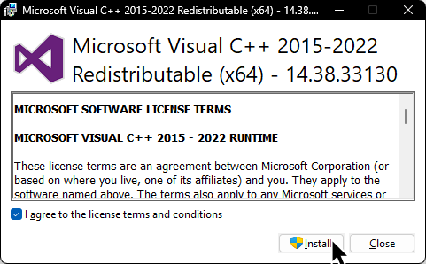](https://aka.ms/vs/17/release/vc_redist.x64.exe "Microsoft Visual C++ 2015-22 Redistributable (x64) 14.3833130")

**Next**, let's **download RPCS3**.

[**[Click here to go to RPCS3's download site]**](https://rpcs3.net/download).

Scroll down a bit and download the Windows version.

**Once it downloads, extract the .7zip file.**  

I would strongly suggest extracting the files into “C:\\Games\\RPCS3” or a separate internal drive to avoid permissions issues. Also, untick the box that will create a sub-directory, as shown highlighted in the picture. 

**Avoid installing to and running from an external drive**, as they typically lack the stability to work properly.  
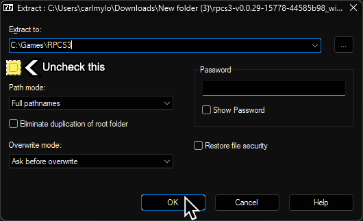

Once that's extracted, [**[download the PlayStation 3 system software from Sony's website]**](https://www.playstation.com/en-us/support/hardware/ps3/system-software/). **Scroll down** until you get **to** “**Update using a computer**”, **click that** to expand, **then click on “Download PS3 Update.**”  
  
_**If you're using a Chromium-based browser like Chrome or Edge, MAKE SURE YOU RIGHT-CLICK AND “Save link as,” or your download MAY become stuck.**_

Once again, the picture below links to the download page.

Now **open up RPCS3**. **Tick "I have read the Quickstart guide" and "Do not show again", then click "Continue."**  

**Drag** the **PS3UPDAT.PUP** file you just downloaded from Sony's website **into RPCS3**. 

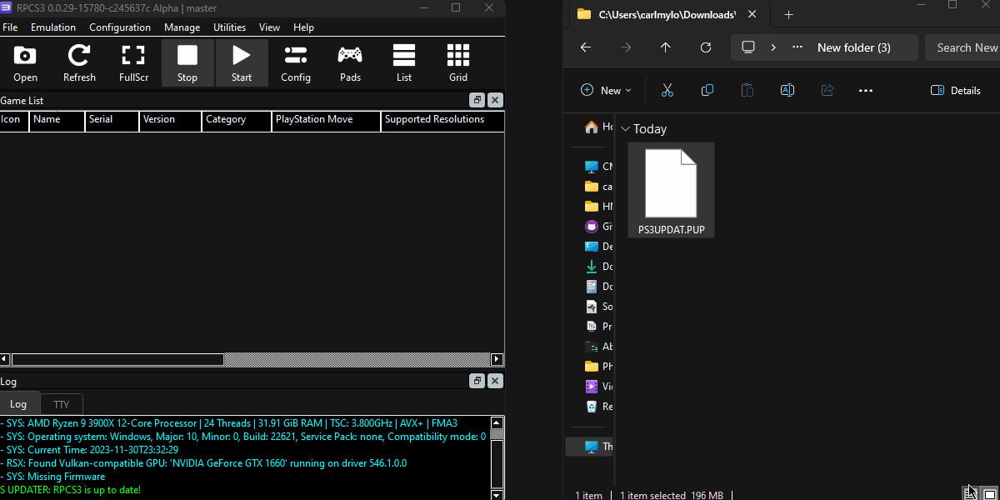

**Click "Yes"** when the firmware installer prompts you.  

**Let it install.**  

**When it finishes, click "OK."**  
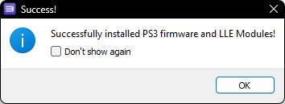

It will start compiling modules to load the PS3 XMB into the emulator, which may take a few minutes. **You can either let it do its thing or close it.**  
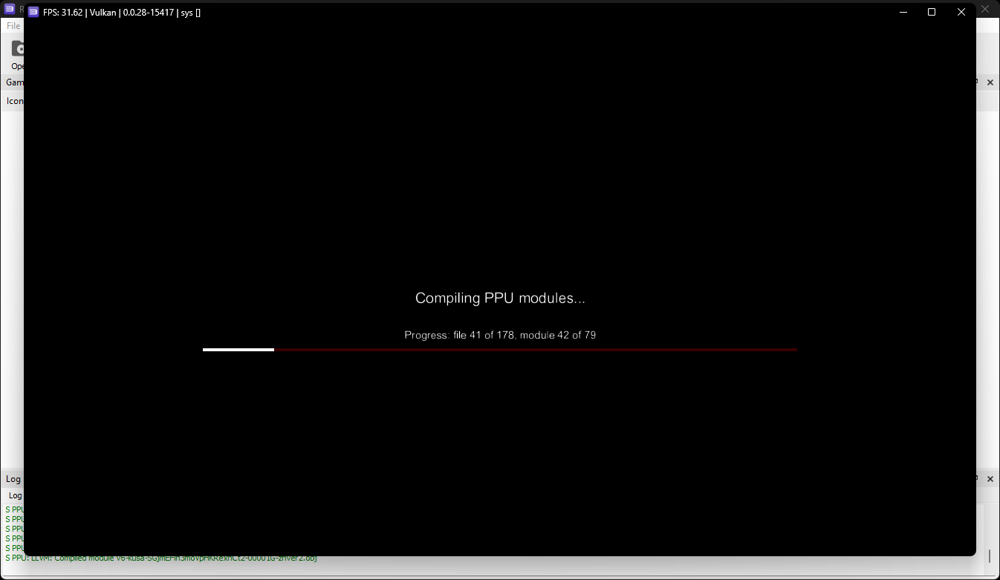

Next, **navigate to the folder where you have your copy of Rock Band 3 stored and drag the folder into RPCS3**. Keep this folder somewhere safe where you won't accidentally delete it, as you'll need it. Again, you're on your own when it comes to finding a copy. [[I used “PS3 Disc Dumper” for this because it's the easiest way]](https://youtu.be/mRxSKxoYt_g).

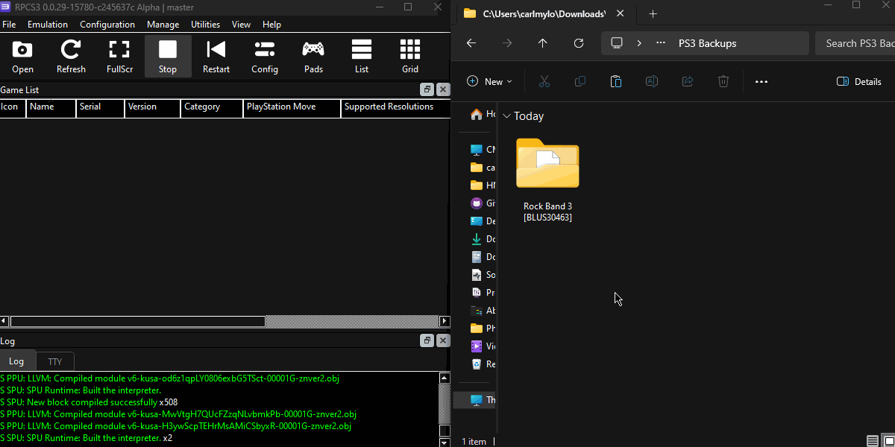

Rock Band 3 is now in your game library in RPCS3, but it's not quite ready yet. Next, go get [**[*Rock Band 3 Deluxe*]**](https://rb3dx.neocities.org/).

This is a must-have mod, which also fixes some critical bugs RPCS3 has with Rock Band 3. On top of that, it adds [**[many great features]**](https://rb3dx.neocities.org/features).

[**[Click here to download Rock Band 3 Deluxe]**](https://nightly.link/hmxmilohax/rock-band-3-deluxe/workflows/build/main/RB3DX-PS3.zip).

**When it's finished downloading, extract the archive**.  

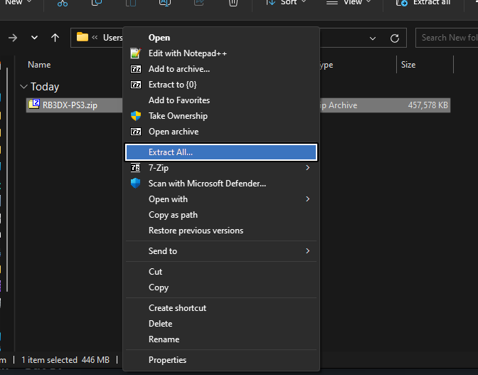

**When it finishes extracting, drag the PKG file into RPCS3 and click "Yes"** on the prompt, just like you did earlier with the PS3UPDAT.PUP file.  

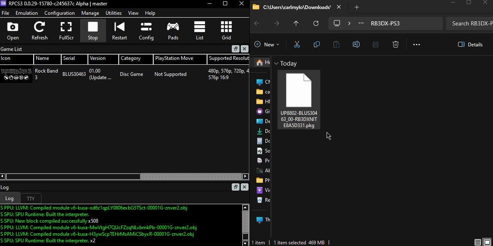

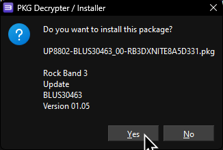

If it installed successfully, you should see that the Rock Band 3 icon has changed.

You can also rename the game in the list to "Rock Band 3 Deluxe" if you wish. To do this, right-click on "Rock Band 3" and select "Rename In Game List."

 

# Configuration:

***IF YOU HAVE CHANGED SETTINGS FOR RPCS3, SET THEM BACK TO DEFAULT BEFORE FOLLOWING THIS TUTORIAL!***

 

## Controllers:

**This section is for standard guitar controls, standard drums, and Pro Drums.**  
Pro Guitars and/or Keyboards are set up later.

If you're playing with a single instrument controller, consider the [[Instrument Repo]](instrument-repo#readme) which has easy drag and drop profiles for various rhythm game instruments.

If not, keep reading.

**Right click on “Rock Band 3” and select “Create Custom Gamepad Configuration”**

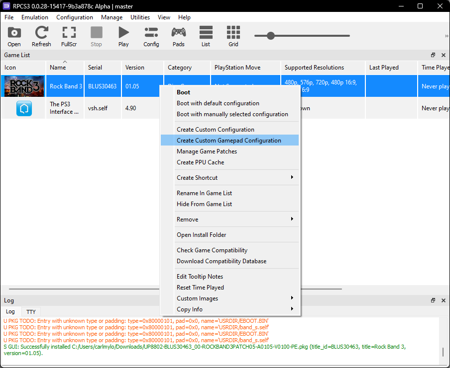

* If you are planning on plugging in multiple instruments, _you must set them on different ports_ (Player 1, Player 2, etc).
* PS3 guitar, drum controllers, and MIDI Pro Adapters for the Rock Band series are plug and play.

**If your controller isn't being detected, click “Refresh”. If that doesn't solve it, restart RPCS3.**

Once you've finished configuring, **remember to click “Save”.**

Below are the buttons you should map in RPCS3's Gamepad Settings.
  
### Guitars:

* If you're using PS3 (Guitar Hero) or Wii guitars, set the “Handlers” option to “MMJoyStick.” 
* If you're using Xbox 360 guitar controllers, set the “Handlers” option to “XInput.”

Make sure you **set “Device Class” to “Guitar”.**

**Switch the drop-down menu, next to "Device Class", to "Rock Band" if you're using a Rock Band guitar or leave it on “Guitar Hero” if you're using a Guitar Hero guitar**. 
 
**Some guitar controllers** (most notably Guitar Hero controllers) misbehave and **refuse to map sometimes. If you try mapping a button and get “U+”, click “Filter Noise"** at the bottom left of the controller configuration window **then try mapping**.

| **RPCS3**          | **Rock Band Guitars** | **Guitar Hero Guitars** |
|:------------------:|:---------------------:|:-----------------------:|
| Cross |  |  |
| Circle |  |  |
| Square |  |  |
| Triangle |  |  |
| L1 |  |  |
| D-Pad: Up |  |  |
| D-Pad: Down |  |  |
| D-Pad: Left |  |
| D-Pad: Right |  |
| Right Stick:   Left/Right   (ignore Left on RB Wii guitars on Linux) |  |  |
| Right Stick:   Up/Down   (PS3/Wii guitars only) |  | |
| L2   (Xbox 360 guitars only) |  | |
| L2   (PS3/Wii guitars only) |  | |
| L3   (Xbox 360 guitars only) |  | |
| R1 |  | Does not work |

### Drums:

Make sure you **set “Device Class” to “Drum”.**

* If you're using PS3 (Guitar Hero), Wii, or Xbox 360 drum controllers, set the “Handlers” option to “MMJoyStick.”
* If you're using a Xbox 360 MIDI Pro Adapter for drums, set the "Handlers" option to "XInput."

**Switch the drop-down menu next to it to "Rock Band Pro" if you're using Rock Band drums or Rock Band Drums with Pro expansions. Do **NOT** use the regular "Rock Band" type. Leave it on “Guitar Hero” if you're using Guitar Hero drums.**

| **RPCS3**    | **Rock Band Drums** | **Guitar Hero Drums** |
|:--------:|:-------------------:|:-----------------:|
| Cross |  |  |
| Circle |  |  |
| Square |  |  |
| Triangle |  |  |
| L1 |  |  |
| D-Pad |  |  |
| R1 |  |  |
| R3 | Cymbal Modifier | |
| L3 | Pad Modifier | |

### Vocals: 

*For vocals*, you can *use regular controllers*. If you're using a PS3 controller, switch "Handlers" to DS4. If you're using a PS4 controller, switch "Handlers" to DS4. If you're using an Xbox 360, Xbox One, or Xbox Series controller, switch "Handlers" to XInput. There's no need to remap anything. Alternatively, you can use a typing keyboard and refer to this guide to customize the mapping according to your preferences.

| **PlayStation (DS4)** | **Xbox One (XInput)** | **Use**                         | **Alt Use**         |
|:---------------------:|:---------------------:|:-------------------------------:|:-------------------:|
|  |  | Navigation |
|  |  | Navigation |
|  |  | Select                          |
|  |  | Back                            | Mic 3 Volume (Song) |
|  |  | Mic 1 Volume (Song) |
|  |  | View More Info (Library)        | Mic 2 Volume (Song) |
|  |  | Options                         | Pause (Song)        |
|  |  | Filters (Library)               | Overdrive (Song)    |
|  |  | Guide Part Selection (Practice) |
|  |  | Vocal Part Selection (Practice) |
|  |  | Vocal Track Volume (Song)       |
|  |  | Pitch Correction (Song)         |

  

Here's what a _The Beatles: Rock Band Höfner_ Wii controller looks like when it's set up. Note that "Handlers" is set to "MMJoystick" and "Devices" is set to the correct Joystick number. Since it's a Rock Band guitar controller, "Device Class" is also set to "Guitar" and the box next to that is set to "Rock Band."

 

## User Account:
In RPCS3, go to **Manage > User Accounts** 
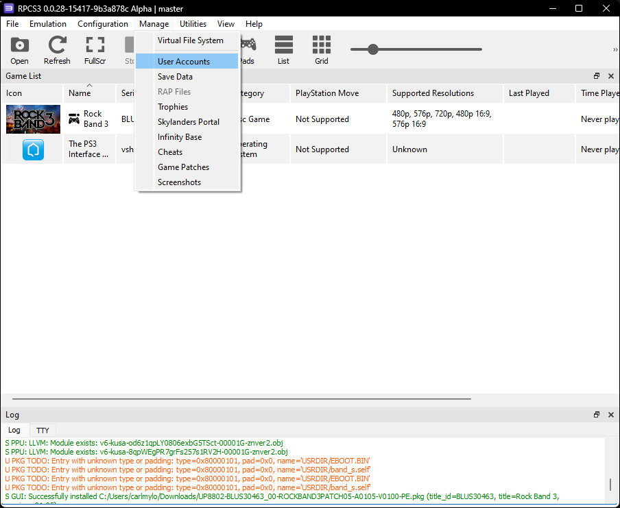

Once you're there, **click on the default username (00000001 - User) and then click “Rename User”.** 

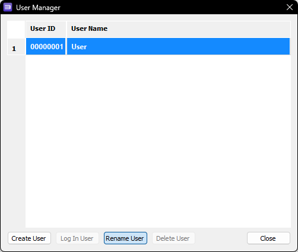

**Now change it** to whatever you want, then close it out.  

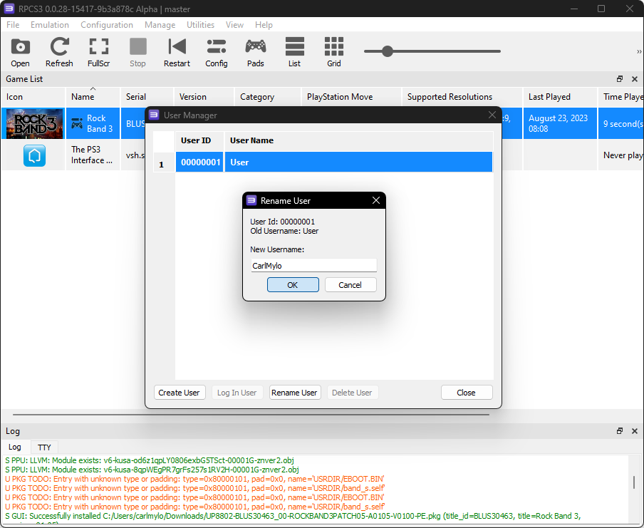

 

## RPCN:

If you don't want to play online, [[you can skip to the next part]](#quick-configuration).

Go to **Configuration > RPCN**
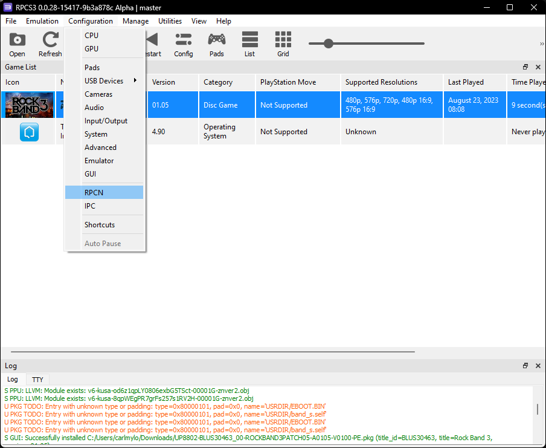

Click on “**Account**”:  
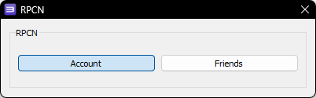

Click “**Create Account**”:  
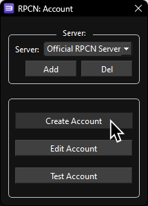

Enter a **username** and **password**:  
  
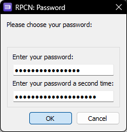  

You will be prompted for an **email address** so you can receive a **verification token**:  
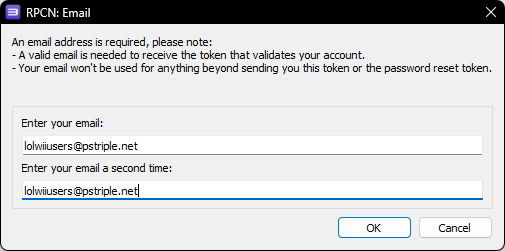  

You will next be asked to confirm your account's creation. **Click “Yes”**.

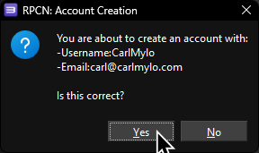

Now go to your email inbox to check for your verification token. You may have to wait a few minutes to get it. If you're still waiting, check your spam inbox. The email will be called **“Your token for RPCN.”  
Copy the token**:

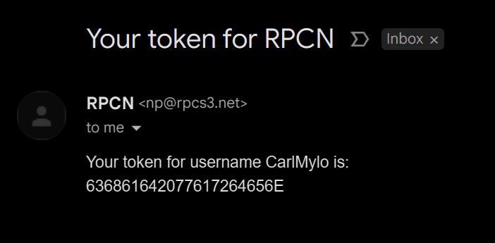

**Paste the token** into RPCS3 and click OK:  
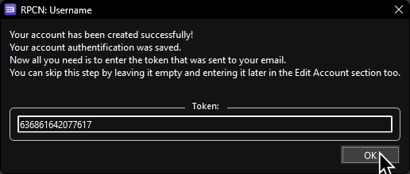

 

# Quick Configuration:
These files are meant for those that just want to play with minimal setup. It is still strongly suggested that you do [[custom configuration]](https://github.com/carlmylo/rb3-pc/tree/main#custom-configuration) to tweak to what's best for your computer.  
[[**Rock Band 3 Deluxe must be installed**]](https://rb3dx.neocities.org/) but if it's not already installed, you're not reading this guide and should go back and read it.  

Players who want to use [[microphones]](#audio), [[Wired Pro Guitar and USB/MIDI Keyboards]](#io), or [[PS3 Mustang guitars or RB3 Keyboards with dongles]](#passthrough-devices) will still need to configure those.

* [[Recommended settings]](https://github.com/carlmylo/rb3-pc/raw/main/config/customconfig/recommended.zip) - These are the settings used for the recommended specs listed in [[requirements]](#requirements).
* [[Minimum settings]](https://github.com/carlmylo/rb3-pc/raw/main/config/customconfig/minimum.zip) - These are the settings used for the minimum specs listed in [[requirements]](#requirements).

To use these, **click on the settings you want to download then extract the ZIP archives in the folder where you extracted RPCS3**. It should combine folders automatically if you did it right.  
In the GIF example below, the "Recommended" requirements settings archive (recommended.zip) was downloaded and its contents were moved into RPCS3's folder.

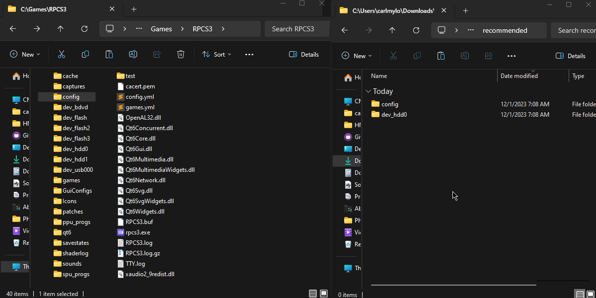

For more info on these settings, [[check the Readme for the settings repository]](https://github.com/carlmylo/rb3-pc/tree/main/config/customconfig#about).

 

# Custom Configuration:

**Right click on Rock Band 3** in RPCS3, then click on “**Create Custom Configuration**”.  
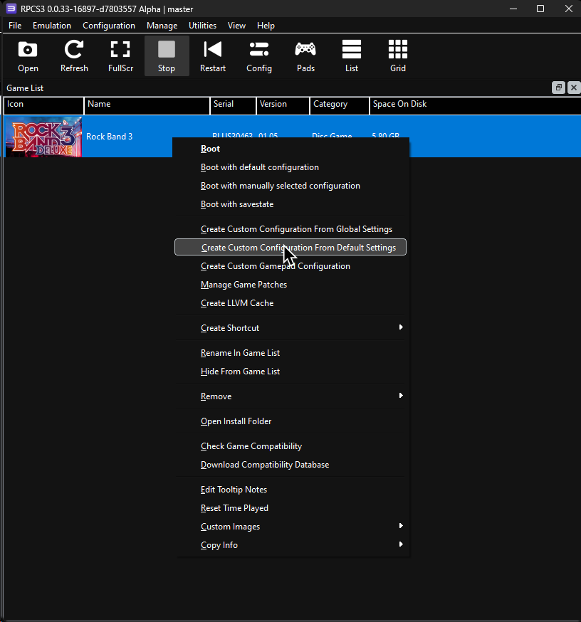

This may seem overwhelming because of the sheer number of options, but I have color-coded the settings that require adjustment. Anything not colored should be left alone.

| COLOR | MEANING |
|---|---|
|  | **REQUIRED** |
|  | **Performance Tweaks** |
|  | **Recommended** |

We'll go tab by tab, starting with:

 

## CPU

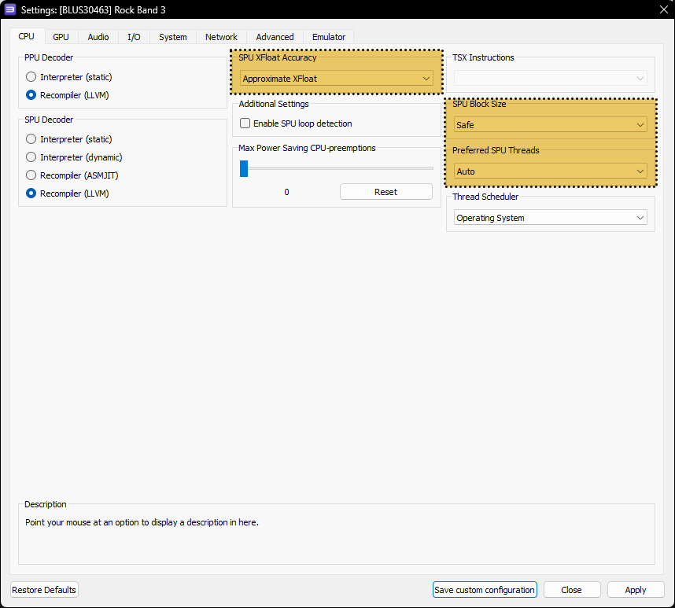
*  **Improved performance, depending on machine**: 
	* **Change "SPU Block Size" to "Mega"** - Ties smaller SPU compiled together, which requiring fewer cores/threads. Drastically speeds up game startup time on certain machines.
	* **Change "Preferred SPU Threads" to "1", "2", "3", or "4"** - Can help prevent stutter caused by CPU overloads on systems with fewer cores/threads. **Start at 4 and lower it one by one until it improves**.
	* **Change "Thread Scheduler" to "RPCS3 Scheduler", or "RPCS3 Alternative Scheduler"** - **FOR CPUs WITH 12+ THREADS ONLY!** May help with thread distribution to prevent microstutters.
	* **AS A LAST RESORT** **"SPU XFloat Accuracy" to "Relaxed"** - Changing this will gain a few frames on low end systems but **will break practice mode and possibly other features!**

 

## GPU

*  **REQUIRED**: 
	* **Enable "Write Color Buffers"** - Characters will have severe graphical bugs without this.
*  **Tweak depending on graphics card**: 
	* **Enable "VSync"** - Reduces screen tearing and may lead to a more stable framerate. Slightly increases input latency.
	* **Change "Frame Limit"** 
		* Set it to "Off" to use higher VBlank Frequencies (which may introduce jitter).
		* Set it to 60 if you want a locked 60 FPS framerate (redundant with 60 Hz Vblank). 
		* Auto will use default RPCS3 settings.
		* It is suggested to use your graphics driver's settings or software like MSI Afterburner to cap your framerate instead.
		* Adjusting the frame rate to be higher than 60 exponentially uses more GPU and CPU, so this is not recommended for low end machines.
	* **Adjust "Shader Quality"** depending on your system.
		* Low and Medium will reduce quality at certain frame rates with little performance gains.
		* High is the best option. Ultra looks and performs similar to high.
		* Auto will use default RPCS3 settings. This is the suggested setting. 
	* **Adjust "Resolution Scale"** to preference and to what your computer can handle. Lower for performance gains at a drastic cost in quality. Increase for sharper graphics at the cost of higher GPU requirements.
	* **Adjust "Resolution Scale Threshold"** depending on "Resolution Scale" above. Set the number to whatever percent you increased your resolution (i.e., for 1920x1080, which is 150% of 1280x720, you'd calculate what 150% of 16 is, which would be 24.
	* **Change "ZCULL Accuracy" to "Relaxed"** - For low end GPUs. Provides a slight performance improvement but may cause graphical anomalies.
.
 

## Audio

*  **REQUIRED**: 
	* **Enable "Enable Buffering"** - Absolutely required by Rock Band 3. It should be enabled by default but if it's disabled, re-enable it. You should set your global settings to default while you're at it because you should've done that to begin with.
*  **Tweak depending on audio hardware and CPU**: 
	* **Adjust "Audio Buffer Duration"** depending on system.
		* Lower values give you less audio latency but use more CPU.
		* Higher values give you more audio latency but use less CPU.
		* Vocalists are affected the most by this, as a higher latency creates a distracting echo. Instrument players can use calibration to compensate regardless of audio buffer setting.
		* You can change this while the game is running, but it will require re-calibrating in Rock Band 3's system settings.
	* **Change "Audio Out" to "XAudio2"** - This is only recommended for users on extremely low end machines as it causes weird audio problems overtime. Experiment with this setting to make sure it actually helps on your end. **Most users should stay on Cubeb!**
*  **For Vocalists**: 
	* **Select an input device in "Mic1", "Mic2", and "Mic3"** for vocals. If not playing vocals, Mic1 will be used for voice chat.

 

## I/O
**This section is for people playing with USB/MIDI Keyboards or Pro Guitars!**
* **If you're not playing with a wired Pro Guitar or a USB/MIDI keyboard,** [[**skip** over **this section**].](#network)  
* **If you're playing with a PS3 Rock Band 3 Keyboard or wireless PS3 Mustang Pro Guitar,** [[**skip** over **this section**].](#network)  

**If your keyboard has a USB port**, all you need to do is **plug it into your computer**.  
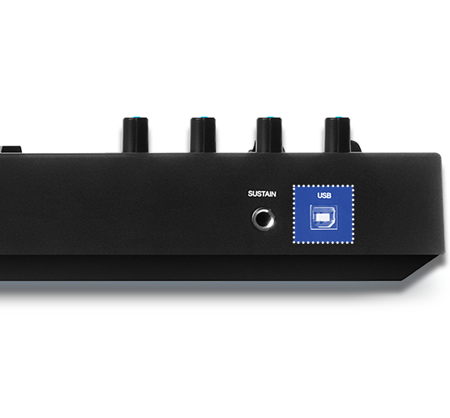  

**If your keyboard only has a MIDI output, you will need a MIDI to USB interface**.
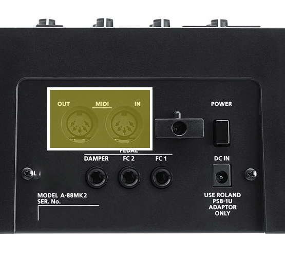  

**The same applies to Rock Band 3 Pro Guitars** as they only have MIDI outputs.
  

Here's an example of a MIDI to USB interface. Most will come with an LED indicator to show activity. **To check that you've plugged it in correctly, you should see “MIDI In” blinking when you press a key**.  
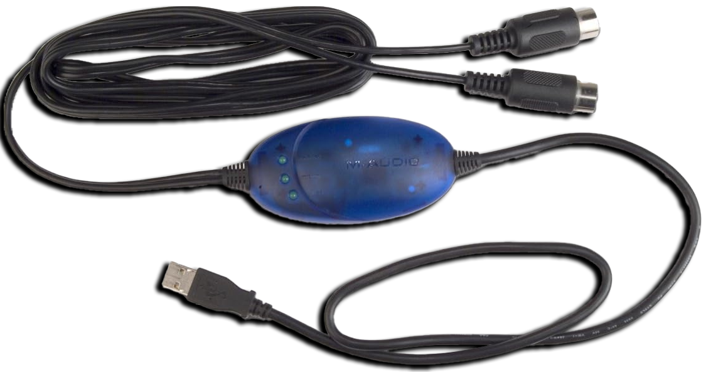  

**If you have an audio interface, you may already have a way to plug in MIDI** to your computer, as some audio interfaces come with MIDI inputs. For example, this Scarlett has MIDI connections in the back.  
>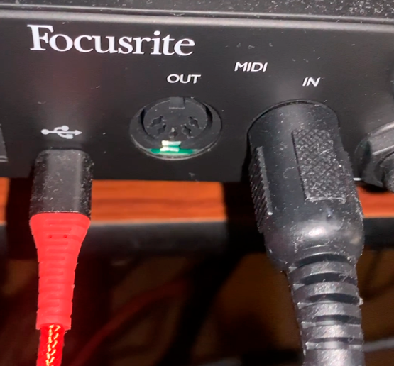  

**If everything's connected**, let's go ahead and **focus on RPCS3's I/O tab.**
**YOU MAY HAVE TO MAKE THE WINDOW WIDER TO READ THE OPTIONS!**
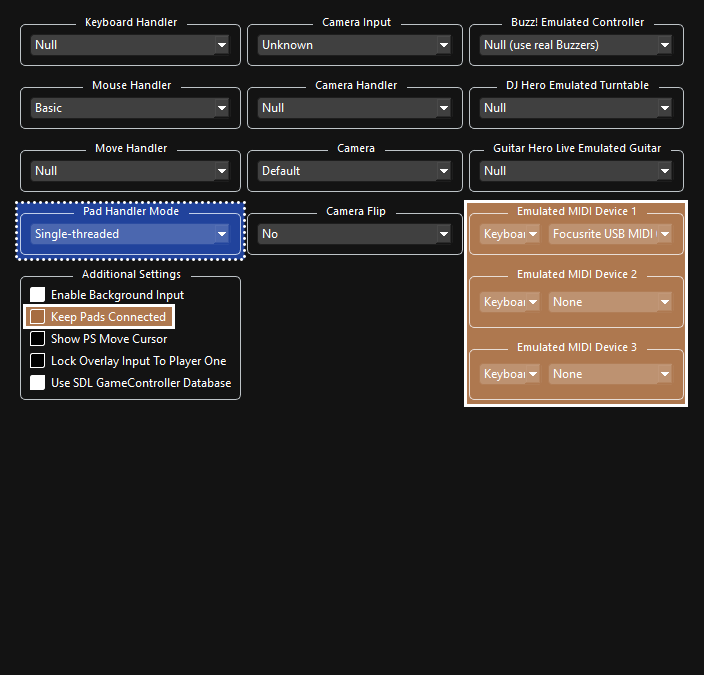
*  **For third party Keyboard and wired Pro Guitar players**: 
	* 🎹 **Keyboard Players: Leave your "Emulated MIDI type" on "Keyboard" and select your keyboard or MIDI interface in the drop-down menu next to it.**.
	* 🎸 **Pro Guitar Players: Change your "Emulated MIDI type" from "Keyboard" to "Guitar (17 Frets)" if you have a Mustang Pro Guitar, or "Guitar (22 Frets)" if you have a Squier Pro Guitar, then select your MIDI to USB interface in the drop-down menu next to it**.

*  **Tweak depending on CPU**: 
	* **Change "Pad Handler Mode" to "Multi-threaded"** if you have a CPU **with more than 12 threads.**
  
 **If your instrument isn't detected in the drop-down menu, click on "Save custom configuration", close the Custom Configuration window, then right click on Rock Band 3 to reopen it. If that doesn't work, restart RPCS3.**  
  
As **keyboards don't have PS3 buttons, the first octave is** reserved **for mapped keys**. Use the picture below as a reference. I **strongly** suggest putting labels on your keyboard to remind you of what each key does along with color ranges. **The** keyboard's **pitch knob should be mapped to the touch strip and modulation wheel and sustain pedal should be mapped to Overdrive deployment.**
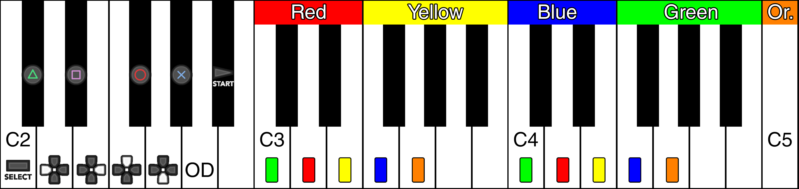  

 

## Network

*  **REQUIRED**: 
	* **Change the Network Status to “Connected” as highlighted in the picture. If left on “Disconnected,” the game will temporarily freeze when browsing the song library.**
*  **For online multiplayer**: 
	* Tick **"Enable UPNP"** or **forward port 9103 (UDP) in your firewall**.
		* **Don't enable UPNP while port forwarding** as this can cause crashes.
	* As of writing this, there are two Rock Band 3 multiplayer servers to connect to. You can easily switch between them.
		* **For AshCentral: Join the** [[**Milohax Discord server**]](https://rb3dx.neocities.org/discord) and **go to** the **[\[#ashcentral-status\]](https://discord.com/channels/961352072140324924/1153056600030973992)** channel. **Copy the information for RPCS3**. This is the suggested server due to having more features and frequent updates.  
		* For RBEnhanced GoCentral: Join the [[RBEnhanced Discord server]](https://discord.gg/6rRUWXPYwb) and go to the [[#gocentral-connecting]](https://discord.com/channels/953085263008129064/1076031372185042984) channel. Follow the instructions for RPCS3.  

 

## Advanced

*  **REQUIRED**: 
	* **Change "Driver Wake-up Delay" to "20µ"** to avoid crashing after a few songs. Increase it to "40µ" if the issue persists.
*  **Depending on your computer**: 
	* **Adjust VBlank Frequency** if you want a higher internal framerate. This can make it easier to hit notes but may cause graphical instability and connection issues while online. **It's best left alone** and not recommended to go above 75 Hz if adjusting it for online play. Increasing it exponentially uses more CPU and GPU.
	* **Change "Maximum Number of SPURS Threads"** - May improve performance on systems with less cores and threads [[like 4th gen Intel i5 CPUs with 4 cores and 4 threads]](https://github.com/carlmylo/rb3-pc/issues/12#issue-1955946005).
	* **Enable "Silence All Logs"** - **Not suggested** but can help reduce drive usage on computers with slower drives. This is a non-issue for most people. **DISABLING THIS MEANS NEITHER THE RPCS3 TEAM NOR THE MILOHAX TEAM WILL BE ABLE TO HELP YOU with troubleshooting and crashes as no log will exist**!
*  **Strongly Suggested**: 
	* **Enable "Debug Console Mode"** - With Rock Band 3 Deluxe installed, and "Large Heap" enabled in its settings, along with this option enabled, you can take advantage of higher memory access, leading to longer sessions with longer songs and increased stability. If your computer is within the minimum (or higher) requirements, there's no reason you shouldn't enable this.
	* **Change "Exclusive Fullscreen Mode" to "Prefer borderless fullscreen"** to prevent potential crashes and audio desync when changing from Rock Band 3 to another program.
	

 

## Emulator
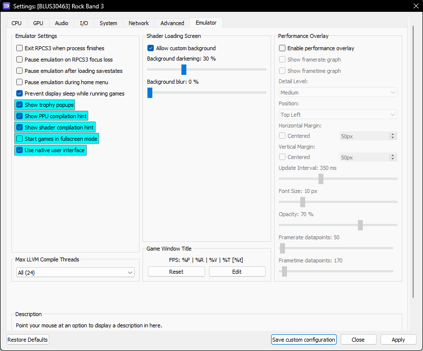
You can leave this as is if you want, but I would consider changing the following options:
*  **Optional tweaks**: 
	* **“Show trophy popups”** - Mimics the way Trophy notifications appear on the PS3. I personally disable this as the game has its own pop-ups.
	* **“Show PPU compilation hint”** - This creates a popup whenever RPCS3 is compiling units for the PPU. This only comes up once as the "Recompiler (LLVM)" setting in the CPU tab does this when launching the game.
	* **“Show shader compilation hint”** - This creates a popup whenever RPCS3 is compiling shaders. Whether you leave it on or not is up to you, but I should tell you what this means as it is important. When you run PS3 games, it has to compile shaders to “translate” the graphics from a PS3 format to a format your PC can work with. **The game will** appear to **stutter when this happens**. **This happens on ALL computer systems. When it finishes** compiling an effect, **it will usually never happen again**. **The best way to deal with this is** just **to** **play the game** as it will quickly go away. You can also use Rock Band 3 Deluxe's Autoplay modifier to let it go through a few songs in party shuffle and let it compile a decent amount of shaders.
	* **“Start games in Fullscreen mode”** - Switches to Fullscreen when you start Rock Band 3.
	* **“Use Native Interface”** - Removes the pretty displays RPCS3 adds, including notifications and game startup background. It will instead use old school pop-ups for keyboard prompts. This used to fix an issue with instrument controllers soft locking the game when the keyboard came up but it seems to no longer be necessary. The native interface does cause frame rate drops, so keep this in mind.
    

**After all of that, remember to click "Apply" then "Save custom configuration"**

If everything seems to be working, **I'd also strongly suggest changing RPCS3's log to only display fatal errors** as it gets flooded by excess messages otherwise.

To do this, **right click in RPCS3's log at the bottom and then left click on "Fatal"**.

That's the difficult part over with.

 

# AshCentral:

Video Version:  

**If you're not playing on AshCentral**, [[**skip over this section**]](#passthrough-devices).

Although **you don't need to set up room codes to play online in AshCentral**, it's strongly suggested to set this up beforehand just in case.

### Setting Up AshCentral:

To use the room code system on AshCentral, **make sure RPCS3 is set to connect to AshCentral**. **Join the** [[**Milohax Discord server**]](https://rb3dx.neocities.org/discord) and **go to** the **[\[#ashcentral-status\]](https://discord.com/channels/961352072140324924/1153056600030973992)** channel.

**Copy the information into RPCS3** like mentioned in the [**[network]**](#network) section of the guide.

Once you've done that, **go to** [**[AshCentral's website]**](https://gocentral.rocks/) **to register an account**.

[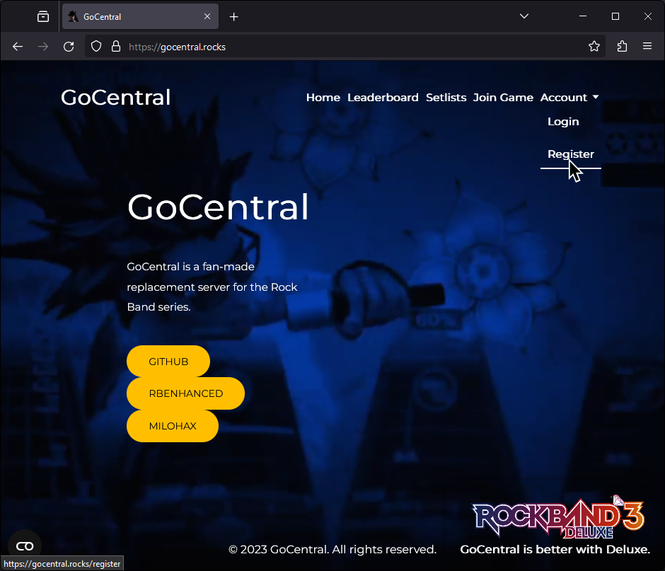](https://gocentral.rocks/ "GoCentral")

**Register your account.**

**When you register your account**, you'll be prompted to **log in**. Do so.

[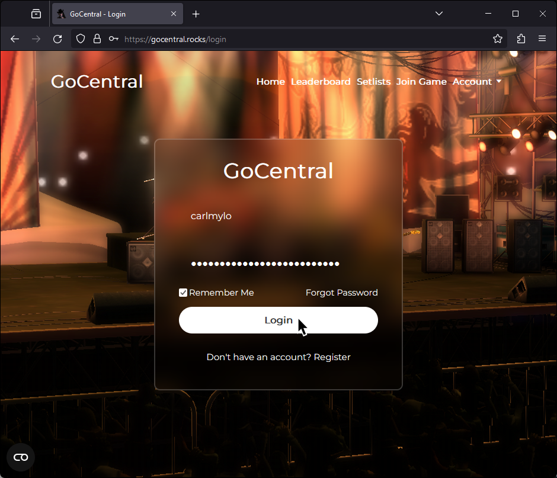](https://gocentral.rocks/login "GoCentral - Login")

You'll be taken to back to the front page. **Under your account's name, you should see "Settings"**. Click on that.

**In the settings page, you'll see a "Link Account" option. Click on that.**

[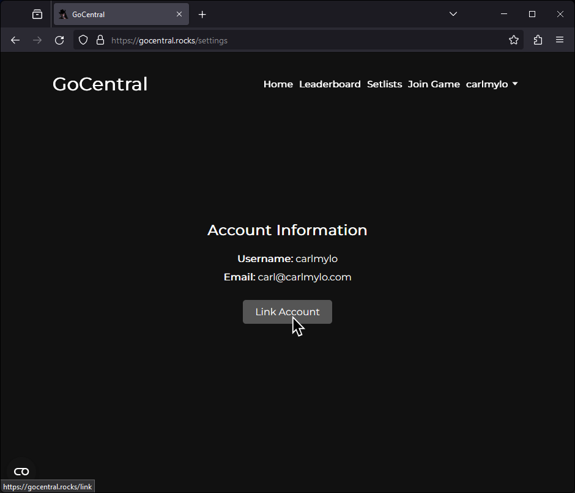](https://gocentral.rocks/link "GoCentral")

This will take you to a page to type in an account linking code. **Leave this page open.**

**Start up Rock Band 3**.

Once it launches, **go the main options menu.**

**Go to the extras menu.**

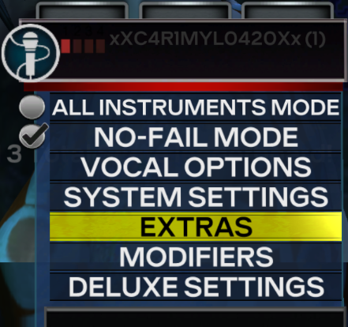

**Go to "Account-linking code."**

**You should see a code now.**

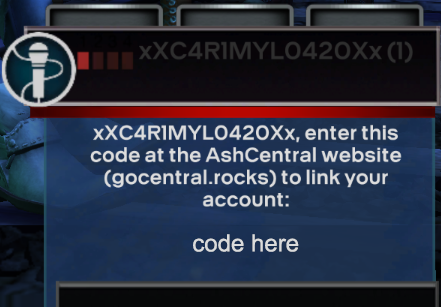

Now, **copy the code into Gocentral.Rocks, then click "Link." After that, restart Rock Band 3.**

You'll be taken back to the front page. **Under your account's name, you should see "Settings"**. Click on that.

If you did everything correctly, **you should see more information for your account, including your account name, console, band name, and fans**.

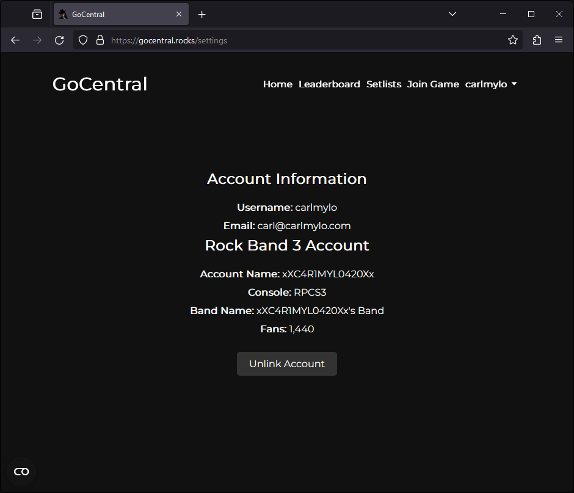

If the website didn't find anything, you may have mistyped the code. Rock Band 3's font may be a bit hard to read so you may have to try again.

Now, let's go over hosting or joining sessions.

**First, launch Rock Band 3** (if it's not already open).

**On the front page of AshCentral, click on "Join Game"**.

**Before clicking either "Host Session" or "Join Session", make sure to press "Play on AshCentral" in Rock Band 3's options menu.**

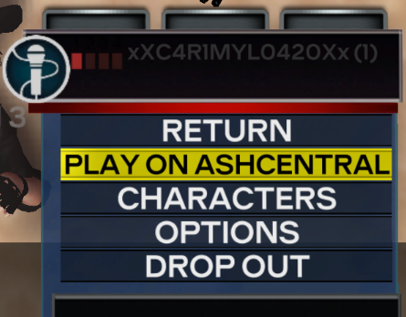

### Hosting Sessions:

**Click on "Host Session"** on GoCentral.Rocks.

You will get a code. **Send this code to those you want to join your session.**

[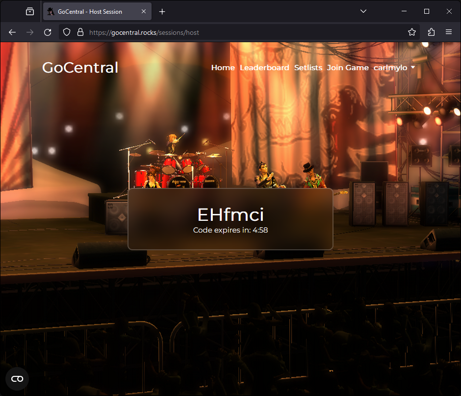](https://gocentral.rocks/sessions/host "GoCentral - Host Session")

Now, **in Rock Band 3, go to "Play Now", then "Quickplay", then "Find AshCentral Players"**

You should see invited players connected to your lobby.
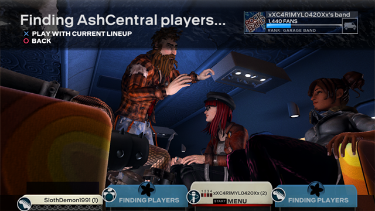

### Joining Sessions:

**Click on "Join Session"** on GoCentral.Rocks.

**Enter the session code you were sent.**

[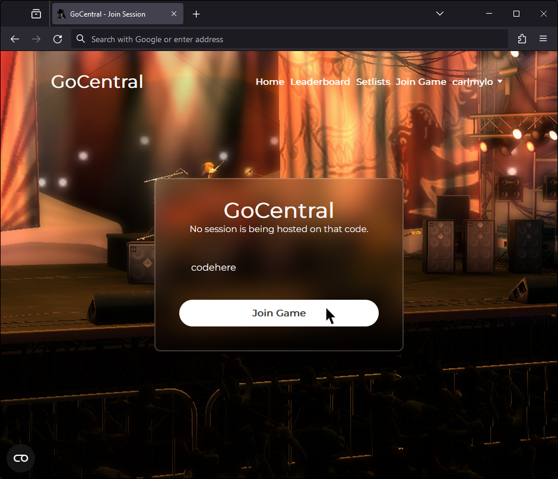](https://gocentral.rocks/sessions/join "GoCentral - Join Session")

Now, **in Rock Band 3, go to "Play Now", then "Quickplay", then "Find AshCentral Players"**

You should connect to the lobby you were invited to.
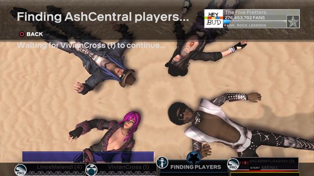

Again, **remember to press "Play on AshCentral" in Rock Band 3 before joining or hosting a session on GoCentral.Rocks.**

 

# Passthrough Devices: 

**If you're not playing with a PS3 Mustang Pro Guitar and PS3 Keyboard with their respective dongles**, [[**skip over this section**]](#troubleshooting).

To start with, **close out RPCS3** **and plug in the instrument's dongle** to your computer.

Now, [**\[go to Zadig's website\]**](https://zadig.akeo.ie/) and **download the latest version, then open it** up.

Click on **Options** then **List All Devices**.  

You should now see devices listed. **Switch it to your Rock Band 3 Pro Instrument**. In this example, we're using the Mustang Pro Guitar, which shows up as “Harmonix RB3 Mustang Guitar for PlayStation® 3”.  

**After selecting the right device, you should see the option to replace the driver. _MAKE SURE YOU ARE REPLACING THE DRIVER ONLY FOR THE PRO GUITAR/KEYBOARD!!_** Click Replace Driver.  

A warning will appear. **Again, make sure you have selected your RB3 Pro Guitar or keyboard instrument.** After you have made sure, **click** “**Yes**.”  

It will then install the driver. As the program says, it may take a few minutes.  
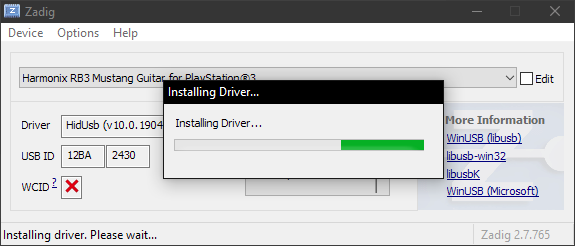

If everything goes well, you will get this message:  
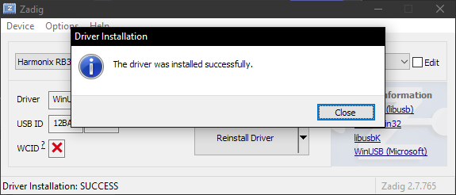

**Close Zadig** and, **with the dongle** still **connected**, **open up RPCS3** and **open Rock Band 3**.

Turn your controller on and you should see it automatically assign a player number.  
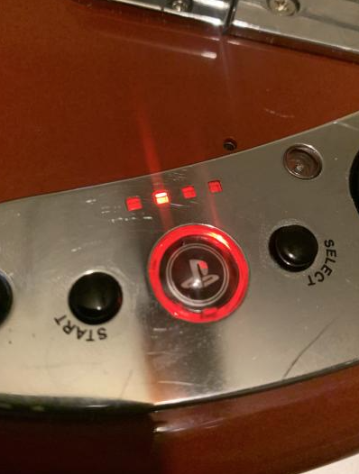

Likewise, in Rock Band 3, you will see the instrument ready to join.  

 

# Troubleshooting:

*   **_Stuttering audio_**

	* [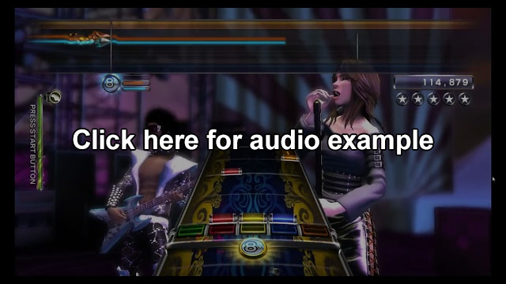](https://www.youtube.com/watch?v=UoCMEQbNThs&t=20s "Rock Band 3 Deluxe - Low-End Low-Buffer Autoplay - YouTube")
	* Increase “Audio Buffer Duration” as mentioned in [[the Audio tab of Rock Band 3's Custom Configuration]](#audio) until the stuttering stops. 100 ms is a great starting point for low end computers.

*   **_General performance issues_**
	*	Set your computer to the [[High Performance power plan]](https://help.ableton.com/hc/en-us/articles/115000211304-Using-the-High-performance-power-plan-Windows-).
	*   Go back to the [[Custom Configuration setup section]](#custom-configuration) and apply suggested low performance tweaks.
	*   Install [[Rock Band 3 Deluxe]](https://rb3dx.neocities.org/) and disable Post Effects in Deluxe Settings.
	*	Close out the dedicated Discord client and open it up in your browser or on your phone.

*   **_"Characters have glitchy flying instruments and accessories."_**
	*   There is currently no fix for this. If you experience this, [[please report your findings on RPCS3's GitHub].](https://github.com/RPCS3/rpcs3/issues/8408)

*   **_"My game doesn't fill the screen."_**
	*   Enable "Overscan" in Rock Band 3's System Settings.

*   **_"My game feels off."_**
	*   Run Calibration in Rock Band 3's System Settings if you haven't for some reason. Disable “Dolby Digital” if you enabled it in the same menu.

*   **_"My game crashes when practicing on regular guitar/bass."_**
	*   You didn't read the guide and did not install Rock Band 3 Deluxe, which fixes this.

*   **_"I cannot use Automatic Calibration in System Settings."_**
	*   Automatic Calibration only works for PS3 guitar controllers with passthrough.

*   **_"My game gets stuck when naming a character or band."_**
	*   This shouldn't be happening on the latest version of RPCS3. That being said, I'd suggest doing any sort of character customization on a typing keyboard or a regular game controller as some instrument controllers don't have enough buttons to use the on-screen keyboard.

*   **_"Scrolling through the library has long pauses."_**
	*   You didn't read the guide and did not set the “Network Status” to “Connected” in the [[Network tab when setting up the Custom Configuration]](#network) for Rock Band 3.

*   **_"My PS3 Rock Band instrument controller shows up as two controllers."_**
	*   You did [[controller configuration]](#controllers) for a PS3 Rock Band controller, which usually isn't needed due to passthrough. Just unbind the controller and it should be fine.

*   **_[Rock Band 3 Deluxe] "I crash in the intro video."_**
	*   You have incompatible Rock Band 3 Deluxe files. You need to go to Rock Band 3's game directory in `dev_hdd0\game\BLUS30463\USRDIR` and delete every `.dta` file aside from `dx_high_memory.dta`.
	
*   **_[Pro Drums] "Hitting two cymbals registers as a tom."_**
	*   This is an infamous Rock Band 3 bug called the "double cymbal glitch" and plagues all versions of Rock Band 3, even console versions. You can buy a Roll Limitless for your drums which fix this, or try to slightly [[flam]](https://en.wikipedia.org/wiki/Drum_rudiment#Flam) the two inputs.

*   **_\[ONLINE\] "I cannot find a 3rd or 4th player when searching."_**
	*   In Rock Band 3's Custom Configuration, [[go to the network tab]](#network) and make sure “Enable UPNP” is enabled. If for some reason you can't do UPNP, you will need to forward port 9103 (UDP) in your firewall. **Don't enable UPNP while port forwarding** as this can cause crashes.

*   **_\[ONLINE\] "I crash when searching for players with UPNP enabled."_**
	*   Your router may have issues with UPNP. Go to Rock Band 3's Custom Configuration [[Network section]](#network), and disable "Enable UPNP." You will need to [[search how to port forward in your router]](https://www.noip.com/support/knowledgebase/general-port-forwarding-guide).

*   **_\[ONLINE\] "I'm stuck on “Registering Account” when trying to connect to online servers."_**
	*   You may have lost connection to RPCN or GoCentral and will have to restart the game. If you continue to get this after restart, close out Rock Band 3, go to the top menu in RPCS3, “Configuration” > “RPCN” > “Account” > “Test Account” then restart the game to force a reconnection.
 
*   **_\[ONLINE\] "I keep disconnecting constantly while playing online."_**
	*   Double check to make sure your connection is stable. Try connecting via Ethernet cable if possible. If you have increased your VBlank past 60 Hz, set it back to 60 Hz. Aside from that, there's not much that can be done aside from getting better internet.

*   **_“I followed every step and my game is crashing/performing horribly!”_**
	*   Double check to make sure you meet the requirements and have followed every step correctly. This guide has been thoroughly tested and has been proven to work by many people with varying degrees of hardware. If you are absolutely sure you followed every step correctly, it is 90% likely that the dump of the game you have is bad, a 9% chance your computer ran out of disk space or doesn't meet the minimum specs, and 1% chance it's a skill issue. If you wish, contact me on [**[the Milohax discord]**](https://rb3dx.neocities.org/discord) for advice.

*	**_"You didn't mention changing (SETTING) in the guide. It helped my performance."_**
	* [[Open an issue]](https://github.com/carlmylo/rb3-pc/issues/new) with your suggestions or contact me on [**[the Milohax discord]**](https://rb3dx.neocities.org/discord) with your findings. If it checks out, I'll probably added to this guide.

 

# Conclusion:

That's it! You now (hopefully) have set up Rock Band 3 on your PC. While you're here, why not join some communities that are helping keep the Rock Band community alive?

**Rock Band 3 Deluxe/Milohax:** 

Milohax are the developers of the must-have Rock Band 3 Deluxe mod that I cannot recommend enough. **[\[Download here\]](https://rb3dx.neocities.org/)**. On top of [[the many features it adds]](https://rb3dx.neocities.org/features), they also have developed mods for [Guitar Hero 1](https://github.com/Milohax-archive/Guitar-Hero-Deluxe), [Guitar Hero 2 (both the Xbox 360](https://github.com/hmxmilohax/Guitar-Hero-II-Deluxe-360) and [PS2 version](https://github.com/Milohax-archive/Guitar-Hero-Deluxe)s), [Dance Central 1](https://github.com/hmxmilohax/dance-central-1-deluxe), [Dance Central 3](https://github.com/hmxmilohax/dance-central-3-deluxe), [Rock Band 1](https://github.com/hmxmilohax/rock-band-1-deluxe), [Rock Band 2](https://github.com/hmxmilohax/rock-band-2-deluxe), [Lego Rock Band](https://github.com/Milohax-archive/lego-rock-band-deluxe), [Green Day Rock Band](https://github.com/Milohax-archive/greenday-rock-band-deluxe), [Rock Band Blitz](https://github.com/Milohax-archive/rock-band-blitz-deluxe), and [The Beatles: Rock Band](https://github.com/Milohax-archive/beatles-rock-band-deluxe) 

[You can **\[join the amazing Milohax Discord here\]**](https://rb3dx.neocities.org/discord).

**RBEnhanced:**

Developers of the amazing RBEnhanced mod that currently only exists for Xbox 360 and Wii. The same developers also help run and maintain the GoCentral server that is the original online revival server for Rock Band 3. Without this, this game would be dead and the entire online portion of this guide wouldn't exist.

You can [**\[join RBEnhanced's Discord here\]**](https://discord.gg/6rRUWXPYwb).

Special thanks to:

*   [Dark](https://dark.ski/), [Linos](https://www.youtube.com/@LinosMelendi), [Jnack](https://www.youtube.com/@jnackmclain), [Hughtobasic](https://www.youtube.com/@thisisRK), [ihatecompvir](https://www.youtube.com/@ihatecompvir1591), and [LysiX](https://www.youtube.com/@LysiX) for technical information regarding RPCS3 and/or Rock Band 3.
* [knvtva](https://github.com/knvtva) for running and maintaining AshCentral, the best way to play Rock Band 3 online.
*   [qfoxb](https://github.com/qfoxb), [SlothDemon](https://www.youtube.com/@SlothDemon1991), [Jnack](https://www.youtube.com/@jnackmclain) (tested for nearly 50 hours lmao), [knvtva](https://github.com/knvtva), and 1osks for reporting results.
*   RPCS3 Wiki for initial information on controllers and USB passthrough.
*   [TheNathannator's](https://github.com/TheNathannator) [PlasticBand GitHub](https://github.com/TheNathannator/PlasticBand) for even better documentation on controllers.

  
This work is licensed under a [Creative Commons Attribution-ShareAlike 4.0 International License](http://creativecommons.org/licenses/by-sa/4.0/).

