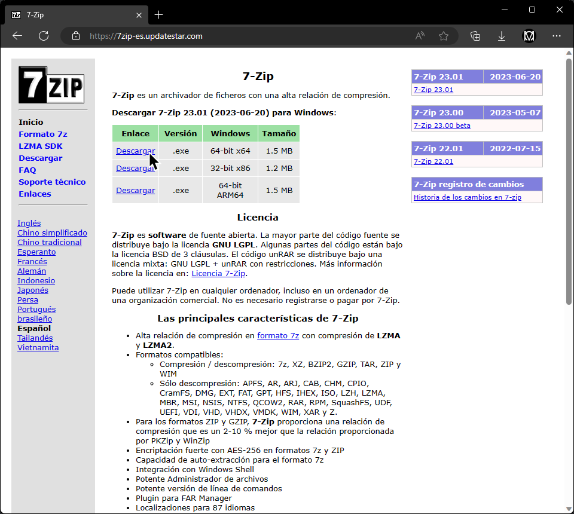
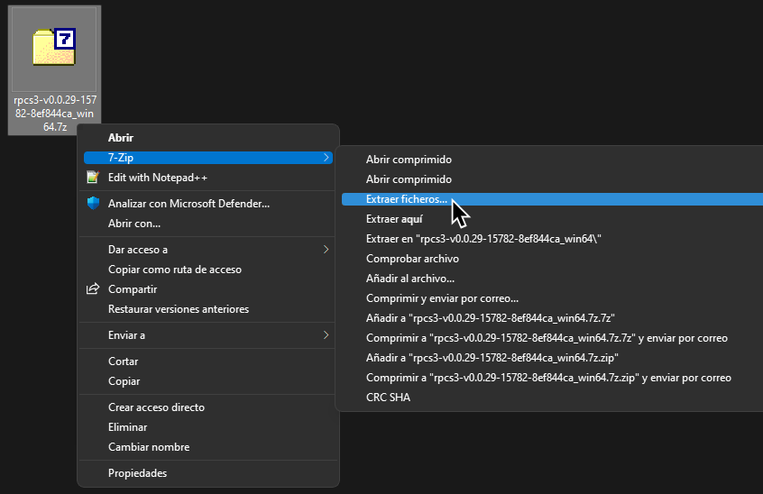
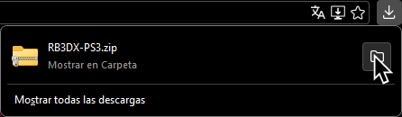
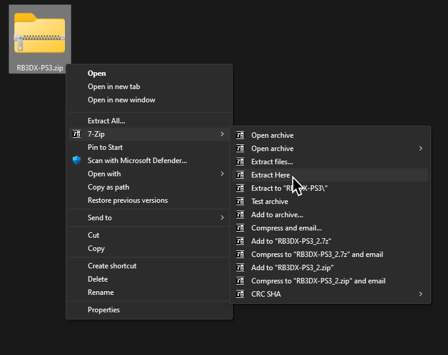
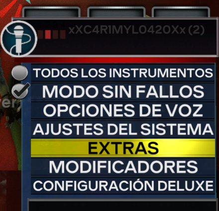
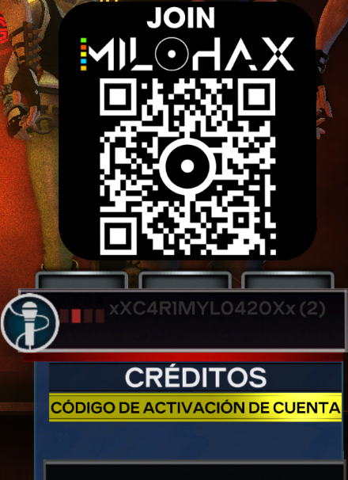
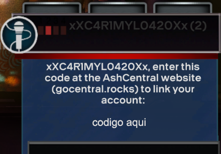
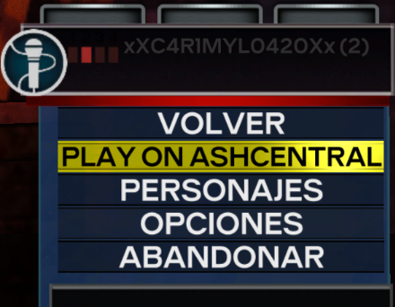
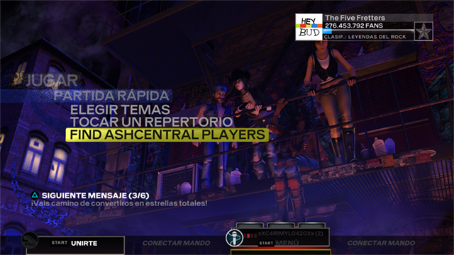

Versión Vídeo en Ingles (no actualizada):  
 - YouTube")

 

>##### Advertencia:
_Esta guía **no** te va a dar links para descargar el juego ni el DLC. Ninguno de los servidores de Discord mencionados tampoco te los va a dar. Haz tu propia copia o busque ayuda en Google. **La piratería es ilegal y atrae a los abogados de Tim Sweeney!**._
 

1. [_[Requisitos]_](#requisitos)
2. [_[Instalación]_](#instalación)
3. [_[Configuración]_](#configuración)
4. [_[Controladores (guitarras, baterías de RB o GH y controles)]_](#controladores)
5. [_[Cuenta de usuario]_](#cuenta-de-usuario)
6. [_[RPCN]_](#rpcn)
7. [_[Configuración Rápida]_](#configuración-rápida)
8. [_[Configuración Personalizada]_](#configuración-personalizada)
9. [_[CPU]_](#cpu)
10. [_[GPU]_](#gpu)
11. [_[Audio]_](#audio)
12. [_[I/O (guitarras Pro y teclados con cable USB/MIDI)]_](#io)
13. [_[Network]_](#network)
14. [_[Advanced]_](#advanced)
15. [_[Emulator]_](#emulator)
16. [_[AshCentral]_](#ashcentral)
17. [_[Conexion Directa (Guitarras Mustang PRO y teclados inalámbricos de PS3 con receptores)]_](#conexión-directa)
18. [_[Problemas y Soluciones]_](#problemas-y-soluciones)
19. [_[Conclusión]_](#conclusión)

 

# Requisitos:

Necesitarás:
* _Una copia de Rock Band 3 para PS3 en tu computadora. (versión BLUS-30463)_
* _Un instrumento. Puedes usar:_
	*   _Cualquier guitarra de Rock Band y Guitar Hero (PS3, Wii, X360)_a
	*   _Cualquier batería de Rock Band y Guitar Hero (PS3, Wii, X360)_b
	*   _Cualquier guitarra o teclado con salida MIDI compatible con el adaptador MIDI Pro de Rock Band 3 (solo la versión de PS3)_c
	*   _Cualquier batería electrónica con salida MIDI compatible con el adaptador MIDI Pro de Rock Band 3 (X360, PS3)_c
	*   _Teclado de Rock Band 3 (solo la versión de PS3 con receptor propio)_c
	*   _Guitarra PRO de Rock Band 3 Fender Mustang \[**Inalámbrica**\] (solo la versión de PS3 con receptor propio)_c
	*   _Guitarra PRO de Rock Band 3 Fender Mustang \[**Con cable**\] (PS3, Wii, X360 con adaptador de MIDI a USB)_
	*   _Guitarra PRO Rock Band 3 Squier Stratocaster (PS3, Wii, X360 con adaptador de MIDI a USB)_
	*   _Cualquier teclado MIDI (**con 37 teclas a lo mínimo** conectado por USB o por adaptador MIDI a USB)_d
	*   _Batería MIDI (conectado por USB o por adaptador MIDI a USB y los programas MidiDrumHero and VJoy)_
	*   _Cualquier micrófono detectado por tu computadora (el juego se puede controlar con la mayoría de mandos o con el teclado cuando juegas como vocalista)_
*   _Una computadora_
	* Mínimo:
		* SO: Windows 10 o mejor
		* Procesador: Intel Core i5-4460 (o equivalente con una puntuación de CPUMark de 4872 y AVX2)
		* Memoria: 8 GBs
		* Gráficos: GeForce GT 730 2GB (o equivalente)
 		* Almacenamiento: ~11.2 GBs para Rock Band 3 con Rock Band 3 Deluxe sin DLC. (5400 RPM HDD)
   		* Notas adicionales: La configuración más básica. Tendrás resolución de 720p sin efectos adicionales, latencia de audio de 130 ms, y frecuencia de actualización de 60 Hz, con posibles inestabilidades en el rendimiento.
	* Recomendado:
		* SO: Windows 10 o mejor
		* Procesador: AMD Ryzen 5 2600 (o equivalente)
		* Memoria: 16 GBs
		* Gráficos: NVIDIA GeForce GTX 1650 (o equivalente)
 		* Notas:
 			* ~145.66 GBs para **todo** el contenido oficial que salio desde RB1 hasta RB3, incluyendo DLC, RBN y expansiones (SSD).
 			* ~67.4 GBs para todo el DLC y expansiones (SSD).
 		* Notas adicionales: Excelente rendimiento. 1080p con todos los efectos, audio de 100 ms (o menos), y 75 Hz (o mas).
	* Puedes verificar [[la página de requisitos de RPCS3 aquí]](https://rpcs3.net/quickstart), aunque están exagerado para este juego.
 
*   _[[7zip]](https://7zip-es.updatestar.com/) (o WinRAR si odias tu vida)_

a Guitarras de PS4 no están incluidas porque RPCS3 no toma whammy, ladeo, o switch de efectos. También tiene latencia terrible. Guitarras de Xbox One no están incluidas porque requieren tres/cuatro programas para funcionar.  
b Baterías/tambores de PS4 no están incluidas porque los platillos no son compatible con RPCS3. También tiene latencia terrible. Baterías/tambores de Xbox One no están incluidas porque requieren tres/cuatro programas para funcionar.  
c Los instrumentos y receptores de Rock Band para el Wii se pueden convertir a PS3, pero eso es demasíado complejo para incluir en esta guía. Google es tu amigo.  
d Es posible conectar teclados con MIDI que tengan menos de 37 teclas, pero no es ideal, así que no está recomendado en esta guía. 

 

# Instalación:

Antes de empezar con la instalación, **asegúrate que tus controladores y sistema operativo estén actualizados.**

**Empezamos descargando 7-Zip**, que es lo que necesitas para abrir mayoría de los archivos que bajamos en esta guía. **Si ya tienes 7-Zip** o una alternativa instalada, **puedes seguir adelante**.

[**[Haz clic aquí para ir a la página de descarga de 7-Zip]**](https://7zip-es.updatestar.com/).

**Ahora**, **vamos a instalar Microsoft Visual C++ 2019 Redistributable**, porque es necesario para RPCS3. Mayoría ya lo tienen, pero no está malo estar seguro.

[**[Haz clic aquí para descargar Microsoft Visual C++ 2019 Redistributable]**](https://aka.ms/vs/17/release/vc_redist.x64.exe).

**Cuando se descargue**, ábrelo y instálalo (Install). 

 14.3833130")

Después, vamos descargar RPCS3.

[**[Haz clic aquí para ir al sitio de descarga de RPCS3]**](https://rpcs3.net/download).

Baja un poco y descarga la versión para Windows.

**Cuando se descargue, extrae el archivo .7zip.**  

Recomiendo que extraigas todo a "C:\\Juegos\\RPCS3" o en un disco interno adicional para evitar problemas de permisos. También desactiva la opción para crear un subdirectorio, como en la imagen.

**Evita instalar Rock Band 3 en un disco externo**, por que mayoría no tiene estabilidad para jugar sin interrupciones.  

Cuando se extraiga, [**[descarga el software del sistema de PlayStation 3 de el sitio de Sony]**](https://www.playstation.com/support/hardware/ps3/system-software/). **Mira un poco abajo en la página** hasta que llegues a "**Actualizar por computadora**", haz click en eso para expandirlo y luego haz click en "**Descargar la actualización de la PS3**".

_**Si estás utilizando un navegador Chromium como Chrome o Edge, ASEGÚRATE DE HACER click DERECHO Y "Guardar enlace como..." o tu descarga PUEDE FALLAR.**_

Como antes, la imagen de abajo va directa a la página de descarga.

Ahora, **abre RPCS3**. **Marca a "I have read the Quickstart guide"** (He leído la guía de inicio rápido) **, "Do not show again" (No volver a mostrar), y, por fin, haz clic en "Continue"** (Continuar).  
")

**Arrastra el archivo PS3UPDAT.PUP** que acabas de descargar del sitio de Sony **a RPCS3**.

**Haz click en "Yes" (Si)** cuando el programa te pregunta si quieres instalar el archivo.  
![[Una captura del instalador de software del sistema de RPCS3 preguntándole al usuario si quiere instalar la software del sistema llamado "PS3UPDAT.PUP".]](images/inst/fwinstall.png "RPCS3 Firmware Installer (Instalador de software del sistema de RPCS3)")

**Déjalo instalar.**  
 en acción")

**Cuando termine, haz click en "OK"**  
!")

Comenzará a compilar módulos para cargar la XMB de PS3 en el emulador. Esto puede tardar unos minutos. **Puedes dejar que haga su trabajo o puedes cerrarlo.**  
")

Después, **ve a la carpeta donde tienes tu copia de Rock Band 3 y arrastra la carpeta a RPCS3**. Pon esta carpeta en un lugar donde no la vas a borrar por accidente, porque la necesitas. De nuevo, no puedo darte una link por las reglas de este sitio. [[Yo usé "PS3 Disc Dumper" porque es la manera más fácil.]](https://youtu.be/gwjRJLHEV7U)

Ahora, Rock Band 3 está en tu biblioteca en RPCS3, pero todavía no esta listo. **Vamos a descargar a** [**[Rock Band 3 Deluxe]**](https://rb3dx.neocities.org/).

Rock Band 3 Deluxe es una modificación que arregla problemas importante con Rock Band 3 en RPCS3. También incluye [**[muchas funciones para mejorar tu juego]**](https://rb3dx.neocities.org/features).

[**[Haz clic aqui para bajar Rock Band 3 Deluxe]**](https://nightly.link/hmxmilohax/rock-band-3-deluxe/workflows/build/main/RB3DX-PS3.zip).

Cuando se baje, **extrae el archivo**.

**Cuando termine de extraer, arrastra el archivo PKG a RPCS3 y haz click en "Yes" (Si)**, como con el archivo PS3UPDAT.PUP.  

")

Si se instala correctamente, el icono de Rock Band 3 va a cambiar.

Puedes renombrar el juego a "Rock Band 3 Deluxe" si quieres. Solo necesitas hacer click derecho en "Rock Band 3" y selecciona a "Rename in Gamelist" (Renombrar en lista de juegos).

 

# Configuración:

*SI HAS CAMBIADO LA CONFIGURACION DE RPCS3, RESTAURA TODO A LO PREDETERMINADO ANTES DE SEGUIR ESTA GUIA.*

 

## Controladores:

**Esta sección es para controladores regulares, como guitarras de cinco botones, baterías, y baterías PRO.**  
La configuración de guitarras Pro y/o teclados piano es más adelante.

Si estas jugando con un controlador, puedes usar el [[Repositorio de Instrumentos]](#instrument-repo-es) que tiene perfiles que ya están configurados. Los perfiles se instalan arrastrando archivos, como todo lo que has instalado anteriormente.

Si no, sigue leyendo.

**Haz click con el botón derecho en "Rock Band 3" y selecciona "Create Custom Gamepad Configuration"** (Crear configuración de controladores personalizada)

* Si planeas conectar varios instrumentos, _debes configurarlos en diferentes puertos (Port)_.
* Guitarras, baterías, y adaptadores de MIDI Pro de Rock Band para el PS3 funcionan en directo sin configuración.
* Si estás utilizando guitarras de PS3 (Guitar Hero) o Wii, configura la opción "Handlers" (Manipuladores) en "MMJoystick". 
* Si estás utilizando guitarras de Xbox 360, configura la opción "Handlers" (Manipuladores) en "XInput".
* Si estás utilizando baterías de PS3 (Guitar Hero), Wii, o Xbox 360, configura la opción "Handlers" (Manipuladores) en "MMJoystick".
* Si estas usando una batería con el adaptador MIDI Pro para el Xbox 360, configura la opción "Handlers" (Manipuladores) en "XInput".

**Si tu controlador no se detecta, haz click en "Refresh" (Actualizar). Si eso no soluciona el problema, reinicia RPCS3.**

Cuando termines de configurar, **recuerda hacer click en "Save" (Guardar).**

Abajo esta una guía de como asignar los botones en RPCS3.

### Guitarras:
**Asegúrate que "Device Class" (Clase de controlador) este en "Guitar" (Guitarra).**

**Cambia el menú desplegable, junto a "Device Class", a "Rock Band" si estás usando una guitarra de Rock Band o déjalo en "Guitar Hero" si estás usando una guitarra de Guitar Hero**. 
 
**Algunas guitarras** (especialmente las de Guitar Hero) aveces tienen problemas y **no quieren asígnar botones. Si tratas de asígnar un botón y todo sale con "U+", haz click en "Filter Noise"** (filtrar ruido) en la parte inferior izquierda de la ventana de configuración **y luego intenta asígnar nuevamente**.

| **RPCS3**          | **Guitarras Rock Band** | **Guitarras Guitar Hero** |
|:------------------:|:---------------------:|:-----------------------:|
| Cross (Cruz) |  |  |
| Circle (Circulo) |  |  |
| Square (Cuadro) |  |  |
| Triangle (Triangulo) |  |  |
| L1 |  |  |
| D-Pad: Up (Arriba) |  |  |
| D-Pad: Down (Abajo) |  |  |
| D-Pad: Left (Izquierda) |  |
| D-Pad: Right (Derecha) |  |
| Right Stick:   Left+Right (izquierda+derecha) |  |  |
| Right Stick:   Up/Down (Arriba/Abajo)   (Para guitarras de PS3/Wii) |  | |
| L2   (Para guitarras de Xbox 360) |  | |
| L2   (Para guitarras de PS3/Wii) |  | |
| L3   (Para guitarras de Xbox 360) |  | |
| R1 |  | No funciona |

### Baterías:

**Asegúrate que "Device Class" (Clase de controlador) este en "Drums" (Batería).**

**Cambia el menú desplegable junto a él a "Rock Band Pro" si estás usando baterías de Rock Band, sin, o con, expansiones Pro. Déjalo en "Guitar Hero" si estás usando baterías de Guitar Hero.**

Si estás utilizando un adaptador de MIDI PRO para 360 con un kit de batería, por favor consulta [**\[el discord de Milohax\]**](https://rb3dx.neocities.org/discord) para obtener la configuración porque saben mas de esto.

| **RPCS3**    | **Batería Rock Band** | **Batería Guitar Hero** |
|:--------:|:-------------------:|:-----------------:|
| Cross (Cruz) |  |  |
| Circle (Circulo) |  |  |
| Square (Cuadro) |  |  |
| Triangle (Triangulo) |  |  |
| L1 |  |  |
| D-Pad |  |  |
| R1 |  |  |
| R3 | Modificador de Platillos | |
| L3 | Modificador de Pads | |

### Vocales:
*Para vocales*, puedes *utilizar controladores regulares*. Si estás usando un control de PS4, cambia "Handlers" (Manipuladores) a "DS4". Si estás usando un control de Xbox One, cambia "Handlers" (Manipuladores) a XInput. No es necesario cambiar otra cosa. También puedes usar tu teclado. Usa esta guía como referencia.

| **PlayStation (DS4)** | **Xbox One (XInput)** | **Uso**                         | **Uso Alternativo**        |
|:---------------------:|:---------------------:|:-------------------------------:|:-------------------:|
|  |  | Navegación |
|  |  | Navegación |
|  |  | Seleccionar                          |
|  |  | Atrás                            | Volumen micro 3 (Canción) |
|  |  | Volumen micro 1 (Canción) |
|  |  | Ver Más Información (Biblioteca)        | Volumen micro 2 (Canción) |
|  |  | Opciones                         | Pausa (Canción)        |
|  |  | Filtros (Biblioteca)               | Éxtasís (Canción)    |
|  |  | Selección de Parte de Guía (Práctica) |
|  |  | Selección de Parte Vocal (Práctica) |
|  |  | Volumen de Pista Vocal (Canción)       |
|  |  | Corrección de Tono (Canción)         |

  

Abajo esta una guitarra _Höfner de The Beatles: Rock Band para el Wii_ configurada como un ejemplo. Mira como "Handlers" (Manipuladores) está configurado en "MMJoystick" y "Devices" (Controladores) esta en el número de Joystick (Controlador) correcto. Como la guitarra es de Rock Band, "Device Class" (Clase de controlador) esta en "Guitar" y la caja junto a eso esta en "Rock Band".

 

## Cuenta De Usuario:
En RPCS3, ve a **Manage > User Accounts** (Administrar > Cuentas de usuario)  

Una vez que estés ahí, dale click en el nombre de usuario predeterminado (00000001 - User) y luego click en **"Rename user"** (Renombrar usuario).

**Ahora cámbialo** al nombre que quieras y luego haz click en "Close" (Cerrar).  

 

## RPCN:
Si no quieres jugar en linea, [[puedes avanzar a la siguiente sección.]](#configuración-rápida)

Ve a **Configuration > RPCN** (Configuración > RPCN)

Haz click en "**Account**" (Cuenta):  

Haz click en "**Create Account**" (Crear Cuenta):  

Pon un **Nombre de Usuario (Username)** y **Contraseña (Password)**:    
  
  

Se mostrara una ventana pidiendo un **Email** para así recibir un **codigo de verificación** (verification token):  
  

Vas a tener que confirmar que quieres crear tu cuenta. **Haz clic en “Yes” (Si)**.

Ve a la bandeja de entrada de tu Email. Puede tardar unos minutos para que te llegue el correo. Si todavía sigues esperando, checa la pestaña de **"Spam"**. El Email se llama **"Your token for RPCN"** (Tu código para RPCN). **Copia los números y letras abajo de "Your token for username" [tu usuario] is:"** (Tu codigo para [tu usuario] es):

")

**Pega el token** a RPCS3 Y presiona "OK":  

 

# Configuración Rápida:
Estos archivos son para personas que quieren jugar sin hacer tanta configuración. Como quiera recomiendo que hagas una [[configuración personalizada]](#configuración-personalizada) para ajustar todo a lo mejor que pueda tu computadora.  
**DEBES de tener** [[**Rock Band 3 Deluxe instalado**]](https://github.com/hmxmilohax/rock-band-3-deluxe#-installing-on-rpcs3) o no funcionaran a su máximo potencial.

Los jugadores que desean utilizar [[micrófonos]](#audio), [[guitarras Pro con cable, teclados USB/MIDI]](#io), o [[guitarras PS3 Mustang o teclados RB3 con receptores]](#conexión-directa) todavía requieren configuración adicional.

* [[Configuración recomendada]](https://github.com/carlmylo/rb3-pc/raw/main/config/customconfig/recommended_es.zip) - Esta configuración es para computadoras que son igual (o mejor) que [los requisitos recomendados](#requisitos).
* [[Configuración mínima]](https://github.com/carlmylo/rb3-pc/raw/main/config/customconfig/minimum_es.zip) - Esta configuración es para computadoras que son igual (o mejor) que [los requisitos mínimos](#requisitos).

Para usar estos archivos, **haz click en las configuración que quieres bajar y luego extrae los archivos en la carpeta donde esta RPCS3**. Las carpetas se combinaran si lo hiciste bien.
El ejemplo abajo enseña la configuración recomendada (recommended.zip) siendo instalada.

Para obtener más información sobre estas configuraciones, [[consulta la pagina de configuraciones rápidas]](https://github.com/carlmylo/rb3-pc/blob/main/config/customconfig/readme_es.md#informacion).

 

# Configuración Personalizada:

**Haz click derecho en Rock Band 3** en RPCS3, luego presiona "**Create Custom Configuration**" (Crear configuración personalizada)  

Esto puede parecer abrumador debido a la gran cantidad de opciones, pero he codificado las cosas que vas a ajustar con colores. Todo lo que no esté coloreado debe estar en las opciones predeterminadas.

| COLOR | SIGNIFICADO |
|---|---|
|  | **REQUERIDO** |
|  | **Para Rendimiento** |
|  | **Recomendado** |

Iremos pestaña por pestaña, comenzando con:

 

## CPU

*  **Rendimiento mejorado, dependiendo en tu sistema**: 
	* **Cambia el "SPU Block Size"** (Tamaño de bloques del SPU) **a "Mega"** - Para juntar hilos de SPU a ser más pequeños, requiriendo menos núcleos/hilos. También tardara menos tiempo para iniciar el juego, dependiendo en tu sistema.
	* **Cambia el "Preferred SPU Threads"** (Hilos preferidos del SPU) **a "1", "2", "3", or "4"** - Puede ayudar a prevenir inestabilidades causadas por sobrecargas de la CPU. **Empieza con 4 y bájalo si no mejora**.
	- **Cambia "Thread Scheduler" (Programador de hilos) a "Programador RPCS3" (RPCS3 Scheduler) o "RPCS3 Alternative Scheduler" (Programador alternativo RPCS3)**. - **¡SOLO PARA CPUs CON MÁS DE 12 HILOS!** Esto puede ayudar con la distribución de procesos para ayudar con rendimiento.
	* **SI NADA AYUDA, cambia el "SPU XFloat Accuracy"** (Precisión de Flotante x del SPU) **a "Relaxed"** (Relajada) - Cambiar eso ayuda un poco con rendimiento pero, **romperá el modo de practica!**

 

## GPU

*  **REQUERIDO**: 
	* **Activa "Write Color Buffers"** (Ingresar búferes de colores) - Personajes tendrán rendimiento corrupto sin esta opción.
*  **Dependiendo de tu sistema**: 
	* **Activa "VSync"** (Sincronización vertical) - Reduce el efecto de rasgado de pantalla y da fotogramas mas estables. Incrementa la latencia ligeramente.
	* **Cambia "Frame Limit"** (Limite de fotogramas):
		* A "Off" (Desactivado) si quieres tener fotogramas altas (VBlank Frequency). Esto puede introducir agitación en el rendimiento del juego.
		* A "60" si quieres fotogramas limitadas a 60 FPS (redundante con Vblank de 60 Hz).
		* **Es sugerido utilizar la configuración de tu tarjeta de gráficas para limitar la fotogramas o utilizar un programa como MSI Afterburner.**
		* Aumentando las fotogramas después de 60 utiliza muchos mas recursos. No es recomendado para sistemas de baja gama.
	* **Ajusta "Shader Quality"** (Calidad de Shaders) dependiendo de tu sistema. 
		* "Low" (Bajo) y "Medium" (Medio) reducirá la calidad drásticamente.
		* "High" (Alto) es la mejor opción. "Ultra" se ve similar a alto.
		* "Auto" usará la configuración sugerida por RPCS3,
	* **Ajusta "Resolution Scale"** (Nivel de resolución) a tu gusto. Bájalo para obtener mas rendimiento a costa de una drástica pérdida de calidad. Auméntala para obtener gráficos más nítidos.
	* **Ajusta el "Resolution Scale Threshold"** (Límite de nivel de resolución) dependiendo de la "Resolution Scale" de arriba. Usa el número de porcentaje con el que aumentaste tu resolución (por ejemplo, para 1920x1080, que es un 150% de 1280x720, calcularías cuál es el 150% de 16, lo que sería 24).
	* **Cambia "ZCULL Accuracy"** (Precisión de ZCull) a "Relaxed" (Relajada) - Mejora el rendimiento un poco pero puede causar anomalías gráficas.

 

## **Audio**

*  REQUERIDO: 
	* **Activa "Enable Buffering"** (Activar Búfer) - Absolutamente requerido para Rock Band 3. Debería estar activado por defecto, pero si no, actívalo.
*  **Dependiendo de tu sistema**: 
	* Ajusta el "Audio Buffer Duration" (duración de búferes de audio) dependiendo de tu sistema. 
		* Valores bajos resulta en menos latencia pero menos CPU
		* Valores altos resulta en mas latencia pero menos CPU.
		* Los que juegan vocales son los más afectados por esto porque latencia alta crea un eco. Los jugadores de instrumentos pueden usar la calibración para compensar.
		* Esto se puede cambiar mientras el juego esta abierto pero **requiere recalibración** en los ajustes del sistema de Rock Band 3.
	* **Cambia "Audio Out"** (Salida de audio) a **"XAudio2"** - **No mas se recomienda cambiar esto para computadoras de baja gama**. Prueba si hace una diferencia porque cambiando a XAudio2 puede causar problemas con sonido.
*  **Para Vocalistas**: 
	* Selecciona tu micrófonos en "Mic1", "Mic2" y "Mic3" para las voces. Si no estas jugando vocales, Mic 1 se usara para el chat de voz.

 

## I/O
**Esta sección es para teclados USB/MIDI o guitarras Pro con cable.**
* **Si no estás jugando con una guitarra Pro con cable o un teclado USB/MIDI,** [[puedes avanzar a la siguiente sección.]](#network)  
* **Si estás jugando con un Teclado Rock Band 3 para PS3 o una Guitarra Pro Mustang para PS3 inalámbrica,** [[puedes avanzar a la siguiente sección.]](#network)  

**Si tu teclado tiene salida USB**, solo necesitas **conectarlo a tu computadora**.  
  

**Si tu teclado solo tiene una salida MIDI, necesitarás un convertidor de MIDI a USB**.
  

**Lo mismo se aplica a las guitarras Pro**, porque solo tienen salidas MIDI.
  

Aquí tienes un ejemplo de un convertidor de MIDI a USB. La mayoría vendrán con una luz para mostrar actividad. **Para probar que lo has conectado correctamente, deberías ver que "MIDI In" parpadea cuando presionas una tecla**.  
  

**Si tienes una interfaz de audio, es posible que ya tengas una forma de conectar MIDI** a tu computadora, ya que algunas interfaces de audio tienen entradas MIDI. Por ejemplo, esta Scarlett tiene conexiones MIDI atrás.  
>  

**Si todo está conectado**, **mira la pestaña I/O de RPCS3**.  

* : Para jugadores de teclado y guitarra Pro:
	* 🎹 **Jugadores de teclado: Deja tu "Emulated MIDI type" (Tipo de MIDI emulado) en "Keyboard" (teclado) y selecciona tu teclado o interfaz MIDI en el menú desplegable junto a él**.
	* 🎸 **Jugadores de Guitarra Pro: Cambia tu "Emulated MIDI type" (Tipo de MIDI emulado) de "Keyboard" (teclado) a "Guitar (17 Frets)"** (guitarra (17 trastes)) **si tienes una guitarra Pro Mustang, o "Guitar (22 Frets)"** (guitarra (22 trastes)) **si tienes una guitarra Pro Squier, luego selecciona tu interfaz MIDI a USB en el menú desplegable junto a él**.
*  Ajuste dependiendo de tu PC: 
	* **Cambia "Pad Handler Mode"** (Modo de manejar controladores) **a "Multi-threaded"** si tienes una CPU con mas de 12 hilos/núcleos.

  
 **Si RPCS3 no detecta tu instrumento, haz click en "Save custom configuration"** (Grabar configuración personalizada), **cierra la ventana de "Create Custom Configuration"** (Crear configuración personalizada) **y luego haz click con el botón derecho en Rock Band 3 para volver a abrirla. Si eso no funciona, reinicia RPCS3.**  
  
**Teclados no tienen botones de PS3, así que el primer octavo esta emulando botones de PS3**. Utiliza la siguiente imagen como referencia. **Te recomiendo poner etiquetas o algo así en tu teclado para recordarte qué hace cada tecla junto con rangos de colores**.
  

 

## Network

*  **REQUERIDO**: 
	* **Cambia Network Status** (estado de red) **a "Connected"** (conectado) **como en la imagen. Si la dejas en "Disconnected"** (desconectado), **el juego se congelara mientras navegas por la biblioteca de canciones.**
*  **Para jugar en linea**: 
	* Activa **"Enable UPNP"** (activar UPnP) o **reenvía el puerto 9103 (UDP) en tu cortafuegos. No actives UPNP mientras reenvías el puerto** porque esto puede causar crasheos.
	* En este tiempo, existen dos servidores para jugar Rock Band 3 a los que te puedes conectar. Cambiando a cual te conectas es muy facil.
		* **Para AshCentral: Unete al** [**[Discord de Milohax]**](https://rb3dx.neocities.org/discord) y **ve al canal** de **[\[#ashcentral-status\]](https://discord.com/channels/961352072140324924/1153056600030973992)**. **Copia la informacion para RPCS3.** Este es el servidor recomendado porque tiene actualizaciones mas frecuentes y mas funciones.
		* Para el servidor de RBEnhanced: Únete al \[[Discord de RBEnhanced](https://discord.gg/6rRUWXPYwb)\] y ve al canal [\[#gocentral-connecting\]](https://discord.com/channels/953085263008129064/1076031372185042984). **Sigue las Instrucciones para RPCS3**.

 

## Advanced

*  **REQUERIDO**: 
	* **Cambia el "Driver Wake-up Delay"** (Retraso de activacion de controlador) **a "20µ" si tu juego se congela luego de algunas canciones. Subelo a "40µ" si sigue pasando.** 
*  **Dependiendo de tu sistema**: 
	* **Cambia el "Exclusive Fullscreen Mode"** (Modo de exclusividad de pantalla llena) **a "Prefer borderless fullscreen"** (preferir pantalla llena sin bordos) para prevenir posibles crasheos o desincronización al cambiar la prioridad del programa.
	* **Ajusta el "VBlank Frequency"** (intervalo vertical) **si quieres unos fotogramas internos altos. Esto puede hacer que atinar las notas sea mas facil, pero puede causar inestabilidad gráfica o problemas de conexión en linea. Es mejor dejarlo tal como esta.**
	* **Cambia a "Maximum Number of SPURS Threads"** (Máximo numero de hilos de SPURS) - Puede ayudar el rendimiento de computadoras con CPU de 4 núcleos/hilos, como [[CPUs de Intel i5 de la cuarta generación]](https://github.com/carlmylo/rb3-pc/issues/12#issue-1955946005).
	* **Activa "Silence All Logs"** - **ESTO NO ESTA SUGERIDO** pero puede ayudar con rendimiento en sistemas que tengas discos de almacenamiento antiguos, como discos duros (HDD) . **SI ACTIVAS ESTO, NI LA COMODIDAD DE RPCS3 O DE MILOHAX TE PODRÁN AYUDAR con problemas porque no va existir un registro de errores**!
* : **Recomendado**:
	* **Activa "Debug Console Mode"** (Modo de consola saca-errores) - **Con Rock Band 3 Deluxe instalado, esto aumenta cuanta memoria Rock Band 3 puede usar. Esto va a ayudar tener sesiones mas largas. mejor estabilidad, mas tener mas canciones en tu librería de música.** Si tu computadora esta en el requisitos mínimos (o mejor), no hay razón para no activar esto.

 

## Emulator

Puedes dejar esto como quieras, pero consideraría cambiar las siguientes opciones:
*  Cambios Opcionales: 
	* **"Show trophy popups"** (Enseñar notificaciones de trofeos) - Simula la notificacion de trofeos de la PS3. Personamente desactivo esto ya que el juego tiene sus propias notificaciones.
	* **"Show PPU compilation hint"** (Enseñar notificaciones de PPUs compilándose) - Esto crea una notificación cuando RPCS3 esta compilando unidades del PPU. Esto solo sale si tienes la opción "Recompiler (LLVM)" activada en la pestaña de CPU.
	* **"Show shader compilation hint"** (Enseñar notificaciones de shaders compilándose) - Esto crea una notificación cuando RPCS3 esta compilando shaders. Ya sea si lo dejas activado o no ya es cosa tuya, pero debo decirte que esto es importante. Cuando ejecutas juegos de PS3, tiene que compilar shaders para "trasladar" los gráficos de una PS3 a un formato que tu PC pueda usar. **El juego seguirá trabándose mientras esto pase** . **Esto Pasa en TODOS los PC's.** Cuando termine de compilar un efecto, **esto usualmente ya no vuelve a pasar otra vez**. **La mejor forma de lidiar con esto es** simplemente **jugar al juego normalmente** y luego se ira rápidamente. También puedes activar el modo de "Autoplay" y dejar que el juego toque unas canciones hasta que pare de trabarse tanto.
	* **"Start games in Fullscreen mode"** (Empezar juego en pantalla llena) - Obviamente solo cambia el modo de pantalla completa cuando inicias Rock Band 3. Personalmente yo activo esto.
	* **"Use Native Interface"** (Usar interfaz nativa) - Desactivar esto hará que se remuevan todas las notificaciones de RPCS3 mientras estás jugando, incluyendo el teclado y fondo mientra el juego cargue. En su lugar, verás una interfaz más antigua. Antes ayudaba antes porque RPCS3 se trababa cuando estabas nombrando algo en el juego con un controlador instrumento. Esto ya no es necesario pero la interfaz nativa si causa problemas con rendimiento en ciertas computadores en los momentos raros que sale

**Después de todo eso, recuerda hacer clic en "Apply"** (aplicar) **y luego en "Save custom configuration"** (Guardar configuración personalizada).

Si todo parece que este funcionando bien, **sugiero cambiar cuales cosas RPCS3 registre un su historial**. Se satura muy fácil en el modo por defecto.

Para hacer esto, **haz clic derecho en el registro historial en la parte de abajo en RPCS3 y luego clic izquiero en "Fatal"**.

Y con eso termina la parte difícil.

 

# AshCentral

Versión Vídeo de esta sección con subtitulos en Español:  

**Si no estas jugando en AshCentral**, [[**puedes seguir a la siguiente sección**]](#conexión-directa).

### Preparaciones para AshCentral:

Para usar el sistema de códigos de sala en AshCentral, **asegúrate que RPCS3 este configurado para conectar a AshCentral**. **Entra al** [[**Discord de Milohax**]](https://rb3dx.neocities.org/discord) y **ve al canal** de **[\[#ashcentral-status\]](https://discord.com/channels/961352072140324924/1153056600030973992)**.

**Copia la información a RPCS3 como dicho en la sección** [**[network]**](#network) (red) **de la guia**.

Cuando hagas eso, [**[ve al sitio de AshCentral, GoCentral.Rocks]**](https://gocentral.rocks/) **para registrar una cuenta**.

**Registra** (Register) **tu cuenta.**

Cuando registres tu cuenta, **entra tus datos para entrar a la cuenta**.

Te va a regresar a la pagina principal. **Se va ver tu usuario en el rincón derecho de arriba. Mueve el cursor arriba de tu nombre y luego haz clic en "Settings"** (Ajustes).

**En la pagina de "Settings" vas a ver una opcion llamada "Link Account"** (Connectar Cuenta). **Hazle clic**.

Te va a llevar a una pagina donde vas a entrar el código para conectar tu cuenta con el juego. Deja esta pagina abierta. **Deja a esta pagina abierta**.

**Abre Rock Band 3**.

Cuando cargue el menú principal, **entra a las "Opciones"**

**Ve a "Extras".**

**Ve a "Código de Activación de Cuenta"**.

**Te va dar un código**.

Ahora, **copia el código en la pagina, y haz clic a "Link"** (Conectar). **Despues, reinicia Rock Band 3**.

Te va a regresar a la pagina principal. **Se va ver tu usuario en el rincón derecho de arriba. Mueve el cursor arriba de tu nombre y luego haz clic en "Settings"** (Ajustes).

Si hiciste todo bien, **la pagina de va enseñar el usuario de tu cuenta RPCN, que estas usando RPCS3, Band Name (nombre de banda), y fans.**

Si no vez nada nuevo, no entraste el código correcto. Las letras de Rock Band 3 pueden ser un poco difícil para leer así que aveces se necesita tratar otra vez. 

Ahora, vamos a ver como crear o entrar a sesiones.

**Abre Rock Band 3** (si no esta abierto).

**En la pagina principal de AshCentral, haz clic a "Join Game"** (Entrar a juego).

**Antes de crear o entrar a una sesión, necesitas tienes que presionar en "Play on AshCentral" en el menu de Rock Band 3.**

### Creando Sesiones:

**Haz click en "Host Session"** en GoCentral.Rocks.

Te dará un código. **Pasa este código a todos los que quieres invitar.**

Ahora, **en Rock Band 3, entra a Jugar, Partida Rápida, y "Find AshCentral Players"** (Encontrar jugadores en AshCentral).

Ahora debes de ver que se conecten los que fueron invitados.

### Entrando a Sesiones:

**Haz clic en "Join Session"** (Unirse a sesión) en GoCentral.Rocks.

**Entra el codigo que te mandaron**.

Ahora, **en Rock Band 3, entra a Jugar, Partida Rápida, y "Find AshCentral Players"** (Encontrar jugadores en AshCentral).

Te vas a conectar a la session donde fuiste invitado.

Acuérdate, necesitas que presionar "Play on AshCentral" en Rock Band 3 antes de que te unas o creas una sesiona en GoCentral.Rocks.

 

# Conexión Directa

Si no estás utilizando una Guitarra Mustang Pro de PS3 y un Teclado Rock Band 3 de PS3 con sus receptores respectivos, [[puedes avanzar a la siguiente sección.]](#conexion-directa)

Para comenzar, **cierra RPCS3** y conecta el receptor del instrumento a tu computadora.

Ahora, [**\[ve al sitio de Zadig\]**](https://zadig.akeo.ie/) y **descárgalo**. Cuando termine de bajar, **ábrelo**.

Haz click en **Options** (Opciones) y luego en **List All Devices** (Listar dispositivos).  

Deberías ver una lista de dispositivos ahora. **Selecciona tu Instrumento Pro de Rock Band 3**. En este ejemplo, estamos utilizando la Guitarra Mustang Pro, que aparece como "Harmonix RB3 Mustang Guitar for PlayStation® 3".  

Después de seleccionar el dispositivo correcto, deberías ver la opción para reemplazar el controlador. **ASEGÚRATE DE QUE SOLO ESTÁS REEMPLAZANDO EL CONTROLADOR DEL INSTRUMENTO PRO DE ROCK BAND 3**. **Haz click en "Replace Driver" (Reemplazar controlador)**.  

Aparecerá una advertencia. **Nuevamente, asegúrate de haber seleccionado tu Guitarra Mustang Pro o teclado de Rock Band 3.** Después de haberlo verificado, haz click en "**Yes**" (Sí).  

Luego, se instalará el controlador. Como dice el programa, esto puede llevar algunos minutos.  

Si todo sale bien, verás este mensaje:  

**Cierra Zadig** y, con el receptor todavía conectado, **abre RPCS3** y **abre Rock Band 3**.

Enciende tu controlador y deberías ver que automáticamente se le asigna un número de jugador.

Del mismo modo, en Rock Band 3, verás el instrumento listo para unirse.  

 

# Problemas y Soluciones

*   **_Audio Corrupto_**

	* 
	* Aumenta el "Audio Buffer Duration" como se menciona en [[la pestaña de Audio de la configuración personalizada]](#Audio) hasta que el Audio Entrecortado se detenga. 100 ms es un buen comienzo para computadoras de baja gama.

*   **_Problemas generales de rendimiento_**
	* Cambia el plan de energía de tu computadora a "Máximo rendimiento"
	*   Regresa y Lee las sugerencias para PCs de gama baja en la [[sección de configuración personalizada]](#cpu).
	*   Instala [[Rock Band 3 Deluxe](https://github.com/hmxmilohax/rock-band-3-deluxe/tree/main#playstation-3) y deshabilita efectos adicionales en el apartado "Deluxe Settings". Si no lo tienes, no seguiste la guía.
	*	Cierra el cliente de Discord y abre Discord en tu navegador o tu celular.

*   **_Los instrumentos o accesorios de los personajes flotan o los traspasan_**
	*   Actualmente no hay ninguna solución para esto. Si te pasa esto esto, [[por favor reporta tus descubrimientos en el GitHub de RPCS3.]](https://github.com/RPCS3/rpcs3/issues/8408)

*   **_El juego no se llena en toda la pantalla_**
	*   Activa la opción "Tamaño" en las opciones de RB3.

*   **_El juego tiene retraso de audio o notas_**
	*   Entra a calibración en el menú de opciones de RB3 si no lo has hecho. Deshabilita la opción "Dolby Digital" en el mismo menú.

*   **_El juego crashea cuando practico en guitarra/bajo regular_**
	*   No leíste la guía por weon y se te olvido instalar a Rock Band 3 Deluxe, porque Rock Band 3 Deluxe arregla esto.
	
*   **_No puedo usar la Calibración Automática_**
	*   La calibración automática solo funciona con las guitarras de PS3 con conexión directa.

*   **_El juego se traba al ponerle nombre a un personaje_**
	*   Esto no debe de pasar en las versiones nueva de RPCS3. Diciendo eso, como quiera sugiero que uses un control standard para cualquier personalización porque unos instrumentos no tienen los botones requeridos para escribir en el teclado virtual.

*   **_Navegando la biblioteca me da pausas largas_**
	*   Ctm. Se te olvido poner "Network Status" a "Connected" en la [[pestaña "Network" al hacer la configuración personalizada]](#network) para Rock Band 3, como te dijo la guía.

*   **_Instrumentos de PS3 se detectan como dos_**
	*   Creaste una [[configuración de controladores personalizada]](#controladores) para un control de PS3, que usualmente no se necesita. Desborra la configuración del controlado y todo debe de estar bien.

- **_[Rock Band 3 Deluxe] Crasheo en el video de introducción_**
  * Tienes archivos de Rock Band 3 Deluxe para una versión vieja. Ve a la carpeta del juego en `dev_hdd0\game\BLUS30463\USRDIR` y desborra todos los archivos con extensión `.dta`, excepto a `dx_high_memory.dta`.

*   **_[Bateria Pro] Golpear dos platillos se registra como un tambor_**
	*   Este es un problema conocido de Rock Band 3 que afecta todas las versiones, incluso las de consolas. Puedes comprar un Roll Limitless, que arregla esto. También puedes tocar estas cosas con un [[flam/mordente]](https://es.wikipedia.org/wiki/Rudimento#Terminolog%C3%ADa). Por favor siéntete pregunta en el [**[servidor de Discord de MiloHax]**](https://rb3dx.neocities.org/discord).

*   **_\[ONLINE\] No puedo encontrar al tercer o cuarto jugador_**
	*   En la configuración Personalizada de Rock Band 3, [[ve a la pestaña de "Network" de configuración personalizada]](#network) y asegúrate de tener activado la opción "Enable UPNP". Si por alguna razón no puedes activar el UPNP, tendrás que redireccionar el puerto 9103 (UDP) en tu cortafuegos . **No actives el UPNP mientras estas redireccionando el puerto** ya que esto puede causar crasheos.

*   **_\[ONLINE\] Crasheo cuando busco jugadores**
  - Si tienes UPNP prendido en la Configuración Personalizada de Rock Band 3 [[sección de Network]](#network), deberás desactivarlo y [[buscar cómo configurar el reenvío de puertos en tu enrutador]]([https://www.noip.com/support/knowledgebase/general-port-forwarding-guide](https://es.wikihow.com/configurar-el-reenv%C3%ADo-de-puertos-en-un-router)).
	
*   **_\[ONLINE\] Al tratar de conectar a GoCentral el juego se queda en "Registering Account_**
	*   Puede que hayas perdido la conexión a RPCN o GoCentral y tendrás que reiniciar el Juego. Si continuas teniendo esto luego de haber reiniciado, ve al menú de arriba en RPCS3 a, "Configuration" > "RPCN" > "Account" > "Test Account" luego reinicia el juego para forzar una reconexión.

*   **_\[ONLINE\] Me sigo descontando mientras juego en linea_**
	*   Chequea que no estés bajando algo y que tu conexión al internet no este sobrecargada. Si cambiaste tu VBlank a mas de 60 Hz, bájalo de vuelta a 60 Hz. Además, necesitas tener una conexión estable tanto con RPCN y los servidores de GoCentral.

*   **_"Seguí todos los pasos y todavía tengo crasheos/mal rendimiento"_**
	*   Revisa nuevamente para asegurarte de que has seguido cada paso correctamente. Esta guía ha sido probada y ha demostrado funcionar para muchas personas con diferentes tipos de hardware. Si estás absolutamente seguro de haber seguido cada paso correctamente, es muy probable que el archivo del juego que tienes esté dañado en un 90%, que haya un 9% de posibilidades de que tu computadora se haya quedado sin espacio en disco, y un 1% que la chingaste. Si quieres, puedes mandarme un mensaje por [**[el servidor de Milohax]**](https://rb3dx.neocities.org/discord). Yo hablo Español.

*	**_"No mencionaste ajustando (opcion) en la guia, pero a mi me ayudo."_**
	* [[Abre un asunto nuevo]](https://github.com/carlmylo/rb3-pc/issues/new) o mandarme un mensaje por [**[el servidor de Milohax]**](https://rb3dx.neocities.org/discord) con tu sugerencia. Si es verdad, lo puedo incluir en la guía.

 

# Conclusión

Eso es todo! Ahora (con un poco de suerte) tienes un manera funcional para jugar Rock Band 3 en tu computadora. Mientras estas acá, porque no te unes a algunas comunidades que están ayudando a mantener viva la Comunidad de Rock Band?

**Rock Band 3 Deluxe/Milohax:** 

Milohax son los desarrolladores de Rock Band 3 Deluxe, que es esencial para jugar Rock Band 3. **[\[Descárgalo aquí\]](https://rb3dx.neocities.org/)**. Además de [[todas la funciones que agrega]](https://rb3dx.neocities.org/features), también han desarrollado mods para [Guitar Hero 1](https://github.com/Milohax-archive/Guitar-Hero-Deluxe), [Guitar Hero 2 (para Xbox 360](https://github.com/hmxmilohax/Guitar-Hero-II-Deluxe-360) y tambien [para el PS2](https://github.com/Milohax-archive/Guitar-Hero-Deluxe)s), [Dance Central 1](https://github.com/hmxmilohax/dance-central-1-deluxe), [Dance Central 3](https://github.com/hmxmilohax/dance-central-3-deluxe), [Rock Band 1](https://github.com/hmxmilohax/rock-band-1-deluxe), [Rock Band 2](https://github.com/hmxmilohax/rock-band-2-deluxe), [Lego Rock Band](https://github.com/Milohax-archive/lego-rock-band-deluxe), [Green Day Rock Band](https://github.com/Milohax-archive/greenday-rock-band-deluxe), [Rock Band Blitz](https://github.com/Milohax-archive/rock-band-blitz-deluxe) y [The Beatles: Rock Band](https://github.com/Milohax-archive/beatles-rock-band-deluxe). [Puedes \[Unirte al servidor de MiloHax\]](https://rb3dx.neocities.org/discord) aqui.

**RBEnhanced:**

Desarrolladores del Increible mod RBEnhanced el cual solamente existe para Xbox 360 y Wii. Los mismos desarrolladores también ayudan y mantienen el servidor de GoCentral que fue la manera original de jugar Rock Band 3 en linea en Xbox, PS3, y Wii por el Momento. Puedes [**\[unirte al servidor de RBEnhanced Aqui\]**](https://discord.gg/6rRUWXPYwb).

Agradecimientos especiales a:

*	[SlothDemon](https://www.youtube.com/@SlothDemon1991) por ayudar a traducir esta guía y ayudarme a recordar como escribir Español.
*   [DarkRTA](https://www.youtube.com/@darkrta), [Linos](https://www.youtube.com/@LinosMelendi), [Jnack](https://www.youtube.com/@jnackmclain), [Hughtobasíc](https://www.youtube.com/@thisisRK), [ihatecompvir](https://www.youtube.com/@ihatecompvir1591), and [LysiX](https://www.youtube.com/@LysiX) por informacion tecnica sobre RPCS3 y Rock Band 3.
* [knvtva](https://github.com/knvtva) por crear y mantener a AshCentral, la mejor manera de jugar Rock Band 3 por linea.
*   qfoxb, [SlothDemon](https://www.youtube.com/@SlothDemon1991), [Jnack](https://www.youtube.com/@jnackmclain) (el cual hizo pruebas por 40 horas xd), knvtva, y 1osks por reportar resultados.
*   RPCS3 Wiki por tener una cantidad decente de información sobre los Controladores y los Traspasos Via USB.
*   [TheNathannator](https://github.com/TheNathannator) por su [GitHub de PlasticBand](https://github.com/TheNathannator/PlasticBand) por la mejor documentación de controladores.

  
This work is licensed under a [Creative Commons Attribution-ShareAlike 4.0 International License](http://creativecommons.org/licenses/by-sa/4.0/).

